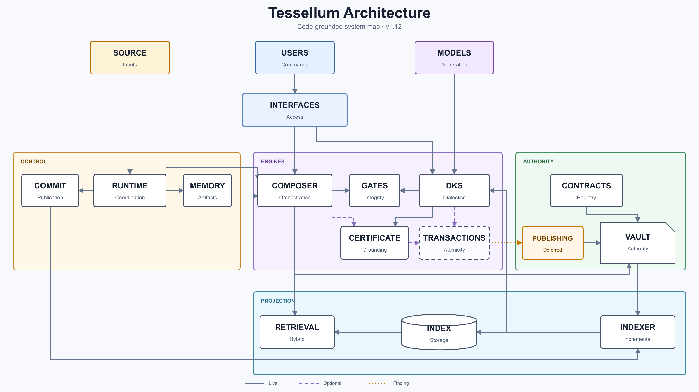

# Tessellum

> **Typed atomic notes in a graph — a Zettelkasten that scales.**
>
> Knowledge construction for humans and agents — **typed atomic notes**, a **Building-Block** type system, a one-way **CQRS** split, and a graph of **Folgezettel** trails, with a **dialectic reasoning engine** on top.

Tessellum is a knowledge-construction system, not an agent-memory store. Its unit of work is a **typed atomic note** — a *tessellum*, a small mosaic tile — small enough to make a single point, and tagged with what *kind* of point it makes. You author these notes yourself, or hand Tessellum a source document and let it **digest** the source into them. Either way, Tessellum indexes the notes and retrieves them with hybrid search (keyword and vector, combined). It lets you grow *Folgezettel trails* — chains of notes that record how one idea led to the next — and it runs a closed-loop reasoning engine, the **Dialectic Knowledge System**, that revises its conclusions as arguments and counter-arguments pile up. Underneath is a clean read/write split (the **CQRS** pattern): the notes you author are the source of truth, the searchable index is a projection rebuilt from them, and changes only ever flow one way — from the notes to the index, never back.

## Quick Start

```bash
pip install tessellum

# 1. Scaffold a new vault (templates + seed term + master TOC)
tessellum init ~/my-vault
cd ~/my-vault

# 2. Capture your first typed atomic note — 18 flavors available
tessellum capture concept page_rank --vault .        # creates resources/term_dictionary/term_page_rank.md
tessellum capture skill my_skill --vault .           # creates a single self-contained skill_*.md
tessellum capture code_snippet my_algo --vault .     # creates resources/code_snippets/snippet_*.md
tessellum capture code_repo my_repo --vault .        # creates areas/code_repos/repo_*.md
tessellum capture --help                   # full flavor list

# 3. Validate format (closed-enum YAML spec)
tessellum format check .

# 4. Index the vault (notes + links + FTS5 + sentence-transformer embeddings)
tessellum index build --vault .

# 5. Retrieve — hybrid RRF default; --bm25 / --dense / --bfs for explicit strategy
tessellum search "graph traversal"
tessellum search --bm25 "PageRank"          # lexical only
tessellum search --bfs term_page_rank.md    # graph traversal from a seed
tessellum filter --tag concept --building-block model   # direct metadata filter

# 6. Compose — typed-contract runtime for skill-driven workflows
tessellum composer validate resources/skills/                                 # all skills
tessellum composer compile  resources/skills/skill_my_skill.md                # typed DAG, zero LLM
tessellum composer run resources/skills/skill_my_skill.md --vault .           # serial mock backend
tessellum composer run resources/skills/skill_my_skill.md --vault . --backend anthropic
tessellum composer run resources/skills/skill_my_skill.md --vault . --backend bedrock
tessellum composer run resources/skills/skill_my_skill.md --vault . --dynamic --workers 8 \
    --manifest run.json --close-gate --wave-gate --max-invocations 200
tessellum composer batch    jobs.json --parallelism 8                        # parallel multi-skill
tessellum composer eval     scenarios/  --judge-backend anthropic            # structural assertions + LLMJudge rubric
tessellum composer digest   --source source.json --vault .                   # digest one source: plan → augment → review → execute

# 7. DKS — run the Dialectic Knowledge System engine over observations
tessellum dks observations.jsonl --perspectives a,b,c                        # multi-cycle dialectic (N>2 → Dung)
tessellum dks --report                                                       # inter-cycle telemetry
tessellum dks --meta --apply                                                 # second-order: mutate the BB schema

# 8. Run automatic inbox digestion
tessellum runtime init
tessellum runtime serve --backend anthropic                                 # scan, lease, digest, commit

# 9. Serve tools to an agent over MCP (pip install tessellum[mcp])
tessellum mcp serve                                                          # stdio server, 12 tools
```

`tessellum --version` prints the version; bare `tessellum` prints the capability banner.

## Status

**Current `main` — every engine subsystem shipped.** Test suite: **1762 passing**. Newest: per-note type contracts, incremental indexing, a hard plan-atomicity gate, hybrid retrieval feeding note authoring, a runnable grounding certificate, and the DKS self-driving reasoning arc.

- **Composer** — *typed-contract pipeline runtime.* A skill compiles to a typed DAG with **zero LLM calls**. It then runs serially or in parallel. Backends: Mock / Anthropic / Bedrock / Pooled.
- **Knowledge transaction** — *a multi-note digestion as one atomic transaction.* Staged, gated, then **published all-or-nothing**. Additive and opt-in.
- **DKS** — *the Dialectic Knowledge System.* It reasons, not just stores. Arguments meet counters; **conclusions update from disagreement**. A meta-layer even evolves the type schema.
- **Retrieval** — *hybrid search over the graph.* **BM25 + vector (RRF fusion)**, plus graph traversal and metadata filters.
- **Indexer** — *the vault as one SQLite database.* **Full-text + vector + link graph**, rebuilt in a single pass.
- **Format** — *the note validator.* A **closed-enum** check of frontmatter, links, and building-block edges.
- **BB** — *the Building Block ontology.* **8 typed note roles**, versioned and event-sourced. The source of truth for types.
- **Automatic runtime** — *unattended, crash-safe digestion.* A durable inbox queue with leased workers. **Atomic index publication**.
- **Interfaces** — *for humans and agents.* A **12-command CLI** and a **12-tool MCP server**.

See the [CHANGELOG](CHANGELOG.md) for the full per-release ship list.

## Foundations & Capabilities

Tessellum rests on four foundations — remove any one and the system stops working. Its flagship features are built on top of them.

**Foundations** — what the whole implementation stands on:

| Foundation | What it is | In the code |
|---|---|---|
| **Typed atomic note** | The unit: one note, one claim, tagged with its type — a closed-enum YAML contract every note must satisfy. | `format/` — parser + validator + `REQUIRED_FIELDS` |
| **[Building Blocks](vault/resources/term_dictionary/term_building_block.md)** | The type system: **8 note roles**, each defined by its epistemic function, wired by a versioned, event-sourced edge schema. | `bb/types.py` — `BBType`, `BB_SCHEMA` |
| **[CQRS split](vault/resources/term_dictionary/term_cqrs.md)** | The architecture: the vault is the source of truth; the index is a projection rebuilt from it; changes flow **one way only**. | `indexer/` drop-and-rebuild · read-only `retrieval/` |
| **The typed graph** | The structure: notes joined by links and by **[Folgezettel](vault/resources/term_dictionary/term_folgezettel.md) trails** — IDs like `7 → 7a → 7a1` that record how one idea led to the next. | `note_links` + `folgezettel_parent` edges |

**Capabilities** — built on those foundations:

| Capability | What it does |
|---|---|
| **Dialectic engine ([DKS](docs/dks.md))** | A closed reasoning loop over the typed graph — arguments, counters, syntheses — that updates conclusions from disagreement. |
| **[Composer](docs/composer.md)** | Compiles a skill into a typed pipeline and authors notes through one sanctioned write channel (swappable LLM backends). |
| **[Hybrid retrieval](docs/retrieval.md)** | Finds notes by keyword, vector, and graph traversal — fused into one ranking. |

**Lineage.** Tessellum descends from the **[Zettelkasten](vault/resources/term_dictionary/term_zettelkasten.md)** tradition (a *slipbox* of atomic, linked notes) and borrows **[PARA](vault/resources/term_dictionary/term_para_method.md)** (Projects / Areas / Resources / Archives) as a filing convention. That is the ancestry; the foundations above are what this implementation actually stands on.

## What Tessellum Is *Not*

| | Tessellum |
|---|---|
| **Note app** (Obsidian / Notion / Roam) | Tessellum *constructs* knowledge — typed atomicity, dialectic, CQRS — not just stores it |
| **Agent memory** (Mem0 / Letta / palinode) | Tessellum is a typed knowledge system. Memory tools focus on per-session recall; Tessellum focuses on **epistemic structure** |
| **Knowledge graph** (Neo4j / Stardog) | The graph emerges from typed wikilinks and Folgezettel trails. You write atomic markdown, not Cypher |
| **RAG framework** (LangChain / LlamaIndex) | Retrieval is hybrid BM25 + vector (RRF) + best-first BFS + metadata filter over a *typed* graph. Notes are typed atoms, not opaque chunks |

## Architecture



*Source-level view of Tessellum's write and retrieval paths. Solid arrows are active runtime paths; dashed arrows identify opt-in primitives or integrations that are implemented but not wired into the automatic runtime end to end.*

```
                    inbox sources (papers, drafts, PDFs, docs)
                                       │  digest: plan → augment → review → execute
                                       ▼
                    ┌──────────────────────────────────────┐
                    │  vault/  (markdown + YAML)           │
                    │  System P — typed substrate          │
                    │   • 8 BB types × ~80 sub-kinds       │
                    │   • PARA categories                  │
                    │   • Folgezettel trails               │
                    └──────────────────┬───────────────────┘
                                       │ indexed
                                       ▼
                    ┌──────────────────────────────────────┐
                    │  data/tessellum.db (one .db file)    │
                    │  SQLite + sqlite-vec + FTS5          │
                    └──────────────────┬───────────────────┘
                                       │ queried
                                       ▼
                    ┌──────────────────────────────────────┐
                    │  src/tessellum/retrieval/            │
                    │  System D — descriptive retrieval    │
                    │   • Hybrid BM25 + vector via RRF     │
                    │   • Best-first BFS + metadata filter │
                    └──────────────────┬───────────────────┘
                                       │ exposed
                                       ▼
                    ┌──────────────────────────────────────┐
                    │  Interfaces + runtimes               │
                    │   • CLI (12 cmds): init/format/      │
                    │     capture/index/search/filter/fz/  │
                    │     bb/composer/dks/mcp/runtime      │
                    │   • Composer v4: skill canonicals →  │
                    │     typed DAGs, serial or --dynamic  │
                    │     self-claiming scheduler;         │
                    │     backends Mock/Anthropic/Bedrock  │
                    │   • DKS engine: closed-loop dialectic│
                    │     over the BB graph (+ meta-DKS)   │
                    │   • MCP stdio server (shipped, 12    │
                    │     tools) + a composer-ts/ bridge   │
                    └──────────────────────────────────────┘
```

The loop closes through the vault. The Composer and DKS engines read the index (System D) and author new, connected notes back into the vault (System P); the next build re-projects them into the index. So knowledge flows from the vault, into the index, into new notes, and back to the vault — never around it. The automatic runtime drives this loop continuously (`tessellum runtime serve`). See [docs/digestion.md](docs/digestion.md) for the source-to-notes flow and [docs/architecture.md](docs/architecture.md) for the full deep dive.

## The Building Block Ontology

Every tessellum has a `building_block` field in YAML frontmatter — one of 8 typed roles, each with a defining epistemic function. The typed edges between roles form a versioned, event-sourced schema graph (~16 edges: 8 epistemic + 7 navigation-index + 1 DKS extension) — the source of truth is `src/tessellum/bb/`, and the second-order meta-DKS can mutate it. This ontology drives the Dialectic Knowledge System. See [vault/resources/term_dictionary/term_building_block.md](vault/resources/term_dictionary/term_building_block.md) and [docs/bb.md](docs/bb.md).

## Folgezettel Trails

Wikilinks tell you what's *related*. Folgezettel trails tell you *how thinking developed* — argument → counter → response → reframe → synthesis, encoded in trail IDs (`7 → 7a → 7a1 → 7a1a`). See [vault/resources/term_dictionary/term_folgezettel.md](vault/resources/term_dictionary/term_folgezettel.md).

## Digestion — sources into connected notes

Tessellum doesn't only store the notes you write; it **digests** source documents into them. A digestion runs one pipeline of four phases — `plan → augment → review → execute` — and it does two things at once.

It *decomposes* the source into notes small enough that each makes a single point, one per building-block type. And it *connects* each note into the graph: back to the source it came from, up to the index pages that make it findable, across to its neighbouring notes, and into its place on a Folgezettel trail. A digested note is never dropped in as an island.

The plan is reviewed and gated before the authoring step runs, so an unsound decomposition never reaches the vault. The optional **knowledge-transaction track** goes one step further: it stages a whole digestion off to the side, proves it is sound, and publishes every note at once — all-or-nothing. See **[docs/digestion.md](docs/digestion.md)** for the full flow.

## Documentation

New here? The fastest path is to run the **Quick Start** above, skim **Foundations & Capabilities** for the mental model, then read the two docs that explain the system end to end.

- **[docs/digestion.md](docs/digestion.md)** — how a source becomes connected notes: the `plan → augment → review → execute` flow, and how each note is wired into the graph.
- **[docs/architecture.md](docs/architecture.md)** — the whole system in one picture: the CQRS wall between authoring and computation, the subsystems, and the invariants that keep each honest.
- **[docs/](docs/)** — per-module design + reference docs (composer, dks, retrieval, indexer, bb, format, runtime, cli, mcp).
- **[vault/0_entry_points/entry_master_toc.md](vault/0_entry_points/entry_master_toc.md)** — the concept documentation itself, written as typed notes (Tessellum dogfoods its own format).
- **[CHANGELOG.md](CHANGELOG.md)** — per-release ship list. **[DEVELOPING.md](DEVELOPING.md)** — contributor guide and the two-surfaces rationale.

## Project Structure

The top-level layout maps each folder to a defined CQRS role — System P (capture), System D (retrieval), or governance/runtime that sits outside both. See [`plans/plan_cqrs_repo_layout.md`](plans/plan_cqrs_repo_layout.md) for the full workflow → folder mapping.

```
Tessellum/
├── src/tessellum/         Python code — engines for System P (capture) and System D (retrieval)
│   ├── bb/                Building Block ontology — 8-type, versioned, event-sourced schema graph (source of truth)
│   ├── format/            Validator + parser + BB-graph-aware link checker (closed-enum YAML spec)
│   ├── indexer/           Vault → one SQLite DB (notes + note_links + FTS5 + sqlite-vec; all-MiniLM-L6-v2 384-d)
│   ├── retrieval/         BM25 + dense + hybrid RRF + best-first BFS + metadata filter (+ heuristic router)
│   ├── composer/          Composer v4 runtime — compiler + scheduler (serial run_pipeline + dynamic
│   │                      run_pipeline_dynamic) + executor (retry ladder) + manifest + gates + fix +
│   │                      credential_pool + context_assembler + planning + signoff + llm
│   │                      (Mock/Anthropic/Bedrock/Pooled) + batch + eval
│   ├── dks/               Dialectic Knowledge System engine — core + fsm + dung + confidence + persistence + meta/
│   ├── runtime/           Durable automatic inbox queue, routing, leased supervisor, commit tail, and tool broker
│   ├── capture.py         18-flavor capture registry (concept, procedure, skill, model, argument,
│   │                      counter_argument, hypothesis, empirical_observation, experiment,
│   │                      navigation, entry_point, acronym_glossary, code_snippet, code_repo,
│   │                      faq, sop, coe, thought) + a template⟺registry⟺BB_SPECS drift gate
│   ├── init.py            tessellum init scaffold
│   ├── cli/               Per-subcommand dispatchers (12 commands) wired into argparse
│   ├── mcp/               Shipped MCP stdio server (12 tools) — `tessellum mcp serve`
│   └── data/              Force-included template directory + seed-vault content
├── composer-ts/           TypeScript orchestration bridge (bridge-not-port; shells the Python CLI)
├── docs/                  Architecture + per-module design reference
├── vault/                 Shared substrate — typed atomic notes (Tessellum dogfoods itself)
│   ├── 0_entry_points/    Master TOC + 5 acronym glossaries (statistics, critical thinking,
│   │                      cognitive science, network science, LLMs) + master glossary index
│   ├── resources/
│   │   ├── term_dictionary/   Conceptual primer (BB, FZ, DKS, CQRS, Z, PARA, …)
│   │   ├── how_to/            How-to guides
│   │   ├── analysis_thoughts/ Architecture arguments + FZ trails
│   │   ├── templates/         15 copy-and-fill skeletons (executable spec exemplars)
│   │   ├── skills/            Self-contained skill canonicals (per-step contract blocks inline)
│   │   ├── code_snippets/     `## Patterns`-format snippet notes (one component or algorithm)
│   │   ├── code_repos/        Repo notes (main + sub-note structure)
│   │   ├── teams/   tools/   faqs/   digest/   papers/
│   └── areas/             Code-repo notes (main + module sub-notes)
├── inbox/                 System P input queue — drop zone for raw incoming (papers, drafts)
├── plans/                 Governance — project-management plans (committed, top-level)
├── data/                  System D build output (gitignored, regenerable: DBs + embeddings)
├── runs/                  Both-system runtime traces (gitignored)
│   ├── capture/           Capture-pipeline traces (reserved; not yet wired)
│   ├── retrieval/         Retrieval evaluation + benchmark traces (reserved; not yet wired)
│   ├── composer/          Composer chain run traces (wired by `tessellum composer run/batch`)
│   └── runtime/           Durable jobs, content-addressed spool, artifacts, and source archive
├── experiments/           Experiment outputs
├── scripts/               Operational utilities (one-off migrations; not in wheel)
└── tests/                 Test suite (1389 passing, 1 skipped)
```

**Two documentation surfaces, by audience.** [`docs/`](docs/) is the **engineering reference** — the system architecture, the end-to-end [digestion](docs/digestion.md) flow, and a per-module design doc (runtime, composer, dks, retrieval, indexer, bb, format, cli, mcp) for contributors reading the code. [`vault/`](vault/) is the **knowledge documentation** — Tessellum dogfoods itself, so its concepts, how-tos, and design arguments live as typed atomic notes; start at [`vault/0_entry_points/entry_master_toc.md`](vault/0_entry_points/entry_master_toc.md). See [DEVELOPING.md](DEVELOPING.md) for the rationale.

## Compared to Adjacent Tools

| | Tessellum | Obsidian | palinode | Mem0 |
|---|---|---|---|---|
| Typed atomic notes (8 BB types) | ✅ | — | partial (5) | — |
| Folgezettel trails | ✅ | manual | — | — |
| Dialectic / counters as first-class | ✅ | — | — | — |
| CQRS read/write split | ✅ | — | — | — |
| Hybrid BM25 + vector retrieval | ✅ | plugin | ✅ | proprietary |
| MCP server | ✅ (12 tools) | plugin | ✅ | — |
| Closed-loop dialectic compaction | ✅ (DKS) | — | partial (5 ops) | — |
| Typed-contract pipeline runtime | ✅ (Composer) | — | — | — |
| Knowledge-construction (vs storage) | ✅ | — | — | — |

## License

[MIT](LICENSE) — use freely, contribute back.

## Origin

Tessellum is the public release of a typed-knowledge system originally developed inside a production research vault. The architecture (BB ontology, Folgezettel trails, DKS protocol, CQRS thesis) was discovered through ~14 long-running Folgezettel research trails over 2024–2026.

The name **Tessellum** is Latin: *small mosaic tile* — the atomic typed unit. A vault is the mosaic.

## Acknowledgments

- The **Zettelkasten community** (especially Sascha Fast at zettelkasten.de) for the Building Block taxonomy this work builds on
- **Niklas Luhmann** for proving typed atomic notes scale to ~90k connected ideas
- **Tiago Forte** for the PARA scheme
- The **Phasespace-Labs / palinode** project for independently validating the SQLite + sqlite-vec + FTS5 + RRF stack
- CQRS architects (Greg Young, Udi Dahan) for the read/write split applied here to typed knowledge
