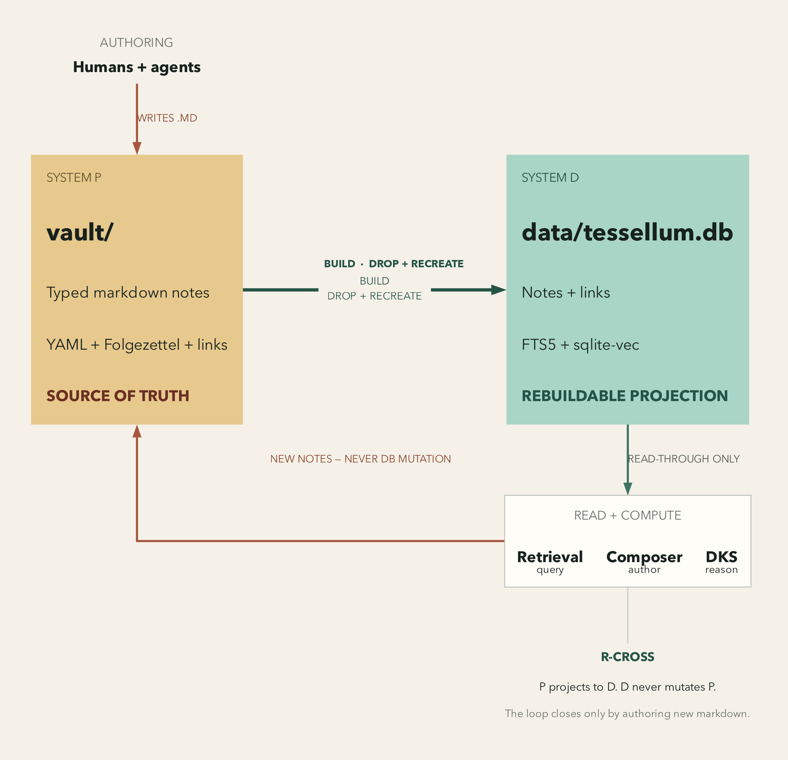
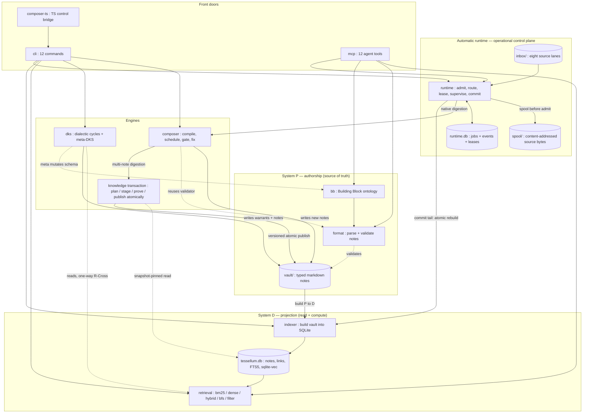

# Tessellum 1.8.0 — System Architecture

## 1. What Tessellum is

Tessellum builds knowledge the way a mind does — by writing atomic, typed thoughts and then indexing them so they can be found again. It is a knowledge-construction system, and its shape is a CQRS split: one side is written, the other side is read and computed. The written side is a vault of markdown notes. The read side is a database projected from that vault, plus the machinery that searches and reasons over it. The two sides are named System P and System D, and the arrow between them points one way. Everything else in this document is a consequence of that arrow.

The essential idea is that authorship and computation live on opposite sides of a wall. Humans and agents write notes; nothing writes back over their heads. An automatic runtime may coordinate how new source material reaches an authoring engine, but its queue is operational state, not knowledge. This is what makes the system trustworthy: there is exactly one source of truth for knowledge, and it is human-legible.

## 2. The two systems

System P is the substrate. It is the `vault/` directory of typed markdown notes. Each note carries YAML frontmatter — its building block type, its Folgezettel position, its tags, the schema version it was born under — and a body woven with plain `[text](path.md)` links. Notes are authored by humans and by agents. The vault is the single source of truth. No part of the system writes vault-authoritative state from anywhere else.

System D is the projection. It is one SQLite database, built from the vault, together with the retrieval, composer, and DKS layers that read it. Its schema is defined once, in `indexer/schema.sql`. The database holds nothing the vault does not already imply; it is the vault made queryable.

The flow between them runs one way, P to D, and only one way. The index is a pure projection: the build step is idempotent and drops-and-recreates the database on every run, so the DB can never drift from the vault by accumulating edits. The database wrapper is deliberately read-oriented — its own docstring tells any caller who wants to change a row to rebuild instead of mutate. The DKS side states this law by name as **R-Cross**: System P calls System D, but System D never calls System P. The read-through client it exposes has no path back.



There is one feedback arrow, and it does not break the law. The composer and DKS engines read System D, then write brand-new markdown into System P. They author notes; they never claim authority in the database. On the next build, the vault they wrote is re-projected. So the loop closes through the substrate, never around it.

The automatic runtime sits outside this P/D authority split. It owns a second SQLite database, `runs/runtime/runtime.db`, but that database is a durable work queue and event journal, not the knowledge projection. It spools source bytes before recording work, leases jobs to Composer workers, and invokes an atomic P-to-D index rebuild only after Composer has authored notes. Losing runtime state can lose pending work history; it cannot change the meaning or authority of notes already in the vault.

## 3. The subsystem map

Read the system from the ground up, and it stacks in layers. At the bottom sit two primitives. Above them, projection. Above that, the ways of reading. At the top, two knowledge engines, an operational runtime, and the front doors.



Solid arrows carry data, control, or authored notes; dotted arrows mean *uses* or *reads* — a check, a query, a schema edit — never a write to someone else's source of truth. Three facts jump out of the picture. First, `bb` and `format` guard the P side: the ontology defines what may exist, the validator enforces it. Second, the engines close a loop through the substrate — they read System D and write new notes back into System P, which the next build re-projects. Third, the runtime can repeat and recover that loop because its operational records are separate from both the vault and its read projection. The knowledge loop never runs around the vault; it always runs through it.

The `bb` subsystem is the ontology of Building Blocks. It fixes what kinds of thought exist and how they may connect. `bb/types.py` is the source of truth for the eight BB types and the roughly sixteen typed edges between them; `bb/graph.py` is the corpus view — the actual instances, streamed from the index. The `format` subsystem is the gatekeeper on the P side: it parses a note into frontmatter and body, validates it against the YAML spec and the link and edge rules, and checks its links. Nothing enters the vault well-formed by accident; `format` is where form is enforced.

The `indexer` is the projector — it walks the vault and writes every table in one transaction. `retrieval` offers five ways to find a note. The `composer` compiles a skill into a typed pipeline and runs it. `dks` runs dialectic reasoning cycles that grow the vault. The automatic `runtime` admits inbox files and supervises native Composer digestion under durable leases. And three surfaces expose all of this: `cli`, twelve top-level commands for humans; `mcp`, twelve stdio tools for agents; and `composer-ts`, a thin TypeScript bridge over the composer — a control-flow shell, not a reimplementation.

## 4. The memory model

The deepest idea in Tessellum is where authority lives. It lives in the vault, and nowhere else. Everything the system stores beyond the vault is either a projection that can be rebuilt from it, or a log that merely records how the present was reached.

| Store | Kind | Rebuildable from | Authority |
|---|---|---|---|
| `vault/` markdown | **source of truth** | — | authoritative |
| `data/tessellum.db` | derived projection | vault (`index build`, drop+recreate) | never authoritative |
| composer resume manifest | durable projection | not fully rebuildable for verified skip | never authoritative |
| `runs/runtime/runtime.db` | operational queue + event journal | not fully rebuildable | authoritative only for in-flight coordination |
| `runs/runtime/spool/` | content-addressed admitted source bytes | original inbox source, while present | authoritative payload for an admitted job |
| `runs/runtime/artifacts/` | execution records + Composer resume data | source + vault, partially | never knowledge-authoritative |
| `runs/runtime/archive/` | source acknowledgement by completed job | spool | operational history |
| DKS `warrant_history.jsonl`, `schema_events.jsonl` | append-only logs (in `runs/`, outside vault + package) | — (log, not state) | event history |

The index database is the obvious projection: drop it, rebuild it, lose nothing. The subtler one is the composer's resume manifest, which tracks how far a long pipeline got. It is not knowledge authority. A surviving valid manifest can verify artifact identity and skip work; losing it is safe but forfeits that optimization, so work re-executes rather than trusting existence-only vault output. The DKS logs are event-sourced history.

Runtime state is deliberately different. A queue cannot be reconstructed from committed notes because it must also remember work that has not committed. `runtime.db` is therefore operationally authoritative for job ownership, cancellation, retry timing, and history, while the spool is authoritative for the exact payload of an admitted job. Neither is allowed to define knowledge. The lesson is more precise than “everything can be thrown away”: only the vault defines knowledge; projections are rebuildable; operational state is durable so unattended work can recover without becoming a second knowledge authority.

## 5. The Composer-v4 engine

The composer turns a skill — a written procedure — into a running pipeline that materializes notes. Its governing principle is that all structure is resolved before any money is spent. A skill is one self-contained markdown note: each pipeline step is an H2 section carrying a typed contract block and, right below it, the step's prompt prose. Compilation is pure logic, zero LLM calls: it reads those per-section contract blocks, validates the step contracts, topologically sorts the steps by their dependencies, catches cycles and forward references, and emits a typed DAG. If the pipeline is structurally broken, it fails here — deterministically, cheaply, before a single model is invoked.

Execution then flows through five stages.

```
 compile ─► schedule ─► gate ─► fix ─► observe
 (compiler) (scheduler) (gates) (fix)  (manifest / eval / signoff)
```

Compilation produces the DAG and dispatches nothing. Scheduling runs it — either serially, as the reference path, or wave-parallel, as the opt-in fast path. Each step resolves its placeholders, dispatches to a backend under a watchdog, validates the response against a schema, and hands the result to a materializer. Gating checks the work. Fixing repairs what fails a gate, without ever making it worse — it checkpoints the note's bytes before each attempt and keeps the best-scoring version. Observing records what happened: the manifest for resume, the evaluator for structural assertions and a judged rubric, the signoff ladder for approval, the credential pool for key rotation and run budgets.

Two lines are load-bearing here. The gates are pure programs and never call a model — when a gate needs a semantic judgment, it consumes a verdict a verifier already produced, rather than judging for itself. And the LLM lives only where it must: inside the fixer callable and inside the backends, injected by the caller, never buried in the control logic. The engine orchestrates; the model only produces content the engine then checks.

## 5.1 The knowledge-transaction track

The composer can also write many notes at once, and when it does it treats the whole digestion as a single transaction rather than a stream of independent writes. This is the knowledge-transaction track — an additive, opt-in layer, built in phases P0 through P9, that plans typed edits, stages them beside the live index, proves them safe, and makes them visible to readers atomically. Like every fast-path feature in Tessellum, it is byte-identical when its paths are off, so the single-note authoring above is unchanged until a caller asks for a transaction.

A transaction begins as typed proposals that compose into a plan — a graph of note intents, each carrying its one building block, its cited spans, the entry points it joins, and the backlinks it owes. The plan is staged into an overlay that layers the pending changes over System D without mutating it, so every gate reads exactly the view promotion will publish. From the intents alone the system derives the exact set of rows that must commit, and a boundary proof rejects any edge that would carry a write outside that set. Two gates then stand between plan and publish: a structural suite of pure-program checks that must pass, and a calibrated semantic certificate that either clears a capsule inside a measured domain or defers to a human sign-off. Publication writes an immutable generation and swaps one pointer under a lock, so a reader sees a whole generation or nothing, and a transaction planned against a base that has since moved is refused rather than allowed to lose an update.

The track sharpens the one feedback arrow rather than bending it. It reads System D through a pinned snapshot and writes only new markdown into System P — exactly the R-Cross discipline the rest of the system obeys — with the atomic pointer swap standing in as the authoring seam made transactional. It also mirrors, one layer up, what the automatic runtime already does at commit time: the runtime's atomic index replacement and effect journal and the transaction's versioned publication are the same fail-closed, crash-recoverable publication idea, applied to the projection and to the vault respectively. One caveat keeps this accurate — the track is built, verified, and additive, but it is not yet the runtime's live commit path; a runtime digestion still publishes note by note through the commit tail, and wiring the versioned publication in as the accept point is the single deferred step. See [digestion.md](digestion.md) for the end-to-end digestion flow, [composer.md](composer.md#the-knowledge-transaction) for the phase-by-phase design, and [reference/composer.md](reference/composer.md#knowledge-transaction-track-p0p9) for the exact APIs.

## 6. The DKS engine

DKS is the Dialectic Knowledge System — the part of Tessellum that thinks. Where the composer executes a written procedure, DKS runs a reasoning cycle and deposits its conclusions back into the vault as a Folgezettel subtree. One cycle is a closed seven-component loop: an observation, then several sibling arguments, then the disagreements between them as edges, then a counter, then a pattern, then one or more revised warrants. A runner threads many such cycles together, carrying warrant changes forward from one to the next. Each cycle leaves a small, typed argument-tree behind in System P.

The engine has two additive refinements, both designed to change nothing they touch. Confidence gating lets a cycle short-circuit: when confidence is high, it emits just an observation and a single argument, skipping most of the loop and saving most of the backend round-trips; when confidence is low, the full dialectic runs. Dung argumentation handles genuine multi-perspective conflict: when more than two views produce a graph of contradiction edges, grounded labelling decides which arguments survive, using Dung's grounded semantics. For the two-perspective case it collapses back to the original single-edge outcome — a strict extension, never a replacement. A generic FSM walker over the schema offers an alternative dispatcher for the same components, again leaving the core cycle untouched.

## 6.1 The automatic runtime

The runtime makes native Composer digestion continuously operable. Admission first confines a stable file to one of eight explicit inbox lanes, writes and verifies its bytes in a SHA-256-addressed spool, and only then creates an idempotent job. Every lane currently routes without an LLM to the same pinned `native_digestion` capability; lane metadata supplies source-kind and optional building-block hints, while a digest of the four phase skills records the routed procedure.

SQLite owns the operational state machine and ordered job events. Claims run transactionally, carry an owner plus monotonically increasing lease generation, and are extended by heartbeats. Owner-and-generation checks fence stale workers. Expired execution claims return to `ready` when routing metadata is complete or `admitted` when routing must be repaired; expired commit claims stay `committing` and resume only the idempotent commit tail. Separate bounded execution and commit attempts dead-letter exhausted work. Composer's finer-grained manifest then avoids redoing execute leaves whose committed artifacts still verify. The runtime's lease generation identifies process ownership, while Composer's execution generation identifies logical output identity.

Execution invokes the native `plan → augment → review → execute` digestion driver, not a shell command or generic heuristic tool router. The first three phases are linear; execute fans planned notes out through the dynamic Composer scheduler. Cancellation is cooperative between phases and leaf dispatches. Retryable failures reuse Composer's error classes and full-jitter ladder; terminal failures retain their payload and artifacts in `dead_letter`, and an operator retry creates a linked successor instead of rewriting history.

Completion is an ordered commit tail. A cross-process live-vault lock spans crash-journal recovery and Composer authoring through temporary index construction — the dense vector surface is now built on the live path (fail-soft to a BM25-only index if the encoder is unavailable, surfaced as `dense_degraded`, never silent) — and atomic publication, so another runtime job cannot index partial output. Before mutation, a durable generation-scoped effect journal fsyncs every touched path's original bytes and intended postimage hashes; recovery restores only known states and preserves unknown manual edits. Durable `committing` state is the acceptance decision across a crash before journal cleanup. The runtime verifies and archives admitted spool bytes, atomically quarantines and verifies the inbox source before acknowledgement, replays and fsyncs a job-owned quarantine after interruption, and marks the job complete last. Lease guards fence vault publication, manifest saves, index publication, and acknowledgement; model-supplied paths are confined to the vault. The foreground service uses deterministic polling and rescans rather than relying on filesystem events. A standalone read-only `ToolBroker` defines allowlist, schema, path, timeout, call-count, and output-size boundaries, but it is not injected into Composer and does not yet persist to the reserved `tool_calls` table. See [runtime.md](runtime.md) for the design and [reference/runtime.md](reference/runtime.md) for exact APIs.

## 7. The invariants and why they hold

The composer names its load-bearing invariants IDENT-2 through IDENT-5 in its own docstrings, but they are the spine of the whole system, not just one subsystem. Each one is a rule about how to fail, because a knowledge system is only as trustworthy as its behavior under stress.

The first is that the vault is the source of truth — **IDENT-2**. The database and resume manifest are non-authoritative projections. A lost manifest does not lose knowledge, but exact verified resume requires its computation identity and therefore falls back to safe re-execution.

The second is that gates are pure programs — **IDENT-3**. Every gate is deterministic code, and the one gate that needs a semantic verdict consumes one a verifier already produced rather than invoking a model itself. The same discipline runs through the fixer, the planner, the credential pool, and the signoff ladder: the program orchestrates, the agent or human produces the verdict. The reason is stark. A gate is a commit-check. A gate that could hallucinate a PASS would be worthless, and worse than worthless if it silently corrupted the substrate.

The third is that the serial path is byte-identical — **IDENT-4**. The serial scheduler is the reference, and it stays the default. The dynamic wave scheduler is opt-in, reached only through an explicit flag, and it is defined to produce the same vault output, the same per-leaf outcomes, and the same ordered result. Parallelism is a throughput optimization, and an optimization must never change answers. The serial path stays the ground truth to diff against.

The fourth is fail-closed — **IDENT-5**. A gate that cannot prove PASS is a FAIL. An unverifiable source is a FAIL, never a plausibility pass. A corrupt manifest falls back to the newest good backup or starts empty with a logged warning. An empty backend outcome is treated as a crash. The principle is that silent success on unproven state corrupts the substrate, and refusing is always safe.

And underneath the reasoning ontology, one more invariant makes growth possible without erasing history: the schema is closed, finite, versioned, and event-sourced. The full schema is the epistemic edges, plus navigation edges, plus DKS extensions, plus whatever the user has added — around sixteen typed edges over eight BB types. User additions are the fold over an append-only event log; retractions are first-class events, and the log is never rewritten. The schema version bumps on each landed event, and the schema can be reconstructed as of any past version, so a note always validates against the schema it was frozen under at creation. The reason is that an ontology must be able to grow under discipline without invalidating what was typed before it. Old edges stay interpretable forever.

## 8. Key modules and abstractions

| File | Role |
|---|---|
| `bb/types.py` | Source of truth for the 8 `BBType` values, `EpistemicEdgeType`, the composed `BB_SCHEMA` (~16 edges), `BB_SCHEMA_VERSION`, and event-sourced schema growth (`SchemaEditEvent`, `fold_schema_events`, `BB_SCHEMA_AT_VERSION`). |
| `bb/graph.py` | Corpus (instance) BB graph. `BBGraph.schema` = the 8-node type graph; `BBGraph.from_db` streams the vault's BB-typed notes + edges from the index (read-only). |
| `format/parser.py` | Parse a `.md` note into frontmatter + body (`parse_note`, `Note`). |
| `format/validator.py` | `validate` / `is_valid` — YAML-0xx, LINK-00x, TESS-00x rules. The vault-side gatekeeper. |
| `format/frontmatter_spec.py` | The YAML spec data (valid PARA buckets, statuses, `VALID_BUILDING_BLOCKS` derived from `BBType`, forbidden fields). |
| `indexer/schema.sql` | The one DDL: `notes`, `note_links`, `notes_vec` (vec0, 384-dim cosine), `notes_fts` (FTS5, porter+unicode61). |
| `indexer/build.py` | `build` — walk vault, parse notes, extract links w/ broken-path detection, write all four tables in one transaction. Drop+recreate (idempotent). |
| `indexer/db.py` | `Database` — read-oriented typed query wrapper (`NoteRow`, `LinkRow`). |
| `retrieval/{metadata,graph,bm25,dense,hybrid}.py` | The five retrieval surfaces (see §9). `router.py` = heuristic query→surface classifier. |
| `composer/compiler.py` | Skill canonical (per-section contract blocks) → typed `CompiledPipeline` DAG. Zero LLM. |
| `composer/contracts.py` | Typed registries: `MATERIALIZER_CONTRACTS`, `BACKEND_CONTRACTS`, `MCP_CONTRACTS`; `ContractViolation`. |
| `composer/scheduler.py` | `run_pipeline` (serial reference) + `run_pipeline_dynamic` (wave-parallel, self-claiming). |
| `composer/executor.py` | `execute_step` unit op: placeholder resolve → dispatch → schema-validate → materialize; retry ladders. |
| `composer/materializer.py` | Five materializers (no_op, body_markdown_to_file, body_markdown_frontmatter_to_file, edits_apply_to_files, edits_apply_xml_tags) — the D→P authoring seam. |
| `composer/gates.py` | One `Gate` abstraction at plan/session/wave scope. Pure predicates; never call an LLM. |
| `composer/fix.py` | Non-regressive close-gate repair (checkpoint bytes, keep best snapshot). |
| `composer/manifest.py` | Per-leaf/per-attempt verified resume ledger; safe to discard, but verified skip is not rebuildable from file existence alone. |
| `composer/llm.py` | `LLMBackend` protocol + 4 backends: `MockBackend`, `AnthropicBackend`, `BedrockBackend`, `PooledBackend`. |
| `composer/credential_pool.py` | Same-provider key pool (leasing, error-class rotation, cooldowns) + `RunBudget` (invocation/cost caps). |
| `composer/{planning,signoff,eval}.py` | Selective planning depth + $0 change-detection pre-gate; plan→execute approval ladder; scenario assertions + LLMJudge rubric. |
| `composer/{proposals,knowledge_plan,overlay,overlay_index}.py` | **Transaction P0–P3:** typed change proposals + content-addressed merge; the `NoteIntentGraph` plan + writer-leaf projection; the create-only staging overlay; the read-through `OverlayIndex` over base ⊕ delta. |
| `composer/write_closure.py` | **Transaction P4:** exact write closure from typed invariants + boundary witness + bounded validation heuristic + capsule partition. |
| `composer/publication.py` | **Transaction P5:** `VersionedVault` — three-phase atomic commit with snapshot CAS, crash recovery, and generation GC. |
| `composer/structural_gates.py` | **Transaction P6:** capsule-level structural gate suite (no LLM) + `supervised_admit` (structural pass + a capsule-bound human approval). |
| `composer/semantic_certificate.py` | **Transaction P7:** calibrated semantic certificate — pluggable scorer, per-class empirical thresholds, fail-closed abstain. |
| `composer/planner_loop.py` | **Transaction P8:** bounded planner loop with a proven halt (ℕ-valued deficit + three hard stops). |
| `runtime/{models,store}.py` / `runtime/schema.sql` | Durable job state machine, event journal, transactional claims, lease-generation fencing, retry, and cancellation. |
| `runtime/{admission,inbox,routing,policy}.py` | Stable-file spool-before-admit, deterministic eight-lane scanning/routing, and unattended policy profiles. |
| `runtime/{executor,supervisor,service,commit_tail}.py` | Native Composer digestion adapter, heartbeat supervision, polling service, atomic index replacement, and source acknowledgement. |
| `runtime/tool_broker.py` | Standalone bounded tool broker; deliberately outside Composer and not yet wired to the runtime audit table. |
| `dks/core.py` | `DKSCycle` (7-component loop) + `DKSRunner` (multi-cycle) + the 7 typed component dataclasses + FZ allocator. |
| `dks/dung.py` | `DungAF` + `grounded_labelling` — multi-perspective survivorship. |
| `dks/fsm.py` | Generic FSM walker over `BB_SCHEMA` (additive dispatcher). |
| `dks/confidence.py` | Confidence gate (`ConstantConfidence`, `CalibratedConfidence`). |
| `dks/persistence.py` | `WarrantRegistry` (current set) + `WarrantHistory` (append-only JSONL log). |
| `dks/retrieval_client.py` | R-Cross read-through client wrapping `hybrid_search`; no path back to P. |
| `cli/main.py` | Dispatcher wiring the 12 top-level subparsers; bare `tessellum` prints the capability banner. |
| `mcp/server.py` | `build_server` / `run_stdio` — 12 tools over stdio (see §9). |
| `composer-ts/src/{bridge,dag}.ts` | TS control-flow bridge: shells the composer CLI (`bridge.ts`) + pure DAG-walk helpers (`dag.ts`). Zero contract logic. |

## 9. Public surfaces

**CLI — 12 top-level subcommands** (wired in `cli/main.py`):

`init` · `format` · `capture` · `index` · `search` · `filter` · `fz` · `bb` · `composer` · `dks` · `mcp` · `runtime`.

Selected surfaces:

- `tessellum index build` — build the unified SQLite index (P→D).
- `tessellum search <query> [--bm25|--dense|--hybrid|--bfs]` — the five retrieval surfaces: **metadata** (structured filter), **bfs** (best-first BFS over `note_links`), **bm25** (FTS5 lexical), **dense** (sqlite-vec cosine over 384-dim MiniLM embeddings), **hybrid** (RRF fusion, the default). There is **no PageRank** in retrieval — the schema notes `static_ppr_score` is an *unshipped* parity column.
- `tessellum filter --tag <t> [--building-block …]` — metadata-only filtering.
- `tessellum fz {list|show|ancestors|descendants|path|all}` — Folgezettel trail explorer.
- `tessellum bb audit` — corpus BB-graph telemetry (counts, untyped edges, unrealised schema edges).
- `tessellum composer {validate|compile|run|batch|eval|scaffold-sidecar|digest}` — Composer validation, execution, authoring, evaluation, and native digestion.
- `tessellum dks <observations.jsonl>` — run a multi-cycle DKS session.
- `tessellum mcp serve` — start the stdio MCP server.
- `tessellum runtime {init|submit|work|serve|get|list|cancel|retry|doctor}` — initialize, operate, inspect, and continuously run the durable automatic-ingestion control plane.

**Python API** (banner in `cli/main.py` plus the runtime package): `from tessellum import BB_SPECS, validate, parse_note, Note, Issue`; `from tessellum.composer import load_pipeline, Pipeline, ContractViolation`; `from tessellum.indexer import build, Database`; `from tessellum.retrieval import bm25_search, dense_search, hybrid_search, best_first_bfs, metadata_search`; `from tessellum.runtime import RuntimePaths, RuntimeStore, Job, JobState, WorkRequest, admit_path`.

**MCP — 12 tools over stdio** (`mcp/server.py`, requires `[mcp]` extras): `tessellum_search`, `tessellum_format_check`, `tessellum_bb_audit`, `tessellum_fz_traverse`, `tessellum_capture`, `tessellum_get_skill`, `tessellum_list_skills`, `tessellum_submit_job`, `tessellum_get_job`, `tessellum_list_jobs`, `tessellum_cancel_job`, and `tessellum_retry_job`. The tools are deterministic Python-API wrappers (no server-side LLM); `get_skill` returns procedure text, `list_skills` returns metadata, and the five job tools operate the durable runtime store. **MCP is shipped, not deferred.**

**composer-ts bridge** (`@tessellum/composer-ts`): `compile`, `run`, `columns`, `readyFrontier`. Runs under Node's native type-stripping with zero npm dependencies.

## 10. Extension points

- **New BB edge / schema growth** — append a `SchemaEditEvent` to `runs/dks/meta/schema_events.jsonl` via `tessellum dks meta --apply` (folded into `BB_SCHEMA_USER_EXTENSIONS`); or commit a project-team edge into `BB_SCHEMA_DKS_EXTENSIONS` in `bb/types.py`. The version and per-version reconstruction follow automatically.
- **New LLM backend** — implement the `LLMBackend` protocol in `composer/llm.py` and register a `LLMBackendContract` in `composer/contracts.py:BACKEND_CONTRACTS`.
- **New materializer** — add a concrete materializer in `composer/materializer.py` and its `MaterializerContract` to `MATERIALIZER_CONTRACTS`; the compiler validates every step's `expected_output_schema` against it.
- **New gate / validator rule** — add a `Gate` predicate (`composer/gates.py`) or a new `TESS-0xx`/`YAML-0xx`/`LINK-00x` rule in `format/validator.py`. Keep it a pure program (IDENT-3).
- **New retrieval surface** — add a primitive under `retrieval/` and route to it in `retrieval/router.py`.
- **New DKS transition handler** — inject a handler for one BB edge via the `dks/fsm.py` transition-handler registry without touching cycle-level code.
- **New inbox lane** — add its explicit hint/source-kind tuple to `runtime/routing.py:LANE_HINTS` and its scaffold entry to `init.py:_INBOX_LANES`; runtime initialization and scanning derive their lane set from `LANE_HINTS`.
- **New runtime policy profile** — extend `RuntimePolicy.for_profile`; unknown profile names intentionally fail closed.
- **Runtime tools** — register a `ToolSpec` with an explicit allowlist entry. Wiring the broker into execution also requires an audit writer and a deliberate change to the current tool-free Composer boundary.
- **New MCP tool** — add a descriptor to `tool_specs` in `mcp/server.py`.
- **New CLI subcommand** — add a `cli/<name>.py` exposing `add_subparser` and wire it in `cli/main.py`.

---

**Per-module docs.** This is the map; the [digestion](digestion.md) doc traces the end-to-end `plan → augment → review → execute` flow across subsystems, and deeper per-subsystem docs (when present) live alongside each — `bb`, `format`, `indexer`, `retrieval`, `composer` (compiler/scheduler/gates/fix/manifest/llm + the P0–P9 transaction track), `runtime`, `dks`, `cli`, `mcp`, and the `composer-ts/README.md` bridge doctrine. Grounding files: `src/tessellum/{bb/types.py, indexer/schema.sql, indexer/build.py, indexer/db.py, retrieval/router.py, composer/{compiler,scheduler,gates,fix,manifest,llm,materializer,credential_pool,planning,signoff,eval,digestion}.py, runtime/{models,paths,store,admission,routing,policy,executor,supervisor,inbox,service,commit_tail,tool_broker}.py, runtime/schema.sql, dks/{core,dung,fsm,confidence,persistence,retrieval_client}.py, mcp/server.py, cli/main.py, cli/composer.py, cli/runtime.py}` and `composer-ts/README.md`.
