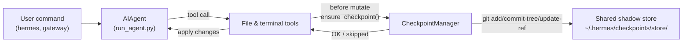

---
tags:
  - resource
  - documentation
  - hermes_agent
  - checkpoints
  - filesystem_safety
keywords:
  - checkpoints and rollback
  - shadow git store
  - checkpoint manager
  - rollback restore
  - pre-mutate snapshot
  - auto-prune retention
topics:
  - Hermes Agent
  - Filesystem Safety
language: markdown
date of note: 2026-06-19
status: active
building_block: procedure
source_url: https://hermes-agent.nousresearch.com/docs/user-guide/checkpoints-and-rollback
access_control_group: ["general"]
---

# Hermes Agent — Checkpoints and `/rollback`

## Overview

Checkpoints are Hermes Agent's **opt-in filesystem safety net**: before a destructive operation, the agent can automatically snapshot the project and later restore it with a single `/rollback` command. The mechanism is a single shared **shadow git repository** under `~/.hermes/checkpoints/store/` managed by an internal **Checkpoint Manager** — your real project `.git` is never touched, and git's content-addressable object DB deduplicates snapshots across projects and turns. As of v2 checkpoints default to **off** (most users never need `/rollback` and the shadow store is non-trivial over time), so they are enabled per-session with `--checkpoints` or globally in config. This note documents the user-facing surface: what triggers a snapshot, the `/rollback` slash + `hermes checkpoints` CLI commands, the config knobs, restore behavior, the safety/performance guards, the store layout, and v1→v2 migration.

## Enabling Checkpoints

Enable checkpoints per-session with `--checkpoints`:

```bash
hermes chat --checkpoints
```

Or enable globally in `~/.hermes/config.yaml`:

```yaml
checkpoints:
  enabled: true
```

The safety net is powered by a **Checkpoint Manager** that keeps a single shared shadow git repository under `~/.hermes/checkpoints/store/` — the real project `.git` is never touched. Every project the agent works in shares the same store, so git's content-addressable object DB deduplicates across projects and across turns.

## What Triggers a Checkpoint

Checkpoints are taken automatically before:

- **File tools** — `write_file` and `patch`
- **Destructive terminal commands** — `rm`, `rmdir`, `cp`, `install`, `mv`, `sed -i`, `truncate`, `dd`, `shred`, output redirects (`>`), and `git reset`/`clean`/`checkout`

The agent creates **at most one checkpoint per directory per turn**, so long-running sessions don't spam snapshots.

## Quick Reference

In-session slash commands:

| Command | Description |
|---------|-------------|
| `/rollback` | List all checkpoints with change stats |
| `/rollback <N>` | Restore to checkpoint N (also undoes last chat turn) |
| `/rollback diff <N>` | Preview diff between checkpoint N and current state |
| `/rollback <N> <file>` | Restore a single file from checkpoint N |

CLI for inspecting and managing the store outside a session:

| Command | Description |
|---------|-------------|
| `hermes checkpoints` | Show total size, project count, per-project breakdown |
| `hermes checkpoints status` | Same as bare `checkpoints` |
| `hermes checkpoints list` | Alias for `status` |
| `hermes checkpoints prune` | Force a sweep: delete orphans/stale, GC, enforce size cap |
| `hermes checkpoints clear` | Nuke the entire checkpoint base (asks first) |
| `hermes checkpoints clear-legacy` | Delete only the `legacy-*` archives from v1 migration |

## How Checkpoints Work

At a high level, Hermes detects when tools are about to **modify files** in the working tree. Once per conversation turn (per directory), it resolves a reasonable project root for the file, initialises or reuses the **single shared shadow store** at `~/.hermes/checkpoints/store/`, stages into a per-project index, builds a tree, and commits to a per-project ref (`refs/hermes/<project-hash>`). These per-project refs form a checkpoint history that you can inspect and restore via `/rollback`.



## Configuration

Configure in `~/.hermes/config.yaml`:

```yaml
checkpoints:
  enabled: false              # master switch (default: false — opt-in)
  max_snapshots: 20           # max checkpoints per project (enforced via ref rewrite + gc)
  max_total_size_mb: 500      # hard cap on total store size; oldest commits dropped
  max_file_size_mb: 10        # skip any single file larger than this

  # Auto-maintenance (on by default): sweep ~/.hermes/checkpoints/ at startup
  # and delete project entries whose working directory no longer exists
  # (orphans) or whose last_touch is older than retention_days. Runs at most
  # once per min_interval_hours, tracked via a .last_prune marker.
  auto_prune: true
  retention_days: 7
  delete_orphans: true
  min_interval_hours: 24
```

When `enabled: false`, the Checkpoint Manager is a no-op and never attempts git operations. When `auto_prune: false`, the store grows until you run `hermes checkpoints prune` manually.

## Listing and Inspecting

From a CLI session, `/rollback` returns a formatted list showing change statistics (commit hash, timestamp, the operation that triggered the snapshot, and a `(N file, +x/-y)` change stat), followed by the three `/rollback` usage lines.

From the shell, `hermes checkpoints` reports the checkpoint base path, total size (broken into `store/` and `legacy-*`), the project count, and a per-project table of `WORKDIR / COMMITS / LAST TOUCH / STATE` (where `STATE` is `live` or `orphan`), plus any legacy archives with a `Clear with: hermes checkpoints clear-legacy` hint. A full sweep that ignores the 24h idempotency marker is forced with flags:

```bash
hermes checkpoints prune --retention-days 3 --max-size-mb 200
```

## Previewing and Restoring

Before committing to a restore, preview what has changed since a checkpoint with `/rollback diff <N>` (e.g. `/rollback diff 1`), which shows a git diff stat summary followed by the actual diff.

Restoring with `/rollback <N>` (e.g. `/rollback 1`) runs, behind the scenes:

1. Verifies the target commit exists in the shadow store.
2. Takes a **pre-rollback snapshot** of the current state so you can "undo the undo" later.
3. Restores tracked files in your working directory.
4. **Undoes the last conversation turn** so the agent's context matches the restored filesystem state.

**Single-file restore** (`/rollback <N> <file>`, e.g. `/rollback 1 src/broken_file.py`) recovers just one file from a checkpoint without affecting the rest of the directory.

## Safety and Performance Guards

- **Git availability** — if `git` is not found on `PATH`, checkpoints are transparently disabled.
- **Directory scope** — Hermes skips overly broad directories (root `/`, home `$HOME`).
- **Repository size** — directories with more than 50,000 files are skipped.
- **Per-file size cap** — files larger than `max_file_size_mb` (default 10 MB) are excluded from the snapshot. Prevents accidentally swallowing datasets, model weights, or generated media.
- **Total store size cap** — when the store exceeds `max_total_size_mb` (default 500 MB), the oldest commit per project is dropped round-robin until under the cap.
- **Real pruning** — `max_snapshots` is enforced by rewriting the per-project ref and running `git gc --prune=now` afterwards, so loose objects don't accumulate.
- **No-change snapshots** — if there are no changes since the last snapshot, the checkpoint is skipped.
- **Non-fatal errors** — all errors inside the Checkpoint Manager are logged at debug level; your tools continue to run.

## Where Checkpoints Live

```text
~/.hermes/checkpoints/
  ├── store/                 # single shared bare git repo
  │   ├── HEAD, objects/     # git internals (shared across projects)
  │   ├── refs/hermes/<hash> # per-project branch tip
  │   ├── indexes/<hash>     # per-project git index
  │   ├── projects/<hash>.json  # workdir + created_at + last_touch
  │   └── info/exclude
  ├── .last_prune            # auto-prune idempotency marker
  └── legacy-<ts>/           # archived pre-v2 per-project shadow repos
```

Each `<hash>` is derived from the absolute path of the working directory. You normally never need to touch these manually — use `hermes checkpoints status` / `prune` / `clear` instead.

### Migration from v1

Before the v2 rewrite, each working directory got its own complete shadow git repo directly under `~/.hermes/checkpoints/<hash>/`. That layout couldn't dedup objects across projects and had a documented no-op pruner — the store would grow without bound. On first v2 run, any pre-v2 shadow repos are moved into `~/.hermes/checkpoints/legacy-<timestamp>/` so the new single-store layout starts clean. Old `/rollback` history is still reachable by manually inspecting the legacy archive with `git`; once you're confident you don't need it, `hermes checkpoints clear-legacy` reclaims the space. Legacy archives are also swept by `auto_prune` after `retention_days`.

## Best Practices

- **Enable checkpoints only when you need them** — `hermes chat --checkpoints` or per-profile `enabled: true`.
- **Use `/rollback diff` before restoring** — preview what will change to pick the right checkpoint.
- **Use `/rollback` instead of `git reset`** when you want to undo agent-driven changes only.
- **Check `hermes checkpoints status` occasionally** if you use checkpoints regularly — shows which projects are active and what the store costs you.
- **Combine with Git worktrees** for maximum safety — keep each Hermes session in its own worktree/branch, with checkpoints as an extra layer. For running multiple agents in parallel on the same repo, see the guide on Git worktrees.

**Source**: `inbox/hermes_agent_docs/user-guide/checkpoints-and-rollback.md` · https://hermes-agent.nousresearch.com/docs/user-guide/checkpoints-and-rollback
**Last Updated**: 2026-06-19
**Status**: Active
