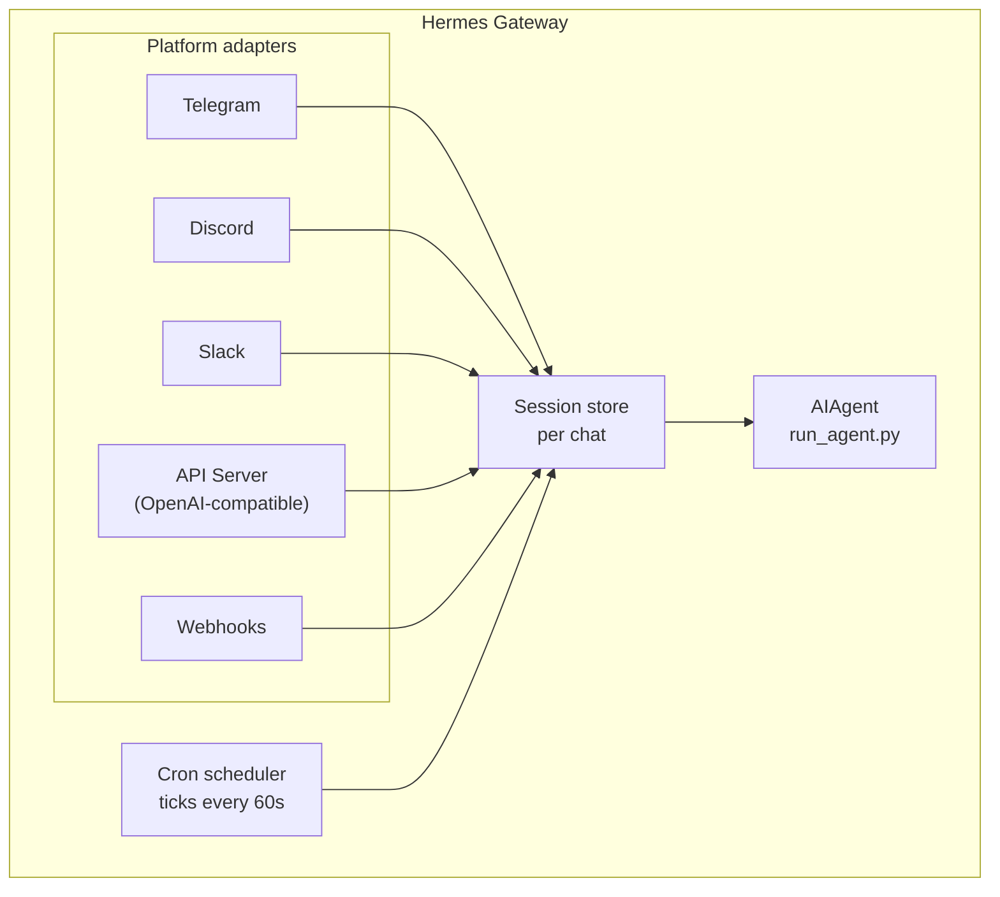

---
tags:
  - resource
  - documentation
  - hermes_agent
  - messaging
  - architecture
keywords:
  - messaging gateway
  - platform adapters
  - per-chat session store
  - intentional silence tokens
  - reset policies
  - platform capability matrix
topics:
  - Hermes Agent
  - Messaging Gateway
language: markdown
date of note: 2026-06-19
status: active
building_block: model
source_url: https://hermes-agent.nousresearch.com/docs/user-guide/messaging/
access_control_group: ["general"]
---

# Hermes Messaging Gateway — Architecture

## Overview

The **Messaging Gateway** is a single background process that bridges 20+ chat platforms to the Hermes agent. It lets you chat with Hermes from Telegram, Discord, Slack, WhatsApp, Signal, SMS, Email, Home Assistant, Mattermost, Matrix, DingTalk, Feishu/Lark, WeCom, Weixin, BlueBubbles (iMessage), QQ, Yuanbao, Microsoft Teams, LINE, ntfy, or a browser — and, via the API server, from any OpenAI-compatible frontend. The one process "connects to all your configured platforms, handles sessions, runs cron jobs, and delivers voice messages." This note is the **model** for that gateway: how each platform adapter fans into a shared per-chat session store and the AIAgent, the platform capability matrix, the intentional-silence-token mechanism, per-platform session reset policies, and the per-platform toolset map. Day-2 operations (setup, commands, security, service management, multi-platform ops) live in the sibling [hermes_gateway_operations](hermes_gateway_operations.md) procedure, and the per-chat session-store internals (session keys, FTS5 storage) are owned by SP02's `hermes_session_search_storage` — link-outs, not re-explained here.

The voice feature set (CLI microphone mode, spoken replies in messaging, Discord voice-channel conversations) is documented separately under Voice Mode (SP08); a [Nous Portal](https://hermes-agent.nousresearch.com/docs/integrations/nous-portal) subscription bundles the model provider plus the TTS/web tool providers a bot needs (SP14).

## Platform Comparison

Each platform adapter supports a different subset of rich-chat capabilities. The capability matrix below enumerates the columns the gateway model tracks per platform — Voice (TTS audio replies and/or voice-message transcription), Images (send/receive), Files (send/receive attachments), Threads (threaded conversations), Reactions (emoji reactions), Typing (typing indicator while processing), and Streaming (progressive message updates via editing):

| Platform | Voice | Images | Files | Threads | Reactions | Typing | Streaming |
|----------|:-----:|:------:|:-----:|:-------:|:---------:|:------:|:---------:|
| Telegram | ✅ | ✅ | ✅ | ✅ | — | ✅ | ✅ |
| Discord | ✅ | ✅ | ✅ | ✅ | ✅ | ✅ | ✅ |
| Slack | ✅ | ✅ | ✅ | ✅ | ✅ | ✅ | ✅ |
| Google Chat | — | ✅ | ✅ | ✅ | — | ✅ | — |
| WhatsApp | — | ✅ | ✅ | — | — | ✅ | ✅ |
| Signal | — | ✅ | ✅ | — | — | ✅ | ✅ |
| SMS | — | — | — | — | — | — | — |
| Email | — | ✅ | ✅ | ✅ | — | — | — |
| Home Assistant | — | — | — | — | — | — | — |
| Mattermost | ✅ | ✅ | ✅ | ✅ | — | ✅ | ✅ |
| Matrix | ✅ | ✅ | ✅ | ✅ | ✅ | ✅ | ✅ |
| DingTalk | — | ✅ | ✅ | — | ✅ | — | ✅ |
| Feishu/Lark | ✅ | ✅ | ✅ | ✅ | ✅ | ✅ | ✅ |
| WeCom | ✅ | ✅ | ✅ | — | — | — | — |
| Weixin | ✅ | ✅ | ✅ | — | — | ✅ | ✅ |
| BlueBubbles | — | ✅ | ✅ | — | ✅ | ✅ | — |
| QQ | ✅ | ✅ | ✅ | — | — | ✅ | — |
| Yuanbao | ✅ | ✅ | ✅ | — | — | ✅ | ✅ |
| Microsoft Teams | — | ✅ | — | ✅ | — | ✅ | — |
| LINE | — | ✅ | ✅ | — | — | ✅ | — |
| ntfy / Raft | — | — | — | — | — | — | — |

(Telegram, Discord, Slack, Matrix, and Feishu/Lark are the most feature-complete; SMS, Home Assistant, ntfy, and Raft are minimal/wake-only surfaces.)

## Architecture

Each platform adapter receives messages, routes them through a per-chat session store, and dispatches them to the AIAgent (`run_agent.py`) for processing. The gateway also runs the cron scheduler, ticking every 60 seconds to execute any due jobs. The architecture is an event-driven fan-in: every `<platform> --> store` edge feeds the same session store, the store dispatches into the single AIAgent, and the cron node feeds the store on its 60s tick:



(The full source diagram lists all 20+ adapters — Telegram, Discord, WhatsApp, Slack, Google Chat, Signal, SMS, Email, Home Assistant, Mattermost, Matrix, DingTalk, Feishu/Lark, WeCom, WeCom Callback, Weixin, BlueBubbles, QQ, Yuanbao, Microsoft Teams — plus the API Server and Webhooks; each has its own `--> store` edge. Curated above to the load-bearing structure.)

## Intentional Silence Tokens

For group chats, hooks, and automation flows, Hermes supports explicit silence tokens. If the agent's final response is exactly one supported token, the gateway suppresses outbound delivery and sends nothing to the chat. Supported tokens: `[SILENT]`, `SILENT`, `NO_REPLY`, and `NO REPLY`.

Whitespace and case are normalized, but the *whole* final response must be the token — a sentence like "Use `[SILENT]` when nothing changed" is delivered normally. Silence is a **delivery decision only**: Hermes keeps the assistant silence turn in the session transcript, so the conversation still alternates normally:

```text
user: side-channel chatter
assistant: [SILENT]   # stored, not delivered
user: next message
```

Failed turns still surface as errors; Hermes does not hide failures just because the text resembles a silence token.

## Session Management

### Session Persistence

Sessions persist across messages until they reset — the agent remembers your conversation context. The per-chat session-key derivation and the FTS5-backed transcript storage internals are owned by SP02 (`hermes_session_search_storage`); this model only frames the session as the unit of per-chat state.

### Reset Policies

Sessions reset based on configurable policies — Daily (reset at a specific hour each day, default 4:00 AM), Idle (reset after N minutes of inactivity, default 1440 min), or Both (whichever triggers first). Configure per-platform overrides in `~/.hermes/gateway.json`:

```json
{
  "reset_by_platform": {
    "telegram": { "mode": "idle", "idle_minutes": 240 },
    "discord": { "mode": "idle", "idle_minutes": 60 }
  }
}
```

The `config.yaml` gateway knobs governing reset/silence/media behavior are owned by SP02 (`hermes_messaging_media_settings`) — link-out, not duplicated here.

## Platform-Specific Toolsets

Each platform has its own toolset, which determines the agent capabilities exposed through that surface. Most chat platforms get a "full tools including terminal" toolset; a few diverge:

| Platform | Toolset | Capabilities |
|----------|---------|--------------|
| CLI | `hermes-cli` | Full access |
| Telegram | `hermes-telegram` | Full tools including terminal |
| Discord | `hermes-discord` | Full tools including terminal |
| Slack | `hermes-slack` | Full tools including terminal |
| Home Assistant | `hermes-homeassistant` | Full tools + HA device control (`ha_list_entities`, `ha_get_state`, `ha_call_service`, `ha_list_services`) |
| API Server | `hermes-api-server` | Full tools (drops `clarify`, `send_message`, `text_to_speech` — programmatic access has no interactive user) |
| Raft | `hermes-raft` | Wake-only channel; agent uses Raft CLI for message I/O |

(Most platforms — WhatsApp, Signal, SMS, Email, Mattermost, Matrix, DingTalk, Feishu/Lark, WeCom, Weixin, BlueBubbles, QQBot, Yuanbao, Microsoft Teams, Webhooks — each map to a `hermes-<platform>` toolset granting full tools including terminal. The detailed per-tool toolset reference is owned by SP21.)

**Source**: `inbox/hermes_agent_docs/user-guide/messaging/index.md` · https://hermes-agent.nousresearch.com/docs/user-guide/messaging/
**Last Updated**: 2026-06-19
**Status**: Active
