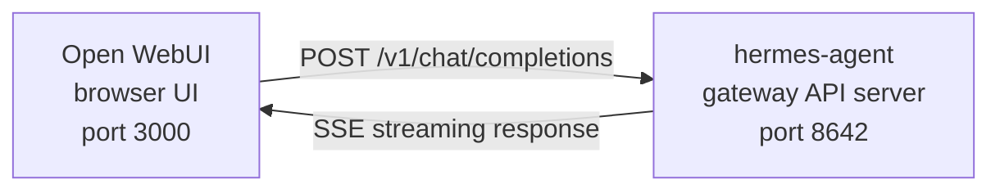

---
tags:
  - resource
  - documentation
  - hermes_agent
  - messaging
  - web_frontend
keywords:
  - open webui integration
  - openai-compatible api server
  - chat completions vs responses
  - host.docker.internal
  - multi-user profiles
  - inline tool progress streaming
topics:
  - Hermes Agent
  - Messaging
language: markdown
date of note: 2026-06-19
status: active
building_block: procedure
source_url: https://hermes-agent.nousresearch.com/docs/user-guide/messaging/open-webui
access_control_group: ["general"]
---

# Hermes Agent — Open WebUI Integration

## Overview

Open WebUI integration is a **setup procedure** that puts the self-hosted Open WebUI chat interface in front of a Hermes Agent through Hermes' built-in OpenAI-compatible API server. Open WebUI (a 126k★ self-hosted AI chat UI) connects to Hermes exactly as it would connect to OpenAI: you enable the `API_SERVER_*` settings, start the gateway so the API server listens on port `8642`, then point Open WebUI's `OPENAI_API_BASE_URL` at `http://<host>:8642/v1` with a matching bearer key. The result is conversation management, user accounts, and a modern chat interface on top of the agent's full toolset.

The key thing to understand is that the API server is a **Hermes agent runtime, not a pure LLM proxy**. For each request Hermes creates a server-side `AIAgent` on the API-server host, so tool calls (`pwd`, file operations, browser, local MCP, web search) run **where the API server is running** — if Open WebUI on a laptop points at a remote Hermes API server, those tools execute on the remote host, not the laptop. Open WebUI talks to Hermes server-to-server, so `API_SERVER_CORS_ORIGINS` is not needed for this integration. This note owns ALL sections of the `open-webui.md` source page; the API-server feature itself routes to SP09, profiles to SP04, and Docker sandboxing to SP03.

## Architecture

Open WebUI's browser UI (port 3000) POSTs OpenAI-format requests to the Hermes gateway API server (port 8642), which streams the response back over SSE:



Hermes handles the requests with its full toolset — terminal, file operations, web search, memory, skills — and returns the final response. Because the API server is a runtime (not a proxy), the toolset runs on the API-server host. A future split-runtime "remote brain, local hands" mode is tracked upstream but is **not** the behavior of the current API server.

## Quick Setup

### One-command local bootstrap (macOS/Linux, no Docker)

For a reusable local launcher wiring Hermes + Open WebUI together, run `bash scripts/setup_open_webui.sh` from `~/.hermes/hermes-agent`. The script ensures `~/.hermes/.env` contains `API_SERVER_ENABLED`, `API_SERVER_HOST`, `API_SERVER_KEY`, `API_SERVER_PORT`, and `API_SERVER_MODEL_NAME`; restarts the Hermes gateway so the API server comes up; installs Open WebUI into `~/.local/open-webui-venv`; writes a launcher at `~/.local/bin/start-open-webui-hermes.sh`; and installs a background user service (`launchd` on macOS, `systemd --user` on Linux). Defaults: Hermes API `http://127.0.0.1:8642/v1`, Open WebUI `http://127.0.0.1:8080`, advertised model name `Hermes Agent`. Overrides like `OPEN_WEBUI_NAME`, `OPEN_WEBUI_ENABLE_SIGNUP`, and `HERMES_API_MODEL_NAME` are passed as env vars; on a headless SSH box without a working `systemd --user` session, pass `OPEN_WEBUI_ENABLE_SERVICE=false` to skip service installation.

### Manual setup (5 steps)

**1. Enable the API server** — `hermes config set` auto-routes the flag to `config.yaml` and the secret to `~/.hermes/.env`. If the gateway is already running, restart it (`hermes gateway stop && hermes gateway`):

```bash
hermes config set API_SERVER_ENABLED true
hermes config set API_SERVER_KEY your-secret-key
```

**2. Start the gateway** with `hermes gateway`; you should see `[API Server] API server listening on http://127.0.0.1:8642`.

**3. Verify the API server is reachable** — `/health` should return `{"status": "ok"}` and `/v1/models` should list `hermes-agent`:

```bash
curl -s http://127.0.0.1:8642/health
# {"status": "ok", ...}

curl -s -H "Authorization: Bearer your-secret-key" http://127.0.0.1:8642/v1/models
# {"object":"list","data":[{"id":"hermes-agent", ...}]}
```

If `/health` fails, the gateway didn't pick up `API_SERVER_ENABLED=true` — restart it. If `/v1/models` returns `401`, the `Authorization` header doesn't match `API_SERVER_KEY`.

**4. Start Open WebUI** in Docker, pointing it at the Hermes API. `ENABLE_OLLAMA_API=false` suppresses the default Ollama backend (which otherwise clutters the model picker). First launch takes 15–30s while Open WebUI downloads ~150MB of sentence-transformer embedding models:

```bash
docker run -d -p 3000:8080 \
  -e OPENAI_API_BASE_URL=http://host.docker.internal:8642/v1 \
  -e OPENAI_API_KEY=your-secret-key \
  -e ENABLE_OLLAMA_API=false \
  --add-host=host.docker.internal:host-gateway \
  -v open-webui:/app/backend/data \
  --name open-webui \
  --restart always \
  ghcr.io/open-webui/open-webui:main
```

**5. Open the UI** at `http://localhost:3000`, create your admin account (the first user becomes admin), and the agent appears in the model dropdown (named after your profile, or **hermes-agent** for the default profile).

## Docker Compose Setup

For a more permanent setup, use a `docker-compose.yml` with the same base URL, key, and Ollama-disable env, then `docker compose up -d`:

```yaml
services:
  open-webui:
    image: ghcr.io/open-webui/open-webui:main
    ports:
      - "3000:8080"
    volumes:
      - open-webui:/app/backend/data
    environment:
      - OPENAI_API_BASE_URL=http://host.docker.internal:8642/v1
      - OPENAI_API_KEY=your-secret-key
      - ENABLE_OLLAMA_API=false
    extra_hosts:
      - "host.docker.internal:host-gateway"
    restart: always

volumes:
  open-webui:
```

## Configuring via the Admin UI

To configure the connection through the UI instead of env vars: log in at `http://localhost:3000`, click your **profile avatar → Admin Settings → Connections**, under **OpenAI API** click the **wrench icon** (Manage) → **+ Add New Connection**, enter the **URL** `http://host.docker.internal:8642/v1` and the **API Key** (the exact same value as `API_SERVER_KEY`), click the **checkmark** to verify, and **Save**. The agent model then appears in the dropdown.

> **Warning:** Environment variables only take effect on Open WebUI's **first launch**. After that, connection settings are stored in its internal database — to change them later use the Admin UI or delete the Docker volume and start fresh.

## API Type: Chat Completions vs Responses

Open WebUI supports two API modes when connecting to a backend:

| Mode | Format | When to use |
|------|--------|-------------|
| **Chat Completions** (default) | `/v1/chat/completions` | Recommended. Works out of the box. |
| **Responses** (experimental) | `/v1/responses` | For server-side conversation state via `previous_response_id`. |

**Chat Completions** is the default and needs no extra config: Open WebUI sends standard OpenAI-format requests with the full conversation history each time, and Hermes responds accordingly.

To use the **Responses API**, edit the hermes-agent connection in **Admin Settings → Connections → OpenAI → Manage** and change **API Type** from "Chat Completions" to **"Responses (Experimental)"**, then Save. In Responses mode Open WebUI sends requests in Responses format (`input` array + `instructions`), and Hermes can preserve full tool-call history across turns via `previous_response_id`. When `stream: true`, Hermes also streams spec-native `function_call` and `function_call_output` items, enabling custom structured tool-call UI. Note that Open WebUI currently manages conversation history client-side even in Responses mode (it sends the full message history rather than using `previous_response_id`); the main advantage of Responses mode today is the structured event stream — text deltas, `function_call`, and `function_call_output` items arrive as OpenAI Responses SSE events instead of Chat Completions chunks.

## How It Works

When you send a message in Open WebUI:

1. Open WebUI sends a `POST /v1/chat/completions` request with your message and conversation history.
2. Hermes creates a server-side `AIAgent` instance using the API server's profile, model/provider config, memory, skills, and configured API-server toolsets.
3. The agent processes the request — it may call tools (terminal, file operations, web search, etc.) on the API-server host.
4. As tools execute, **inline progress messages stream to the UI** so you can see what the agent is doing (e.g. `` `💻 ls -la` ``, `` `🔍 Python 3.12 release` ``).
5. The agent's final text response streams back to Open WebUI.
6. Open WebUI displays the response in its chat interface.

The agent has access to the same tools and capabilities as that API-server Hermes instance; if the API server is remote, those tools are remote too. If you need tools to run against your **local** workspace today, run Hermes locally and point it at a pure LLM provider or OpenAI-compatible model proxy (vLLM, LiteLLM, Ollama, llama.cpp, OpenAI, OpenRouter, etc.). With streaming enabled (the default), brief inline indicators (tool emoji + key argument) appear in the response stream before the final answer.

## Configuration Reference

Hermes Agent (API server):

| Variable | Default | Description |
|----------|---------|-------------|
| `API_SERVER_ENABLED` | `false` | Enable the API server |
| `API_SERVER_PORT` | `8642` | HTTP server port |
| `API_SERVER_HOST` | `127.0.0.1` | Bind address |
| `API_SERVER_KEY` | _(required)_ | Bearer token for auth. Match `OPENAI_API_KEY`. |

Open WebUI: `OPENAI_API_BASE_URL` = Hermes Agent's API URL (include `/v1`); `OPENAI_API_KEY` must be non-empty and match `API_SERVER_KEY`.

## Troubleshooting

- **No models appear in the dropdown** — Check the URL has the `/v1` suffix (`http://host.docker.internal:8642/v1`, not just `:8642`); verify the gateway is running (`curl http://localhost:8642/health` → `{"status": "ok"}`); check model listing (`curl -H "Authorization: Bearer your-secret-key" http://localhost:8642/v1/models` should return a list with `hermes-agent`); inside Docker `localhost` means the container, so use `host.docker.internal` or `--network=host`; an empty Ollama backend shadows the picker if you omitted `ENABLE_OLLAMA_API=false`.
- **Connection test passes but no models load** — almost always the missing `/v1` suffix; Open WebUI's connection test is only a basic connectivity check and doesn't verify model listing.
- **Response takes a long time** — Hermes may be executing multiple tool calls before producing its final response; this is normal for complex queries and the response appears all at once when the agent finishes.
- **"Invalid API key" errors** — make sure `OPENAI_API_KEY` in Open WebUI matches `API_SERVER_KEY` in Hermes. Because Open WebUI persists connection settings in its own database after first launch, fixing env vars alone is not enough — update or delete the saved connection in **Admin Settings → Connections**, or reset the Open WebUI data directory.

## Multi-User Setup with Profiles

To run separate Hermes instances per user — each with its own config, memory, and skills — use profiles. Each profile runs its own API server on a different port and automatically advertises the profile name as the model in Open WebUI. Because `API_SERVER_*` are env vars (not YAML config keys), write them to each profile's `.env` (e.g. for an `alice` profile created with `hermes profile create alice`, append `API_SERVER_ENABLED=true`, `API_SERVER_PORT=8650`, and `API_SERVER_KEY=alice-secret` to `~/.hermes/profiles/alice/.env`), picking ports outside the default-platform range (`8644` webhook adapter, `8645` wecom-callback, `8646` msgraph-webhook), e.g. `8650+`.

Start each gateway (`hermes -p alice gateway &`), then in **Admin Settings → Connections → OpenAI API → Manage** add one connection per profile (Alice → `http://host.docker.internal:8650/v1` / `alice-secret`; Bob → `:8651/v1` / `bob-secret`). The model dropdown shows `alice` and `bob` as distinct models, and you can assign models to Open WebUI users via the admin panel — giving each user an isolated Hermes agent. The model name defaults to the profile name; override it with `API_SERVER_MODEL_NAME` in the profile's `.env`.

## Linux Docker (no Docker Desktop)

On Linux without Docker Desktop, `host.docker.internal` doesn't resolve by default. Three options:

```bash
# Option 1: Add host mapping
docker run --add-host=host.docker.internal:host-gateway ...

# Option 2: Use host networking
docker run --network=host -e OPENAI_API_BASE_URL=http://localhost:8642/v1 ...

# Option 3: Use Docker bridge IP
docker run -e OPENAI_API_BASE_URL=http://172.17.0.1:8642/v1 ...
```

**Source**: `inbox/hermes_agent_docs/user-guide/messaging/open-webui.md` · https://hermes-agent.nousresearch.com/docs/user-guide/messaging/open-webui
**Last Updated**: 2026-06-19
**Status**: Active
