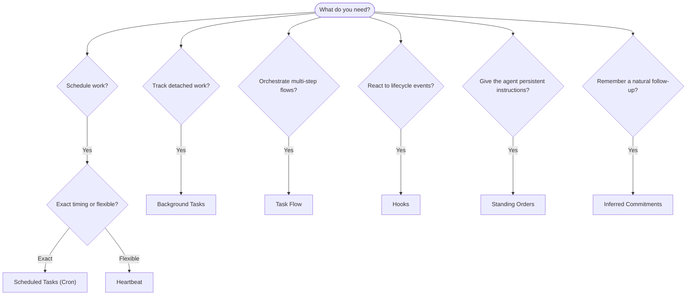

---
tags:
  - resource
  - documentation
  - openclaw
  - automation
  - background_work
keywords:
  - openclaw automation mechanisms
  - scheduled tasks cron vs heartbeat
  - inferred commitments
  - task flow orchestration
  - standing orders
  - event hooks plugin hooks
  - background tasks ledger
  - automation decision guide
topics:
  - OpenClaw
  - Automation
language: markdown
date of note: 2026-06-22
status: active
building_block: concept
source_url: https://docs.openclaw.ai/automation
access_control_group: ["general"]
---

# OpenClaw — Automation Mechanism Overview

## Overview

This note covers OpenClaw's **automation overview** page (`automation`): the mechanism chooser for running work in the background. OpenClaw runs background work through tasks, scheduled jobs, inferred commitments, event hooks, and standing instructions — and this page exists to help you pick the right mechanism and understand how they fit together. It mirrors the source page's three parts: the **Quick decision guide** (the decision flowchart plus a use-case table and a dedicated Scheduled Tasks (Cron)-vs-Heartbeat comparison), the **Core concepts** definitions of the seven mechanisms (cron, tasks, inferred commitments, Task Flow, standing orders, hooks, heartbeat), and **How they work together**.

## Quick decision guide

OpenClaw frames automation as a choice among six question-driven outcomes. The decision flowchart routes each need to a mechanism:

The source page pairs the flowchart with a use-case → mechanism table. Scheduled Tasks (Cron) is recommended for "send daily report at 9 AM sharp" (exact timing, isolated execution), "remind me in 20 minutes" (one-shot with precise timing, `--at`), and "run weekly deep analysis" (standalone task, can use a different model). Heartbeat is recommended for "check inbox every 30 min" (batches with other checks, context-aware) and "monitor calendar for upcoming events" (natural fit for periodic awareness). Inferred Commitments cover "check in after a mentioned interview" (memory-like follow-up, no exact reminder request) and "gentle care check-in after user context" (scoped to the same agent and channel). Background Tasks cover "inspect status of a subagent or ACP run" (the tasks ledger tracks all detached work) and "audit what ran and when" (`openclaw tasks list` / `openclaw tasks audit`). Task Flow covers "multi-step research then summarize" (durable orchestration with revision tracking). Hooks cover "run a script on session reset" (event-driven, fires on lifecycle events); Plugin hooks cover "execute code on every tool call" (in-process hooks can intercept tool calls). Standing Orders cover "always check compliance before replying" (injected into every session automatically).

### Scheduled Tasks (Cron) vs Heartbeat

The page separates these two because they are the most easily confused. Their differences, per the source comparison:

| Dimension | Scheduled Tasks (Cron) | Heartbeat |
| --- | --- | --- |
| Timing | Exact (cron expressions, one-shot) | Approximate (default every 30 min) |
| Session context | Fresh (isolated) or shared | Full main-session context |
| Task records | Always created | Never created |
| Delivery | Channel, webhook, or silent | Inline in main session |
| Best for | Reports, reminders, background jobs | Inbox checks, calendar, notifications |

The page's rule of thumb: use Scheduled Tasks (Cron) when you need precise timing or isolated execution, and use Heartbeat when the work benefits from full session context and approximate timing is fine.

## Core concepts

OpenClaw defines seven distinct automation mechanisms, each with its own dedicated documentation page (linked under References).

### Scheduled tasks (cron)

Cron is the Gateway's built-in scheduler for precise timing. It persists jobs, wakes the agent at the right time, and can deliver output to a chat channel or webhook endpoint. It supports one-shot reminders, recurring expressions, and inbound webhook triggers.

### Tasks

The background task ledger tracks all detached work: ACP runs, subagent spawns, isolated cron executions, and CLI operations. Tasks are records, not schedulers. They are inspected with `openclaw tasks list` and `openclaw tasks audit`.

### Inferred commitments

Commitments are opt-in, short-lived follow-up memories. OpenClaw infers them from normal conversations, scopes them to the same agent and channel, and delivers due check-ins through heartbeat. Exact user-requested reminders still belong to cron.

### Task Flow

Task Flow is the flow-orchestration substrate above background tasks. It manages durable multi-step flows with managed and mirrored sync modes, revision tracking, and `openclaw tasks flow list|show|cancel` for inspection.

### Standing orders

Standing orders grant the agent permanent operating authority for defined programs. They live in workspace files (typically `AGENTS.md`) and are injected into every session. They are intended to be combined with cron for time-based enforcement.

### Hooks

Internal hooks are event-driven scripts triggered by agent lifecycle events (`/new`, `/reset`, `/stop`), session compaction, gateway startup, and message flow. They are automatically discovered from directories and can be managed with `openclaw hooks`. For in-process tool-call interception, the page points to Plugin hooks instead.

### Heartbeat

Heartbeat is a periodic main-session turn (default every 30 minutes). It batches multiple checks (inbox, calendar, notifications) into one agent turn with full session context. Heartbeat turns do not create task records and do not extend daily/idle session reset freshness. The page describes using `HEARTBEAT.md` for a small checklist, or a `tasks:` block when you want due-only periodic checks inside heartbeat itself. Empty heartbeat files skip as `empty-heartbeat-file`, and due-only task mode skips as `no-tasks-due`. Heartbeats defer while cron work is active or queued, and `heartbeat.skipWhenBusy` can also defer an agent while that same agent's session-keyed subagent or nested lanes are busy.

## How they work together

The source page summarizes the composition of the mechanisms as follows. **Cron** handles precise schedules (daily reports, weekly reviews) and one-shot reminders, and all cron executions create task records. **Heartbeat** handles routine monitoring (inbox, calendar, notifications) in one batched turn every 30 minutes. **Hooks** react to specific events (session resets, compaction, message flow) with custom scripts, and Plugin hooks cover tool calls. **Standing orders** give the agent persistent context and authority boundaries. **Task Flow** coordinates multi-step flows above individual tasks. **Tasks** automatically track all detached work so it can be inspected and audited.

**Source**: OpenClaw documentation — `automation` (mirror `inbox/openclaw_docs/automation.md`)
**Last Updated**: 2026-06-22
**Status**: Active
