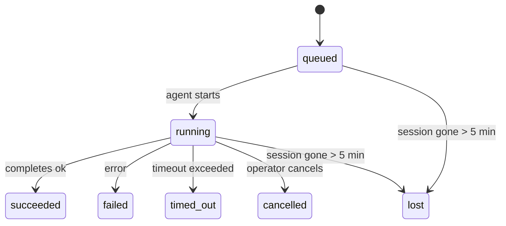

---
tags:
  - resource
  - documentation
  - openclaw
  - automation
  - tasks
keywords:
  - openclaw background tasks
  - task lifecycle states
  - what creates a task
  - task notification policies
  - queued running terminal
  - acp subagent cron cli runtime
  - done_only state_changes silent
  - lost task grace period
topics:
  - OpenClaw
  - Background Tasks
language: markdown
date of note: 2026-06-22
status: active
building_block: procedure
source_url: https://docs.openclaw.ai/automation/tasks
access_control_group: ["general"]
---

# OpenClaw — Background Task Model: Lifecycle, Creation, and Delivery

## Overview

This note documents the OpenClaw **background task** model: what a task is, what kinds of detached work create one, the `queued → running → terminal` lifecycle the runtime drives automatically, and how completion results are delivered under per-task notification policies. It mirrors the `automation/tasks` source page sections TL;DR, Quick start, What creates a task, Task lifecycle, and Delivery and notifications (including Notification policies). The CLI surface, chat `/tasks` board, status-line task pressure, on-disk storage/maintenance, and how tasks relate to other systems are documented in the sibling management note (`oc_automation_tasks_management`), not here.

A background task tracks work that runs **outside your main conversation session** — ACP runs, subagent spawns, isolated cron job executions, and CLI-initiated operations. Tasks do **not** replace sessions, cron jobs, or heartbeats; they are the **activity ledger** that records what detached work happened, when, and whether it succeeded. This page is the activity ledger for background work, not the scheduler — for choosing a scheduling mechanism, see the Automation overview.

## TL;DR

The source page summarizes the model as follows:

- Tasks are **records**, not schedulers — cron and heartbeat decide *when* work runs, tasks track *what happened*.
- ACP, subagents, all cron jobs, and CLI operations create tasks. Heartbeat turns do not.
- Each task moves through `queued → running → terminal` (`succeeded`, `failed`, `timed_out`, `cancelled`, or `lost`).
- Cron tasks stay live while the cron runtime still owns the job; if the in-memory runtime state is gone, task maintenance first checks durable cron run history before marking a task `lost`.
- Completion is push-driven: detached work can notify directly or wake the requester session/heartbeat when it finishes, so status polling loops are usually the wrong shape.
- Isolated cron runs and subagent completions best-effort clean up tracked browser tabs/processes for their child session before final cleanup bookkeeping.
- Isolated cron delivery suppresses stale interim parent replies while descendant subagent work is still draining, and it prefers final descendant output when that arrives before delivery.
- Completion notifications are delivered directly to a channel or queued for the next heartbeat.
- `openclaw tasks list` shows all tasks; `openclaw tasks audit` surfaces issues.
- Terminal records are kept for 7 days, then automatically pruned.

## Quick start

The same `openclaw tasks` CLI both lists/filters and inspects tasks (full command reference lives in the management note). The two read-only starting commands are:

```bash
# List all tasks (newest first)
openclaw tasks list

# Filter by runtime or status
openclaw tasks list --runtime acp
openclaw tasks list --status running

# Show details for a specific task (by ID, run ID, or session key)
openclaw tasks show <lookup>
```

## What creates a task

Not every agent run creates a task. **Heartbeat turns and normal interactive chat do not.** All cron executions, ACP spawns, subagent spawns, and CLI agent commands do. The source page enumerates the task sources, their runtime type, and the default notification policy each is assigned:

| Source | Runtime type | When a task record is created | Default notify policy |
| --- | --- | --- | --- |
| ACP background runs | `acp` | Spawning a child ACP session | `done_only` |
| Subagent orchestration | `subagent` | Spawning a subagent via `sessions_spawn` | `done_only` |
| Cron jobs (all types) | `cron` | Every cron execution (main-session and isolated) | `silent` |
| CLI operations | `cli` | `openclaw agent` commands that run through the gateway | `silent` |
| Agent media jobs | `cli` | Session-backed `image_generate`/`music_generate`/`video_generate` runs | `silent` |

**Notify defaults for cron and media.** Main-session cron tasks use `silent` notify policy by default — they create records for tracking but do not generate notifications. Isolated cron tasks also default to `silent` but are more visible because they run in their own session. Session-backed `image_generate`, `music_generate`, and `video_generate` runs also use `silent` notify policy; they still create task records, but completion is handed back to the original agent session as an internal wake so the agent can write the follow-up message and attach the finished media itself. The requester agent follows its normal visible-reply contract: automatic final reply when configured, or `message(action="send")` plus `NO_REPLY` when the session requires message-tool replies. If the requester session is no longer active or its active wake fails, and the completion agent misses some or all generated media, OpenClaw sends an idempotent direct fallback with only the missing media to the original channel target.

**Concurrent media-generation guardrail.** While a session-backed media-generation task is still active, media tools also act as guardrails for accidental retries. Repeated `image_generate` calls for the same prompt return the matching active task status, while a distinct image prompt can start its own task; `music_generate` and `video_generate` calls still return the active task status for that session instead of starting a second concurrent generation. Use `action: "status"` when you want an explicit progress/status lookup from the agent side.

**What does not create tasks.** Heartbeat turns (main-session), normal interactive chat turns, and direct `/command` responses do not create task records.

## Task lifecycle

A task is created in `queued`, advances to `running` when the agent starts, and ends in one of five terminal states. The source page renders this as a state diagram:



The status meanings are:

| Status | What it means |
| --- | --- |
| `queued` | Created, waiting for the agent to start |
| `running` | Agent turn is actively executing |
| `succeeded` | Completed successfully |
| `failed` | Completed with an error |
| `timed_out` | Exceeded the configured timeout |
| `cancelled` | Stopped by the operator via `openclaw tasks cancel` |
| `lost` | The runtime lost authoritative backing state after a 5-minute grace period |

Transitions happen automatically — when the associated agent run ends, the task status updates to match. **Agent run completion is authoritative for active task records.** A successful detached run finalizes as `succeeded`, ordinary run errors finalize as `failed`, and timeout or abort outcomes finalize as `timed_out`. If an operator already cancelled the task, or the runtime already recorded a stronger terminal state such as `failed`, `timed_out`, or `lost`, a later success signal does **not** downgrade that terminal status.

`lost` is runtime-aware — what counts as "authoritative backing gone" differs per runtime type:

- **ACP tasks:** backing ACP child session metadata disappeared.
- **Subagent tasks:** backing child session disappeared from the target agent store.
- **Cron tasks:** the cron runtime no longer tracks the job as active and durable cron run history does not show a terminal result for that run. Offline CLI audit does not treat its own empty in-process cron runtime state as authority.
- **CLI tasks:** tasks with a run id/source id use the live run context, so lingering child-session or chat-session rows do not keep them alive after the gateway-owned run disappears. Legacy CLI tasks without run identity still fall back to the child session. Gateway-backed `openclaw agent` runs also finalize from their run result, so completed runs do not sit active until the sweeper marks them `lost`.

## Delivery and notifications

When a task reaches a terminal state, OpenClaw notifies you. There are two delivery paths.

**Direct delivery** — if the task has a channel target (the `requesterOrigin`), the completion message goes straight to that channel (Telegram, Discord, Slack, etc.). Group and channel task completions are instead routed through the requester session so the parent agent can write the visible reply. For subagent completions, OpenClaw also preserves bound thread/topic routing when available and can fill a missing `to` / account from the requester session's stored route (`lastChannel` / `lastTo` / `lastAccountId`) before giving up on direct delivery.

**Session-queued delivery** — if direct delivery fails or no origin is set, the update is queued as a system event in the requester's session and surfaces on the next heartbeat. Task completion triggers an immediate heartbeat wake so you see the result quickly — you do not have to wait for the next scheduled heartbeat tick. That means the usual workflow is push-based: start detached work once, then let the runtime wake or notify you on completion. Poll task state only when you need debugging, intervention, or an explicit audit.

### Notification policies

A per-task notification policy controls how much you hear about each task:

| Policy | What is delivered |
| --- | --- |
| `done_only` (default) | Only terminal state (succeeded, failed, etc.) — **this is the default** |
| `state_changes` | Every state transition and progress update |
| `silent` | Nothing at all |

The policy can be changed while a task is running:

```bash
openclaw tasks notify <lookup> state_changes
```

**Source**: OpenClaw documentation — `automation/tasks` (mirror `inbox/openclaw_docs/automation/tasks.md`), sections TL;DR · Quick start · What creates a task · Task lifecycle · Delivery and notifications
**Last Updated**: 2026-06-22
**Status**: Active
