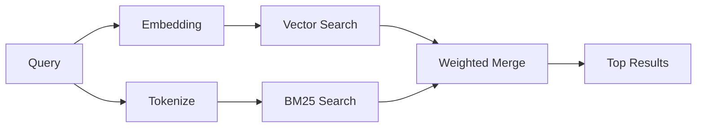

---
tags:
  - resource
  - documentation
  - openclaw
  - concepts
  - memory_search
keywords:
  - openclaw memory search
  - memory_search embedding provider
  - hybrid vector bm25 retrieval
  - memorySearch provider config
  - temporal decay mmr diversity
  - multimodal session memory
  - openclaw memory index force
topics:
  - OpenClaw
  - Memory Search
language: markdown
date of note: 2026-06-22
status: active
building_block: procedure
source_url: https://docs.openclaw.ai/concepts/memory-search
access_control_group: ["general"]
---

# OpenClaw — Configuring Built-in Memory Search

## Overview

This note is the procedure for configuring OpenClaw's built-in `memory_search`, the tool that finds relevant notes from an agent's memory files even when the wording differs from the original text, by indexing memory into small chunks and searching them using embeddings, keywords, or both. It mirrors the `concepts/memory-search` source page: enabling semantic search and picking an embedding provider (quick start), the supported provider table, how the parallel vector + BM25 hybrid retrieval works, the search-quality knobs (temporal decay and MMR diversity), multimodal and session-transcript memory, and troubleshooting. The advanced QMD sidecar backend for this same surface is documented separately; this note covers the built-in engine and its provider/quality configuration.

## Quick start: enable semantic search and pick a provider

Memory search uses OpenAI embeddings by default. To use another embedding backend, set a provider explicitly under `agents.defaults.memorySearch`:

```json5
{
  agents: {
    defaults: {
      memorySearch: {
        provider: "openai", // or "gemini", "local", "ollama", "openai-compatible", etc.
      },
    },
  },
}
```

For multi-endpoint setups with memory-specific providers, `provider` can also be a custom `models.providers.<id>` entry, such as `ollama-5080`, when that provider sets `api: "ollama"` or another memory embedding adapter owner. For local embeddings with no API key, install `@openclaw/llama-cpp-provider` and set `provider: "local"`; source checkouts may still require native build approval via `pnpm approve-builds` then `pnpm rebuild node-llama-cpp`.

Some OpenAI-compatible embedding endpoints require asymmetric labels such as `input_type: "query"` for searches and `input_type: "document"` or `"passage"` for indexed chunks. Configure those with `memorySearch.queryInputType` and `memorySearch.documentInputType` (see the Memory configuration reference's provider-specific config section).

## Supported providers

The page lists the supported embedding providers, their config IDs, whether each needs an API key, and notes (verbatim from source):

| Provider          | ID                  | Needs API key | Notes                         |
| ----------------- | ------------------- | ------------- | ----------------------------- |
| Bedrock           | `bedrock`           | No            | Uses AWS credential chain     |
| DeepInfra         | `deepinfra`         | Yes           | Default: `BAAI/bge-m3`        |
| Gemini            | `gemini`            | Yes           | Supports image/audio indexing |
| GitHub Copilot    | `github-copilot`    | No            | Uses Copilot subscription     |
| Local             | `local`             | No            | GGUF model, ~0.6 GB download  |
| Mistral           | `mistral`           | Yes           |                               |
| Ollama            | `ollama`            | No            | Local/self-hosted             |
| OpenAI            | `openai`            | Yes           | Default                       |
| OpenAI-compatible | `openai-compatible` | Usually       | Generic `/v1/embeddings`      |
| Voyage            | `voyage`            | Yes           |                               |

## How search works (hybrid vector + BM25 merge)

OpenClaw runs two retrieval paths in parallel and merges the results:



Vector search finds notes with similar meaning ("gateway host" matches "the machine running OpenClaw"). BM25 keyword search finds exact matches (IDs, error strings, config keys). If only one path is available, the other runs alone — intentional FTS-only mode (`provider: "none"`) and automatic/default provider selection can still use lexical ranking when embeddings are unavailable.

Explicit non-local embedding providers behave differently. If you set `memorySearch.provider` to a concrete remote-backed provider and that provider is unavailable at runtime, `memory_search` reports memory as unavailable instead of silently using FTS-only results — this keeps a broken configured semantic provider visible. Set `provider: "none"` for deliberate FTS-only recall, or fix the provider/auth configuration to restore semantic ranking.

## Improving search quality

Two optional features help when you have a large note history.

### Temporal decay

Old notes gradually lose ranking weight so recent information surfaces first. With the default half-life of 30 days, a note from last month scores at 50% of its original weight. Evergreen files like `MEMORY.md` are never decayed. The page's tip: enable temporal decay if your agent has months of daily notes and stale information keeps outranking recent context.

### MMR (diversity)

MMR reduces redundant results. If five notes all mention the same router config, MMR ensures the top results cover different topics instead of repeating. The page's tip: enable MMR if `memory_search` keeps returning near-duplicate snippets from different daily notes.

### Enable both

```json5
{
  agents: {
    defaults: {
      memorySearch: {
        query: {
          hybrid: {
            mmr: { enabled: true },
            temporalDecay: { enabled: true },
          },
        },
      },
    },
  },
}
```

## Multimodal memory

With Gemini Embedding 2, you can index images and audio files alongside Markdown. Search queries remain text, but they match against visual and audio content. See the Memory configuration reference for setup.

## Session memory search

You can optionally index session transcripts so `memory_search` can recall earlier conversations. This is opt-in via `memorySearch.experimental.sessionMemory`. See the configuration reference for details.

## Troubleshooting

The page lists four common failure modes and fixes:

- **No results?** Run `openclaw memory status` to check the index. If empty, run `openclaw memory index --force`.
- **Only keyword matches?** Your embedding provider may not be configured. Check `openclaw memory status --deep`.
- **Local embeddings time out?** `ollama`, `lmstudio`, and `local` use a longer inline batch timeout by default. If the host is simply slow, set `agents.defaults.memorySearch.sync.embeddingBatchTimeoutSeconds` and rerun `openclaw memory index --force`.
- **CJK text not found?** Rebuild the FTS index with `openclaw memory index --force`.

**Source**: OpenClaw documentation — `concepts/memory-search` (mirror `inbox/openclaw_docs/concepts/memory-search.md`)
**Last Updated**: 2026-06-22
**Status**: Active
