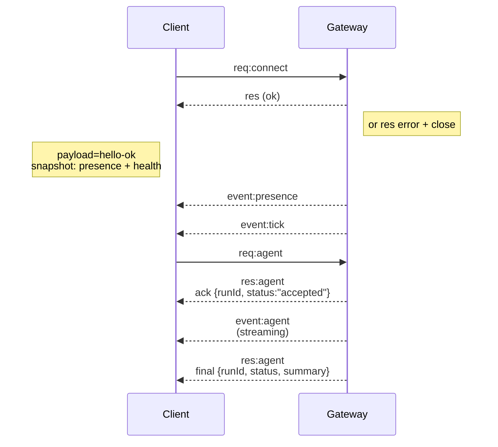

---
tags:
  - resource
  - documentation
  - openclaw
  - concepts
  - architecture
keywords:
  - openclaw gateway architecture
  - single websocket gateway
  - role node nodes
  - wire protocol req res event
  - device-based pairing device token
  - typebox json schema codegen
  - gateway auth modes
  - remote access ssh tunnel tailscale
topics:
  - OpenClaw
  - Gateway Architecture
language: markdown
date of note: 2026-06-22
status: active
building_block: concept
source_url: https://docs.openclaw.ai/concepts/architecture
access_control_group: ["general"]
---

# OpenClaw — Gateway Architecture

## Overview

This note describes the OpenClaw **Gateway architecture**: a single long-lived WebSocket Gateway per host that owns every messaging surface, exposes one typed WS API consumed by both control-plane clients and `role: node` nodes, and enforces a request/response/event wire protocol with device-based pairing. It mirrors the `concepts/architecture` source page — covering the components and flows (Gateway daemon, clients, nodes, WebChat), the connection lifecycle, the wire-protocol summary, pairing and local trust, TypeBox-driven protocol typing and codegen, remote access, an operations snapshot, and the load-bearing architectural invariants.

## Overview (single Gateway + WS)

A single long-lived **Gateway** owns all messaging surfaces — WhatsApp (via Baileys), Telegram (via grammY), Slack, Discord, Signal, iMessage, and WebChat. Control-plane clients (the macOS app, CLI, web UI, and automations) connect to the Gateway over **WebSocket** on the configured bind host, defaulting to `127.0.0.1:18789`. **Nodes** (macOS/iOS/Android/headless) also connect over WebSocket, but declare `role: node` with explicit caps/commands. There is exactly one Gateway per host, and it is the only place that opens a WhatsApp session. The **canvas host** is served by the Gateway HTTP server under `/__openclaw__/canvas/` (agent-editable HTML/CSS/JS) and `/__openclaw__/a2ui/` (the A2UI host); it uses the same port as the Gateway (default `18789`).

## Components and flows

The architecture has four participant roles around the one Gateway.

- **Gateway (daemon)** — maintains provider connections, exposes a typed WS API (requests, responses, and server-push events), validates inbound frames against JSON Schema, and emits events such as `agent`, `chat`, `presence`, `health`, `heartbeat`, and `cron`.
- **Clients (mac app / CLI / web admin)** — hold one WS connection per client, send requests (`health`, `status`, `send`, `agent`, `system-presence`), and subscribe to events (`tick`, `agent`, `presence`, `shutdown`).
- **Nodes (macOS / iOS / Android / headless)** — connect to the **same WS server** with `role: node`, provide a device identity in `connect` (pairing is **device-based** for role `node`, with approval living in the device pairing store), and expose commands like `canvas.*`, `camera.*`, `screen.record`, and `location.get`.
- **WebChat** — a static UI that uses the Gateway WS API for chat history and sends; in remote setups it connects through the same SSH/Tailscale tunnel as other clients.

Protocol details for these flows live in the Gateway protocol reference (linked under References).

## Connection lifecycle (single client)

A single client's lifecycle starts with a `connect` request and proceeds through snapshot delivery, server-push events, and an agent run that streams before its final response:



The `connect` request returns `res (ok)` carrying a `hello-ok` payload (a snapshot of presence + health) or, on failure, a `res` error followed by a close. After the handshake the Gateway pushes `presence` and `tick` events; an `agent` request is acknowledged immediately with `{runId, status:"accepted"}`, streams `event:agent` deltas, and ends with a final `res:agent` of `{runId, status, summary}`.

## Wire protocol (summary)

The transport is WebSocket text frames carrying JSON payloads, and the first frame **must** be `connect`. After the handshake, requests use `{type:"req", id, method, params}` answered by `{type:"res", id, ok, payload|error}`, while events use `{type:"event", event, payload, seq?, stateVersion?}`. The `hello-ok.features.methods` / `events` fields are discovery metadata — not a generated dump of every callable helper route. Shared-secret auth uses `connect.params.auth.token` or `connect.params.auth.password`, depending on the configured gateway auth mode. Identity-bearing modes — Tailscale Serve (`gateway.auth.allowTailscale: true`) or a non-loopback `gateway.auth.mode: "trusted-proxy"` — satisfy auth from request headers instead of `connect.params.auth.*`. Private-ingress `gateway.auth.mode: "none"` disables shared-secret auth entirely and must be kept off public/untrusted ingress. Idempotency keys are required for side-effecting methods (`send`, `agent`) so retries are safe; the server keeps a short-lived dedupe cache. Nodes must include `role: "node"` plus caps/commands/permissions in `connect`.

## Pairing + local trust

All WS clients — operators and nodes alike — include a **device identity** on `connect`. New device IDs require pairing approval, after which the Gateway issues a **device token** for subsequent connects. Direct local loopback connects can be auto-approved to keep same-host UX smooth, and OpenClaw also has a narrow backend/container-local self-connect path for trusted shared-secret helper flows. Tailnet and LAN connects — including same-host tailnet binds — still require explicit pairing approval. All connects must sign the `connect.challenge` nonce; the signature payload `v3` additionally binds `platform` + `deviceFamily`, and the Gateway pins paired metadata on reconnect and requires repair pairing for metadata changes. **Non-local** connects still require explicit approval, and gateway auth (`gateway.auth.*`) still applies to **all** connections, local or remote.

## Protocol typing and codegen

The protocol is defined by **TypeBox** schemas. JSON Schema is generated from those TypeBox schemas, and Swift models are in turn generated from the JSON Schema — giving one source of truth (TypeBox) that flows to runtime validation (JSON Schema) and native client types (Swift).

## Remote access

The preferred remote-access path is Tailscale or a VPN; the alternative is an SSH tunnel:

```bash
ssh -N -L 18789:127.0.0.1:18789 user@host
```

The same handshake + auth token apply over the tunnel, and TLS with optional pinning can be enabled for WS in remote setups.

## Operations snapshot

The Gateway starts in the foreground with `openclaw gateway` (logging to stdout). Health is checked via the `health` method over WS (also included in `hello-ok`), and supervision (auto-restart) is handled by launchd or systemd.

## Invariants

Three invariants hold the architecture together: exactly one Gateway controls a single Baileys session per host; the handshake is mandatory, so any non-JSON or non-`connect` first frame is a hard close; and events are not replayed, so clients must refresh on gaps.

## Related Notes

**Terms**

- **[WebSocket](../../term_dictionary/term_websocket.md)** — full-duplex transport; relevance: the Gateway's single long-lived WS API.
- **[JSON Schema](../../term_dictionary/term_json_schema.md)** — schema validation; relevance: inbound frames validated against JSON Schema (TypeBox-generated).
- **[JSON-RPC](../../term_dictionary/term_json_rpc.md)** — request/response RPC; relevance: the req/res/event wire protocol.
- **[Idempotency](../../term_dictionary/term_idempotency.md)** — safe-retry keys; relevance: idempotency keys required for side-effecting methods (send/agent).
- **[DM Pairing](../../term_dictionary/term_dm_pairing.md)** — device pairing; relevance: device-based pairing + device tokens for clients/nodes.
- **[Messaging Gateway](../../term_dictionary/term_messaging_gateway.md)** — chat-platform gateway; relevance: the Gateway owns all messaging surfaces.
- **[API Gateway](../../term_dictionary/term_api_gateway.md)** — request entry hub; relevance: the Gateway is the single API surface for clients + nodes.
- **[OpenClaw](../../term_dictionary/term_openclaw.md)** — gateway product; relevance: this IS the OpenClaw Gateway architecture.

**Docs**

- **[oc_concepts_agent_loop](oc_concepts_agent_loop.md)** — loop (this series); relevance: the `agent` / `agent.wait` RPC the Gateway dispatches.
- **[oc_concepts_channel_docking](oc_concepts_channel_docking.md)** — docking (this series); relevance: reply delivery over the same Gateway.
- **[oc_concepts_typebox](oc_concepts_typebox_protocol.md)** — TypeBox schemas (planned, co07); relevance: the schema → JSON-Schema → Swift codegen layer.
- **[oc_concepts_presence](oc_concepts_presence.md)** — presence (planned, co05); relevance: the `presence` server-push event.
- **[oc_concepts_queue](oc_concepts_queue.md)** — command queue (planned, co06); relevance: concurrency/serialization over the WS API.
- **[cc_remote_control](../claude_code/cc_remote_control.md)** — Claude Code remote control; relevance: remote-access / tunnel analog for a coding-agent gateway.
- **[hermes_architecture](../hermes_agent/hermes_architecture.md)** — Hermes architecture; relevance: the OpenClaw-lineage gateway architecture.
- **[hermes_messaging_gateway_architecture](../hermes_agent/hermes_messaging_gateway_architecture.md)** — Hermes messaging gateway; relevance: single-gateway-owns-all-channels model.
- **[hermes_gateway_internals](../hermes_agent/hermes_gateway_internals.md)** — Hermes gateway internals; relevance: WS daemon + client/node connection internals.
- **[pi_rpc_protocol](../pi/pi_rpc_protocol.md)** — Pi RPC protocol; relevance: req/res/event wire-protocol analog.
- **[band_websocket_overview](../band/band_websocket_overview.md)** — Band WebSocket; relevance: WS agent/human channel architecture analog.
- **[bedrock_agentcore_gateway_overview](../aws_bedrock_agentcore/bedrock_agentcore_gateway_overview.md)** — AgentCore gateway; relevance: managed agent-gateway architecture counterpart.

**Repos**

- **[repo_openclaw_gateway](../../../areas/code_repos/repo_openclaw_gateway.md)** — Gateway daemon; relevance: implements the WS server + wire protocol.
- **[repo_openclaw_channels](../../../areas/code_repos/repo_openclaw_channels.md)** — channels; relevance: the messaging surfaces the Gateway owns.
- **[repo_openclaw_apps](../../../areas/code_repos/repo_openclaw_apps.md)** — client apps/nodes; relevance: control-plane clients + `role: node` nodes.

**Snippets**

- **[snippet_openclaw_gateway_ws_connection](../../code_snippets/snippet_openclaw_gateway_ws_connection.md)** — WS connection; relevance: the connect handshake (first frame must be connect).
- **[snippet_openclaw_gateway_rpc_protocol_envelope](../../code_snippets/snippet_openclaw_gateway_rpc_protocol_envelope.md)** — RPC envelope; relevance: the `{type:req/res/event}` wire-protocol frames.
- **[snippet_openclaw_gateway_server_http_listen_ws](../../code_snippets/snippet_openclaw_gateway_server_http_listen_ws.md)** — HTTP/WS listen; relevance: the Gateway HTTP server (port 18789 + canvas host).
- **[snippet_openclaw_gateway_nodes_pairing](../../code_snippets/snippet_openclaw_gateway_nodes_pairing.md)** — nodes pairing; relevance: device-based pairing + device tokens.
- **[snippet_openclaw_gateway_connect_error_codes](../../code_snippets/snippet_openclaw_gateway_connect_error_codes.md)** — connect error codes; relevance: handshake error/close behavior.
- **[snippet_openclaw_gateway_client_identity_tls](../../code_snippets/snippet_openclaw_gateway_client_identity_tls.md)** — client identity/TLS; relevance: device identity on connect + TLS pinning for remote.
- **[snippet_openclaw_gateway_rpc_protocol_schema_groups](../../code_snippets/snippet_openclaw_gateway_rpc_protocol_schema_groups.md)** — schema groups; relevance: hello-ok features.methods/events discovery metadata.
- **[snippet_openclaw_gateway_rpc_protocol_error_codes_version](../../code_snippets/snippet_openclaw_gateway_rpc_protocol_error_codes_version.md)** — protocol versioning; relevance: wire-protocol error codes + version.
- **[snippet_openclaw_gateway_auth_modes_helpers](../../code_snippets/snippet_openclaw_gateway_auth_modes_helpers.md)** — auth modes; relevance: shared-secret / trusted-proxy / none auth modes.
- **[snippet_openclaw_gateway_client_connect_proxy](../../code_snippets/snippet_openclaw_gateway_client_connect_proxy.md)** — connect proxy; relevance: Tailscale/SSH-tunnel remote-access path.
- **[snippet_openclaw_kit_gateway_tls_pinning](../../code_snippets/snippet_openclaw_kit_gateway_tls_pinning.md)** — TLS pinning; relevance: optional WS TLS + pinning for remote setups.
- **[snippet_openclaw_gateway_entry_dispatch](../../code_snippets/snippet_openclaw_gateway_entry_dispatch.md)** — entry dispatch; relevance: request routing into method handlers.

## References

- [OpenClaw Docs — Gateway architecture](https://docs.openclaw.ai/concepts/architecture)
- [OpenClaw Docs — Gateway protocol](https://docs.openclaw.ai/gateway/protocol)
- [OpenClaw Docs — Pairing](https://docs.openclaw.ai/channels/pairing)
- [OpenClaw Docs — Security](https://docs.openclaw.ai/gateway/security)
- [OpenClaw Docs — Agent loop](https://docs.openclaw.ai/concepts/agent-loop)
- [OpenClaw Docs — Queue](https://docs.openclaw.ai/concepts/queue)

**Source**: OpenClaw documentation — `concepts/architecture` (mirror `inbox/openclaw_docs/concepts/architecture.md`)
**Last Updated**: 2026-06-22
**Status**: Active
