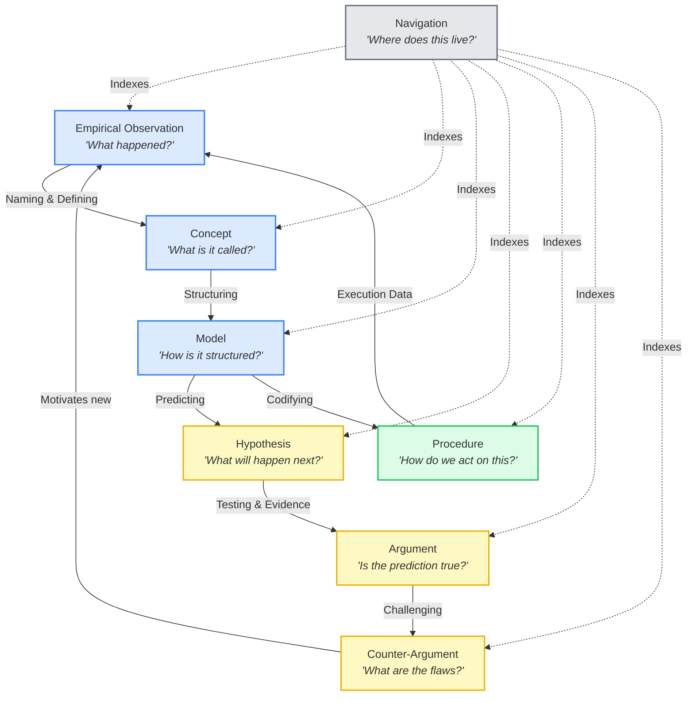

---
tags:
  - entry_point
  - research
  - abuse_slipbox
  - knowledge_management
  - zettelkasten
  - agentic_ai
  - paper
keywords:
  - abuse slipbox
  - knowledge management system
  - zettelkasten
  - research paper
  - human-directed agent-augmented
  - knowledge building blocks
  - skill architecture
  - vault design
topics:
  - Knowledge Management
  - Agentic AI
  - Research
date of note: 2026-04-02
status: active
language: markdown
building_block: navigation
---

# Entry: Abuse SlipBox — Research Paper & System Documentation

## Purpose

Collects **all vault notes related to the Abuse SlipBox system itself** — the knowledge management method, not the abuse prevention domain it documents. Organized following the Mullaney–Booth research structure: **Topic → Questions → Problem → Problem Collective → Argument → Sources**.

**Methodology**: Structure follows [Where Research Begins](../resources/digest/digest_where_research_begins_mullaney.md) (Mullaney & Rea, 2022) for problem discovery and [The Craft of Research](../resources/digest/digest_craft_of_research_booth.md) (Booth et al., 2024) for argument construction.

---

## 1. Topic & Motivation — Why Structured Knowledge Management Needs a Theory of Knowledge Atoms

### The General Problem

> **In domains where knowledge changes faster than organizations can document it, how should knowledge be captured, maintained, and invalidated — and what structure makes this possible?**

This is the **Knowledge Currency Problem** — the primary motivation for the Abuse SlipBox, chosen via Mullaney's self-centered prioritization (see [Problem Prioritization](../resources/analysis_thoughts/analysis_problem_prioritization_mullaney.md)). It applies to any domain with rapidly evolving operational knowledge: cybersecurity, medical practice, financial regulation, supply chain management.

### The Domain Instance

In buyer abuse prevention at Amazon: investigator insights become obsolete before they're encoded into models (~80% of MOs raised in June 2024 were similar to previously identified ones). The domain has 1,573 rulesets, 48,600 variables, 316 models, and 1,100+ policy changes per year — a knowledge corpus that is simultaneously **too large** for any individual to master, **too interconnected** for isolated documents, and **too fast-changing** for manual maintenance.

### Why Existing Solutions Don't Solve It

| Category | Systems | What They Miss |
|----------|---------|---------------|
| **Agent Memory Layers** | Mem0, Zep, LangMem, Letta | Manage conversation memory, not domain knowledge |
| **Auto Knowledge Graphs** | GraphRAG, Cognee | Structure without quality control or epistemic typing |
| **Agentic Memory Research** | A-MEM, PlugMem | No human curation; flat or 2-type stores |
| **Enterprise KM** | Confluence, Obsidian, Notion | Containers without intelligence or atomic structure |

**No existing system combines**: typed knowledge atoms + structural connections + human-directed quality + agent-augmented scale. See [Competitive Landscape Analysis](../resources/analysis_thoughts/analysis_agentic_km_landscape_vs_abuse_slipbox.md) for the full 13-system comparison.

### Three Architectural Innovations

1. **SQLite metadata + link table over RAG/GraphRAG** — Human-authored YAML frontmatter preserves structure that embeddings approximate. SQL enables type-filtered queries, ghost note gap detection, and PPR ranking. See [Long Context vs Structure](../resources/analysis_thoughts/analysis_long_context_vs_structure.md) for empirical evidence.

2. **Atomicity defined through building blocks** — "One idea per note" becomes testable: a note is atomic when it contains one building block type. The 8-type system (concept, argument, counter-argument, model, hypothesis, observation, procedure, navigation) maps to the knowledge reasoning cycle.

3. **Building blocks as agentic infrastructure** — Block types route agents to skills (missing concept → `capture-term-note`; unchallenged argument → `generate-questions`). The reasoning cycle becomes a prescriptive self-improvement loop. Block distribution is a measurable vault quality metric.

### The Motivation Stress-Tested (Counter-Arguments)

Each motivation claim has been challenged and sharpened (see detailed dialectic in Folgezettel 2–4a):

| Motivation | Strongest Counter | Sharpened Framing |
|-----------|-------------------|-------------------|
| **★ Knowledge Currency** ([counter](../resources/analysis_thoughts/counter_knowledge_decay_is_not_the_real_problem.md)) | Tacit knowledge is uncodifiable (Polanyi) ⬛⬛⬛⬜ | The SlipBox targets **explicit** knowledge only (procedures, models, observations). Building block types predict **decay rate** — observations decay daily; concepts decay yearly — enabling targeted maintenance. |
| **Policy-Model Sync** ([counter](../resources/analysis_thoughts/counter_automation_brittleness_llm_adaptation.md), [timing analysis](../resources/analysis_thoughts/analysis_policy_sync_timing_challenge.md)) | ICL eliminates adaptation lag ⬛⬛⬛⬜ | LLMs solve **single-system** adaptation (prompt in minutes). The real bottleneck is **cross-system impact propagation** — one SOP change affects models, rulesets, features, training data across 316 interconnected systems. The SlipBox's 55K cross-references enable graph-based impact analysis that no LLM can replicate. |
| **Expertise Transfer** ([counter](../resources/analysis_thoughts/counter_onboarding_bottleneck_alternative_solutions.md)) | Apprenticeship is more effective (Lave & Wenger) ⬛⬛⬛⬜ | Valid for tacit knowledge — but doesn't scale. The SlipBox **complements** mentoring by handling the 80% of questions that are factual/procedural, freeing mentors for the 20% requiring judgment. Secondary motivation. |

**Net assessment**: Counter-arguments don't defeat the motivation — they **sharpen** it. The refined framing: the SlipBox targets explicit knowledge (not tacit), connects changes across systems (not just stores them), and complements mentoring (not replaces it). Documentation staleness is an acknowledged limitation.

### The Meta-Question

> *Does epistemically typed, structurally connected, agent-maintained knowledge provide measurable value over unstructured information — and under what conditions?*

This single question unifies all three domain problems and opens 17 research questions across 5 clusters.

- [Meta-Question: Value of Typed Knowledge](../resources/analysis_thoughts/thought_meta_question_value_of_typed_knowledge.md) — 3 null hypotheses, existing evidence (LinkedIn KG-RAG: +77.6% MRR; Lost in the Middle), experiment design
  - [Applied to Agentic Memory](../resources/analysis_thoughts/thought_meta_question_agentic_memory.md) — Typed memory for reasoning-aware retrieval, self-diagnosis, calibrated confidence (OQ10–12)
  - [Applied to Multi-Agent Systems](../resources/analysis_thoughts/thought_meta_question_multi_agent_systems.md) — Typed shared KB for specialization, conflict resolution, collaborative reasoning cycle (OQ13–16)

### Generalized Problems (priority order)

1. ★ [Knowledge Currency](../resources/analysis_thoughts/thought_general_problem_knowledge_currency.md) — Building blocks predict decay rate; agent maintenance targets highest-decay types (OQ1–3)
2. [Policy-Model Synchronization](../resources/analysis_thoughts/thought_general_problem_policy_model_synchronization.md) — Cross-referencing enables impact analysis that LLM prompt updates can't (OQ7–9, OQ17)
3. [Expertise Transfer](../resources/analysis_thoughts/thought_general_problem_expertise_transfer.md) — Building blocks predict which onboarding questions benefit from structured KB vs chatbot vs mentor (OQ4–6)

### Research Questions Only This System Can Ask

| Cluster | Core Question | Why Only SlipBox Can Ask |
|---------|--------------|-------------------------|
| **Epistemic Health** | Does building block distribution predict answer quality? | Requires typed knowledge atoms |
| **Atomicity** | Does block-type filtering improve retrieval precision? | Requires block-defined atomicity |
| **Structured Retrieval** | When does SQL metadata beat embeddings? | Requires SQL-first architecture |
| **Human-Agent Division** | Which block types benefit most from human vs agent authorship? | Requires typed + attributed notes |
| **Reasoning Cycle** | Does cycle-directed growth produce better knowledge? | Requires prescriptive block interactions |

See [Research Questions Analysis](../resources/analysis_thoughts/analysis_research_questions_abuse_slipbox.md) for the full 17-question treatment (OQ1–17).

**Vault Notes**:
- [BAP Durable Problems](../areas/area_bap_durable_problems.md) — 7 strategic challenges ($22MM–$128MM+ impact)
- [BAP Brainwriting Digest](../resources/digest/digest_bap_brainwriting_shark_tank.md) — Innovation methodology
- [Problem Prioritization (Mullaney)](../resources/analysis_thoughts/analysis_problem_prioritization_mullaney.md) — Why Knowledge Currency leads

---

## 2. Questions — What We Want to Find Out

Following Mullaney's advice to generate many questions before converging on a Problem, here are the questions that drive this work (see [Research Questions Analysis](../resources/analysis_thoughts/analysis_research_questions_abuse_slipbox.md) for the full 14-question treatment):

| Cluster | Question |
|---------|----------|
| **Epistemic Health** | Can we diagnose what a knowledge base *knows* and *doesn't know* — and does building block distribution predict answer quality? |
| **Atomicity** | What is the right size for a knowledge atom — and does block-type-defined atomicity improve retrieval precision? |
| **Structured Retrieval** | When does SQL metadata filtering outperform vector similarity? Do ghost notes (human-authored gaps) provide a better creation signal than embeddings? |
| **Human-Agent Division** | Which knowledge types benefit most from human authorship vs. agent generation? At what scale does agent augmentation become essential? |
| **Reasoning Cycle** | Does the building block interaction model (observation → hypothesis → argument ↔ counter-argument) produce self-improving knowledge quality? |

---

## 3. Problem — The Gap No Existing System Fills

Following Mullaney: "A problem is something that follows you around." Following Booth: "I am studying X because I want to find out Y in order to help readers understand Z."

### Booth's Research Problem Formula

> **We are studying** agentic knowledge management for operational domains **because we want to find out** whether combining atomic knowledge units with epistemic typing, human-directed quality control, and agent-augmented scalability produces higher-quality knowledge than existing approaches **in order to help readers understand** that the bottleneck in organizational knowledge management is not storage or retrieval but the absence of a structured theory of knowledge atoms — and that building blocks provide this missing theory.

### Why Existing Solutions Fall Short (The Gap)

| Category | Systems | What They Solve | What They Miss |
|----------|---------|----------------|---------------|
| **Agent Memory Layers** | Mem0, Zep, LangMem, Letta/MemGPT | Session memory, user preferences | Domain knowledge, epistemic typing |
| **Auto Knowledge Graphs** | GraphRAG, Cognee, HippoRAG | Structure from raw data | Quality control, building block types |
| **Agentic Memory Research** | A-MEM, PlugMem | How agents should remember | Human curation, operational scale |
| **Enterprise KM** | Confluence, Obsidian, Notion, NotebookLM | Containers for knowledge | Agent augmentation, atomic structure |

**No existing system combines**: atomic notes + typed building blocks + human-directed quality + agent-augmented scale.

**Vault Notes**:
- [Competitive Landscape Analysis](../resources/analysis_thoughts/analysis_agentic_km_landscape_vs_abuse_slipbox.md) — 13 systems across 4 categories; 3 architectural innovations; innovation gap matrix
- [Research Questions the SlipBox Raises](../resources/analysis_thoughts/analysis_research_questions_abuse_slipbox.md) — 14 RQs across 5 clusters that no existing system can ask

---

## 4. Problem Collective — Who Else Works on This

Following Mullaney: "Your Problem Collective is the cross-disciplinary set of researchers who share your underlying Problem."

### 4.1 Personal Knowledge Management (Zettelkasten)

**Shared problem**: How to structure atomic knowledge units for long-term retrieval and creative recombination.

**Term Notes**: [Zettelkasten](../resources/term_dictionary/term_zettelkasten.md) | [Slipbox](../resources/term_dictionary/term_slipbox.md) | [Fleeting Notes](../resources/term_dictionary/term_fleeting_notes.md) | [Literature Notes](../resources/term_dictionary/term_literature_notes.md) | [Permanent Notes](../resources/term_dictionary/term_permanent_notes.md) | [Folgezettel](../resources/term_dictionary/term_folgezettel.md) | [Hub Notes](../resources/term_dictionary/term_hub_notes.md) | [Index Notes](../resources/term_dictionary/term_index_notes.md) | [Commonplace Book](../resources/term_dictionary/term_commonplace_book.md)

**Digests**: [Smart Notes (Ahrens)](../resources/digest/digest_smart_notes_ahrens.md) | [System for Writing (Doto)](../resources/digest/digest_writing_with_zettelkasten_doto.md) | [Building a Second Brain (Forte)](../resources/digest/digest_building_second_brain_forte.md) | [Atomicity (Sascha)](../resources/digest/digest_atomicity_zettelkasten_christian.md) | [BASB vs Zettelkasten](../resources/digest/digest_basb_vs_zettelkasten_sascha.md)

**Innovation Terms**: [Adjacent Possible](../resources/term_dictionary/term_adjacent_possible.md) | [Liquid Network](../resources/term_dictionary/term_liquid_network.md) | [Slow Hunch](../resources/term_dictionary/term_slow_hunch.md) | [Serendipity](../resources/term_dictionary/term_serendipity.md) | [Exaptation](../resources/term_dictionary/term_exaptation.md) | [Shuhari](../resources/term_dictionary/term_shuhari.md) | [Beetle in a Box](../resources/term_dictionary/term_beetle_in_a_box.md) | [Eufriction](../resources/term_dictionary/term_eufriction.md) | [CODE Method](../resources/term_dictionary/term_code_method.md)

### 4.2 Agentic Memory Systems

**Shared problem**: How should AI agents store, retrieve, and reason about knowledge across sessions?

**Paper Pipelines** (each: lit + 5 sections + review):
- [PlugMem (Yang et al., 2026)](../resources/papers/lit_yang2026plugmem.md) — Task-agnostic plugin memory; propositional + prescriptive types
- [A-MEM (Xu et al., 2025)](../resources/papers/lit_xu2025amem.md) — Zettelkasten-inspired linking with reflection
- [Meta-Harness (Lee et al., 2026)](../resources/papers/lit_lee2026metaharness.md) — End-to-end harness optimization via execution traces

**Term Notes**: [PlugMem](../resources/term_dictionary/term_plugmem.md) | [OpenClaw](../resources/term_dictionary/term_openclaw.md) | [Meta-Harness](../resources/term_dictionary/term_meta_harness.md)

**Digests**: [OpenClaw: 10 Lessons](../resources/digest/digest_openclaw_10_lessons_agent_teams.md) | [OpenClaw Pipelines](../resources/digest/digest_openclaw_deterministic_pipelines.md) | [Lobster DSL](../resources/digest/digest_lobster_dsl_openclaw.md)

### 4.3 Thinking, Questioning & Research Methodology

**Shared problem**: How to structure inquiry for reliable knowledge construction.

**Digests**: [Beautiful Question (Berger)](../resources/digest/digest_beautiful_question_berger.md) | [Critical Thinking (Hartley)](../resources/digest/digest_critical_thinking_hartley.md) | [Where Research Begins (Mullaney)](../resources/digest/digest_where_research_begins_mullaney.md) | [Craft of Research (Booth)](../resources/digest/digest_craft_of_research_booth.md) | [Diataxis (Procida)](../resources/digest/digest_diataxis_tutorials_procida.md) | [Building Blocks Roots](../resources/digest/digest_intellectual_roots_knowledge_building_blocks.md)

**Ideation**: [Brainwriting](../resources/term_dictionary/term_brainwriting.md) | [Shark Tank Ideation](../resources/term_dictionary/term_shark_tank_ideation.md) | [How To: Brainwriting](../resources/how_to/howto_run_brainwriting_shark_tank.md)

### 4.4 Literature Survey

- [Survey: Abuse SlipBox Research Landscape](../resources/papers/survey_abuse_slipbox_landscape.md) — 35 papers across 5 threads (PKM, KG+RAG, Agentic Memory, Organizational KM, LLM-Augmented KM)

---

## 5. Response — Our Claim and Argument

Following Booth's **Context → Problem → Response** introduction structure and the **Claim + Reasons + Evidence + Warrants + Acknowledgments** argument model.

### 5.1 Claim

The Abuse SlipBox demonstrates that **human-directed, agent-augmented knowledge management with epistemically typed atomic notes** produces higher-quality organizational knowledge than fully manual (Obsidian), fully automated (A-MEM, GraphRAG), or untyped (Mem0, Zep) approaches — at a scale neither manual nor automated methods can achieve alone.

### 5.2 Reasons (Why You Should Believe This)

**Reason 1**: Building blocks provide a general theory of knowledge atoms that enables epistemic health diagnosis — measuring not just *how much* a KB contains but *what types* of knowledge are present or missing.

**Reason 2**: SQLite metadata + link table retrieval preserves human-authored structure and enables queries impossible in RAG/GraphRAG (type-filtered, gap-detecting, PPR-ranked).

**Reason 3**: The reasoning cycle (observation → hypothesis → argument ↔ counter-argument) creates a prescriptive agent loop where each missing block type triggers a specific remediation skill.

### 5.3 Evidence (The Design and Its Instantiation)

#### Atomic Note Architecture

**Design Principles**: [Atomicity](../../slipbox/2_design/design_principle_atomicity.md) | [Connectionism](../../slipbox/2_design/design_principle_connectionism.md) | [Single Source of Truth](../../slipbox/2_design/design_principle_single_source_of_truth.md) | [Workflow-Driven](../../slipbox/2_design/design_principle_workflow_driven.md)

**Note Type Specifications** (10 types): [Area](../../slipbox/2_design/note_type_area_notes.md) | [Resource](../../slipbox/2_design/note_type_resource_notes.md) | [Project](../../slipbox/2_design/note_type_project_notes.md) | [Index](../../slipbox/2_design/note_type_index_notes.md) | [FAQ](../../slipbox/2_design/note_type_faq_notes.md) | [How-To](../../slipbox/2_design/note_type_how_to_notes.md) | [Data](../../slipbox/2_design/note_type_data_notes.md) | [Cradle](../../slipbox/2_design/note_type_cradle_profile_notes.md) | [ETL](../../slipbox/2_design/note_type_etl_job_notes.md) | [Data Source/Table](../../slipbox/2_design/note_type_data_source_table_notes.md)

**Standards**: [YAML Frontmatter](../../slipbox/2_design/yaml_frontmatter_standard.md) | [Note ID Format](../../slipbox/2_design/note_id_format.md) | [Building Block Classification](../../slipbox/2_design/design_building_block_classification.md)

#### Knowledge Building Blocks (8 Types)

| Building Block | Definition | Question It Answers | Count (%) |
|---|---|---|---|
| **[Concept](../resources/term_dictionary/term_knowledge_building_blocks_concept.md)** | Definition, distinction, category boundary | "What is X? How does X differ from Y?" | 1,329 (21%) |
| **[Empirical Observation](../resources/term_dictionary/term_knowledge_building_blocks_empirical_observation.md)** | Recorded fact, measurement, event — data without interpretation | "What happened? What was measured?" | 2,425 (38%) |
| **[Model](../resources/term_dictionary/term_knowledge_building_blocks_model.md)** | Structural representation of how components relate | "How is this organized? How do parts connect?" | 986 (16%) |
| **[Procedure](../resources/term_dictionary/term_knowledge_building_blocks_procedure.md)** | Step-by-step action sequence producing a specific outcome | "How do I do X?" | 774 (12%) |
| **[Argument](../resources/term_dictionary/term_knowledge_building_blocks_argument.md)** | Claim supported by evidence and reasoning | "Why should I believe X?" | 516 (8%) |
| **[Hypothesis](../resources/term_dictionary/term_knowledge_building_blocks_hypothesis.md)** | Testable prediction with success/failure criteria | "What do we predict?" | 139 (2%) |
| **[Counter-Argument](../resources/term_dictionary/term_knowledge_building_blocks_counter_argument.md)** | Critique, limitation, opposing view | "What could be wrong?" | 50 (1%) |
| **[Navigation](../resources/term_dictionary/term_knowledge_building_blocks_navigation.md)** | Index, glossary, routing structure | "Where do I find X?" | 113 (2%) |

**The Reasoning Cycle** — building blocks interact in a knowledge improvement loop via [10 directed relationships](../resources/analysis_thoughts/thought_building_block_ontology_relationships.md) (our extension of Sascha's flat taxonomy):




**Vault Notes**: [Building Blocks Overview](../resources/term_dictionary/term_knowledge_building_blocks.md) | [Intellectual Roots](../resources/digest/digest_intellectual_roots_knowledge_building_blocks.md) | [Vault Health Analysis](../resources/analysis_thoughts/analysis_building_block_vault_health.md) | [Building Block Ontology](../resources/analysis_thoughts/thought_building_block_ontology_relationships.md) | [Design Doc](../../slipbox/2_design/design_building_block_classification.md)

#### Retrieval & Graph Infrastructure

- [Knowledge Graph Structure](../../slipbox/2_design/knowledge_graph_structure.md) | [Context Retrieval](../../slipbox/2_design/context_retrieval_strategies.md) | [Hybrid Retrieval Engine](../../slipbox/2_design/hybrid_retrieval_engine.md) | [PPR Retrieval](../../slipbox/2_design/personalized_pagerank_retrieval.md) | [Context Assembly](../../slipbox/2_design/context_assembly_engine.md) | [SlipBox vs RAG](../../slipbox/2_design/slipbox_vs_traditional_rag.md)

#### Skill Architecture (50+ Skills, C.O.D.E. Workflow)

| Stage | Skills | Function |
|-------|--------|----------|
| **Capture** | search-papers, save-paper-zotero, digest-paper, capture-term-note, capture-model-note, capture-hypothesis, read-sop-pdf, digest-ruleset, digest-external | Ingest new knowledge |
| **Organize** | run-incremental-update, run-full-database-rebuild, update-ppr, fix-broken-links, check-note-format, detect-atomicity-drift, decompose-note | Maintain vault structure |
| **Distill** | review-paper, generate-questions, analyze-term-relevance, search-notes, answer-query | Extract insights |
| **Express** | update-repo-docs, export-graph, animate-graph, map-paper, rate-paper | Communicate knowledge |

**Vault Notes**: [Kiro Skills Catalog](../projects/abuse_slipbox/abuse_slipbox_kiro_skills_catalog.md) | [Periodic Skills](../projects/abuse_slipbox/abuse_slipbox_periodic_skills.md) | [Agentic Pipelines](../resources/analysis_thoughts/analysis_agentic_pipelines_skill_chaining.md) | [Chain Claude Skills](../resources/how_to/howto_chain_claude_skills.md) | [Chain Kiro Skills](../resources/how_to/howto_chain_kiro_skills.md) | [Autonomous Maintenance (Claude)](../resources/how_to/howto_autonomous_maintenance_claude.md) | [Autonomous Maintenance (Kiro)](../resources/how_to/howto_autonomous_maintenance_kiro.md) | [Gateway Polling](../resources/how_to/howto_setup_kiro_gateway_polling.md)

**Skill Design Docs**: [Answer Query](../../slipbox/2_design/slipbox_answer_query_skill.md) | [Digest Paper](../../slipbox/2_design/slipbox_digest_paper_skill.md) | [Review Paper](../../slipbox/2_design/slipbox_review_paper_skill.md) | [Generate Questions](../../slipbox/2_design/slipbox_generate_questions_skill.md) | [Capture Term](../../slipbox/2_design/slipbox_term_note_capture_skill.md) | [Detect Drift](../../slipbox/2_design/slipbox_detect_atomicity_drift_skill.md) | [Capture Hypothesis](../../slipbox/2_design/slipbox_capture_hypothesis_skill.md)

#### Current Scale (Evidence of Operational Deployment)

| Metric | Value |
|--------|-------|
| **Total notes** | 6,450+ |
| **Cross-reference links** | 55,500+ |
| **Term definitions** | 1,260+ |
| **Papers reviewed** | 51 |
| **Claude + Kiro skills** | 60+ |
| **Building block types** | 8 |
| **Abuse vectors covered** | 10+ |
| **ML models documented** | 190+ |

### 5.4 Warrants (Why the Evidence Supports the Claim)

The warrants connecting our evidence to our claim — the principles our audience must share:

1. **Epistemic typing enables quality reasoning**: If you accept that different types of knowledge serve different roles in reasoning, then measuring their distribution is meaningful (shared with epistemology, philosophy of science)
2. **Atomicity enables composability**: If you accept that smaller, typed units can be assembled into richer answers than monolithic documents, then atomic notes outperform wikis (shared with software engineering — microservices, Unix philosophy)
3. **Human oversight improves agent output**: If you accept that human-designed skill pipelines produce higher quality than fully autonomous agent exploration, then human-directed augmentation outperforms full automation (shared with human-in-the-loop AI research)

### 5.5 Acknowledgments & Responses (Anticipated Objections)

Following Booth: "An argument that ignores the strongest objections doesn't deserve to be believed."

| Objection | Response |
|-----------|----------|
| **"Building blocks are just tags — any system can add them"** | Building blocks are not metadata tags — they define atomicity (one block per note), drive agent routing (block type → skill), and enable the reasoning cycle. Tags describe; building blocks prescribe. |
| **"This is just Obsidian with scripts"** | Obsidian provides a container; the SlipBox provides an epistemic framework. The 50+ skills, building block classification, reasoning cycle, and PPR-ranked retrieval have no Obsidian equivalent. |
| **"Manual quality control doesn't scale"** | Correct — which is why the SlipBox uses agent augmentation. Humans design skills (high-leverage); agents execute at scale (high-throughput). The human reviews the skill output, not every note. |
| **"The approach is only validated on one domain"** | The building block types are domain-independent (from epistemology, not from abuse prevention). The skill architecture transfers to any domain with structured knowledge. Validation in additional domains is future work. |

**Analysis Notes**:
- [PlugMem Lens](../resources/analysis_thoughts/analysis_plugmem_lens_on_abuse_slipbox.md) | [Meta-Harness Lens](../resources/analysis_thoughts/analysis_metaharness_lens_on_abuse_slipbox.md) | [Diataxis vs Building Blocks](../resources/analysis_thoughts/analysis_diataxis_vs_building_blocks.md) | [Building Block Vault Health](../resources/analysis_thoughts/analysis_building_block_vault_health.md) | [Atomicity by Building Block](../resources/analysis_thoughts/analysis_atomicity_by_building_block.md) | [OpenClaw vs Claude/Kiro](../resources/analysis_thoughts/analysis_openclaw_vs_claude_kiro_skills.md) | [Agentic Pipelines](../resources/analysis_thoughts/analysis_agentic_pipelines_skill_chaining.md)

**Collaboration & Scaling**:
- [Multi-Author Contributions](../resources/analysis_thoughts/thought_enabling_multi_author_contributions.md) | [Two-Stage Inbox](../resources/analysis_thoughts/thought_two_stage_inbox_design.md) | [AgentZ Integration](../resources/analysis_thoughts/thought_abuse_slipbox_agentz_integration.md) | [SlipBox vs KnowledgeForge](../resources/analysis_thoughts/thought_abuse_slipbox_vs_project_knowledge_forge.md)

---

## 6. Implementation

### Main Project

- [Project: Abuse SlipBox](../projects/project_abuse_slipbox.md) — Main project hub
- [Development Journey](../projects/abuse_slipbox/abuse_slipbox_development_journey.md) — From human-curated to agent-augmented
- [Kiro Skills Catalog](../projects/abuse_slipbox/abuse_slipbox_kiro_skills_catalog.md) | [Periodic Skills](../projects/abuse_slipbox/abuse_slipbox_periodic_skills.md) | [MCP Server](../projects/abuse_slipbox/abuse_slipbox_mcp_server_setup.md)

### Infrastructure Design

- [Solution Approach](../../slipbox/2_design/slipbox_solution_approach.md) | [Storage & Deployment](../../slipbox/2_design/storage_deployment.md) | [Agentic Workflow](../../slipbox/2_design/agentic_workflow_integration.md) | [Skill Catalog](../../slipbox/2_design/agentic_skill_catalog.md) | [Skill-Code Mapping](../../slipbox/2_design/skill_code_workflow_mapping.md)

---

## 7. Folgezettel: Thought Process Trail

The analysis and thought notes created during research follow a branching Folgezettel sequence — tracing the intellectual progression from competitive landscape through counter-arguments to the meta-question and its applications:

```
1   Competitive Landscape (13 systems, 4 categories, innovation gap)
1a  └── Research Questions (14 RQs across 5 clusters)
2   Counter: Knowledge Decay (tacit knowledge, staleness, long context)
2a  ├── Long Context vs Structure (verifying C3 rebuttal — partially verified)
2b  └── Generalized: Knowledge Currency ★ PRIMARY PROBLEM (OQ1–3)
3   Counter: Onboarding Bottleneck (chatbot, apprenticeship, overhead)
3a  └── Generalized: Expertise Transfer (secondary motivation, OQ4–6)
4   Counter: Automation Brittleness (LLM adaptation, ICL, source systems)
4a  └── Generalized: Policy-Model Synchronization (OQ7–9)
5   Meta-Question: Value of Typed Knowledge (3 null hypotheses, conditions)
5a  ├── Applied to Agentic Memory (typed memory for reasoning, OQ10–12)
5b  └── Applied to Multi-Agent Systems (typed shared KB, OQ13–16)
6   Problem Prioritization (Mullaney self-centered ranking: 2b > 4a > 3a)
6a  └── Policy Sync Timing Challenge (is the bottleneck real? OQ17)
```

| Folgezettel | Note | Building Block | Priority |
|-------------|------|----------------|----------|
| **1** | [Competitive Landscape](../resources/analysis_thoughts/analysis_agentic_km_landscape_vs_abuse_slipbox.md) | argument | |
| **1a** | [Research Questions](../resources/analysis_thoughts/analysis_research_questions_abuse_slipbox.md) | argument | |
| **2** | [Counter: Knowledge Decay](../resources/analysis_thoughts/counter_knowledge_decay_is_not_the_real_problem.md) | counter_argument | |
| **2a** | [Long Context vs Structure](../resources/analysis_thoughts/analysis_long_context_vs_structure.md) | argument | |
| **2b** | [Generalized: Knowledge Currency](../resources/analysis_thoughts/thought_general_problem_knowledge_currency.md) | argument | ★ **1st** |
| **3** | [Counter: Onboarding Bottleneck](../resources/analysis_thoughts/counter_onboarding_bottleneck_alternative_solutions.md) | counter_argument | |
| **3a** | [Generalized: Expertise Transfer](../resources/analysis_thoughts/thought_general_problem_expertise_transfer.md) | argument | 3rd |
| **4** | [Counter: Automation Brittleness](../resources/analysis_thoughts/counter_automation_brittleness_llm_adaptation.md) | counter_argument | |
| **4a** | [Generalized: Policy-Model Sync](../resources/analysis_thoughts/thought_general_problem_policy_model_synchronization.md) | argument | 2nd |
| **5** | [Meta-Question: Value of Typed Knowledge](../resources/analysis_thoughts/thought_meta_question_value_of_typed_knowledge.md) | argument | |
| **5a** | [Applied: Agentic Memory](../resources/analysis_thoughts/thought_meta_question_agentic_memory.md) | argument | |
| **5b** | [Applied: Multi-Agent Systems](../resources/analysis_thoughts/thought_meta_question_multi_agent_systems.md) | argument | |
| **6** | [Problem Prioritization (Mullaney)](../resources/analysis_thoughts/analysis_problem_prioritization_mullaney.md) | argument | |
| **6a** | [Policy Sync Timing Challenge](../resources/analysis_thoughts/analysis_policy_sync_timing_challenge.md) | argument | |

**Problem priority** (Mullaney's "what follows you around?"): Knowledge Currency (daily operational concern) > Policy-Model Sync (real for cross-system impact, not for single-system speed) > Expertise Transfer (episodic, conditional on hiring). See [Prioritization Analysis](../resources/analysis_thoughts/analysis_problem_prioritization_mullaney.md).

**Reading order**: Follow the Folgezettel sequence (1 → 1a → 2 → ... → 6a) to trace how the research argument developed.

**Full argument trail**: [Entry: Argument Trail (Folgezettel)](entry_abuse_slipbox_argument_trail.md) — Dedicated entry point organizing all 14 notes by thought process (4 phases: Landscape → Adversarial Challenge → Unification → Prioritization), with per-note summaries, dialectic pattern, and transition commentary.

---

## 8. References

### Methodology
- [Where Research Begins (Mullaney & Rea)](../resources/digest/digest_where_research_begins_mullaney.md) — Topic → Question → Problem → Collective
- [The Craft of Research (Booth et al.)](../resources/digest/digest_craft_of_research_booth.md) — Claim + Reasons + Evidence + Warrants + Acknowledgments

### Primary Project Notes
- [Project: Abuse SlipBox](../projects/project_abuse_slipbox.md) | [Development Journey](../projects/abuse_slipbox/abuse_slipbox_development_journey.md) | [Literature Survey](../resources/papers/survey_abuse_slipbox_landscape.md) | [Reading Log](entry_research_paper_reading_log.md)

### Related Entry Points
- [Argument Trail (Folgezettel)](entry_abuse_slipbox_argument_trail.md) — 14 notes traced by thought process, not paper section
- [New Hire Curriculum](entry_new_hire_curriculum.md) | [How-To Guides](entry_how_to_guides.md) | [Digest Notes](entry_digest_notes.md) | [Acronym Glossary](entry_acronym_glossary.md)

---

**Last Updated**: April 3, 2026
**Maintained By**: Buyer Abuse ML Team
