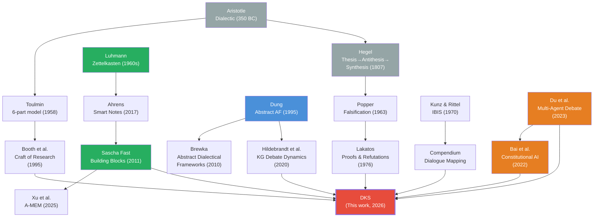
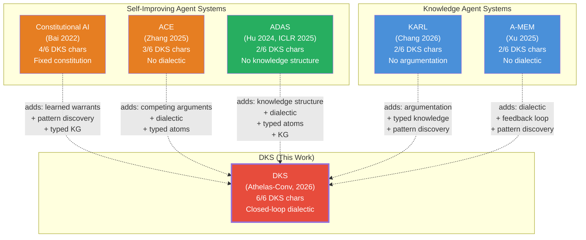

---
tags:
  - resource
  - analysis
  - knowledge_management
  - dialectic
  - novelty_assessment
  - innovation
  - argumentation
  - building_blocks
keywords:
  - Dialectic Knowledge System
  - DKS
  - novelty
  - innovation assessment
  - adjacent possible
  - exaptation
  - intellectual genealogy
  - Dung argumentation
  - Toulmin
  - IBIS
  - multi-agent debate
  - competitive landscape
  - research gap
topics:
  - Innovation Assessment
  - Research Contribution
  - Knowledge Architecture
  - Formal Argumentation
language: markdown
date of note: 2026-04-11
status: active
building_block: argument
folgezettel: "8c5c1a3"
folgezettel_parent: "8c5c1a"
---

# Analysis: DKS Novelty Assessment — What Exists, What's Missing, What's New

## Source

The [DKS formalization [FZ 8c5c1a2]](analysis_dks_formal_foundations_and_implementation.md) grounded the DKS in three formal frameworks (Dung, Toulmin, IBIS) and proposed a 5-layer implementation stack. This note asks the prior question: **Is the DKS a genuinely novel design, or a reframing of existing work?**

We apply the [Innovation Assessment lens](../../.claude/skills/slipbox-review-paper/SKILL.md) (Lens 5 from the paper review skill): Is this truly inventing a new technique, or exapting known methods to a new domain? What prerequisites had to exist (adjacent possible)? What is the intellectual genealogy?

## Method: Systematic Search

We searched for prior work implementing the DKS pattern across three sources:

1. **Vault papers** (312 lit notes, 59 reviews): Keyword search across 6 dimensions — argumentation, feedback loops, typed knowledge, human-AI disagreement, multi-agent debate, prompt optimization
2. **Semantic Scholar**: 6 targeted queries across argumentation+ML, debate+KG, self-improving agents, human-AI disagreement, computational Toulmin, dialectical knowledge systems
3. **Web search**: Dung AF implementations, IBIS knowledge management, multi-agent debate architectures, closed-loop rule optimization

## The Six DKS Characteristics as Search Dimensions

| # | DKS Characteristic | Search Terms |
|:-:|-------------------|-------------|
| C1 | Competing arguments (human vs. AI on same data) | argumentation, debate, human-AI disagreement |
| C2 | Structured disagreement detection & counter-argument capture | counter-argument, gap analysis, conflict resolution |
| C3 | Behavioral pattern discovery from observations | pattern mining, behavior detection, clustering |
| C4 | Closed feedback loop (counter → rule update → reclassify) | self-improving, closed loop, active learning |
| C5 | Typed knowledge atoms (8 building blocks) | typed knowledge, building blocks, ontology |
| C6 | Knowledge graph with typed edges | knowledge graph, typed edges, argumentation graph |

## Findings: What Exists

### Formal Argumentation Theory (C1, C2, C6)

| System | Year | Coverage | What It Does | What It Lacks (vs. DKS) |
|--------|:----:|:--------:|-------------|------------------------|
| **Dung's Abstract AF** | 1995 | C1, C6 | Attack/defense graph with grounded/preferred/stable semantics | Arguments are opaque (no internal structure), no feedback loop, no pattern discovery |
| **Abstract Dialectical Frameworks** (Brewka & Woltran) | 2010 | C1, C2, C6 | Extends Dung with acceptance conditions per argument | Still abstract — no typed atoms, no learning |
| **Toulmin Model** | 1958 | C1, C2 | 6-part argument structure (data, claim, warrant, backing, rebuttal, qualifier) | Descriptive model only — no computation, no feedback loop, no graph |
| **IBIS** (Kunz & Rittel) | 1970 | C1, C2 | Issue → Position → Pro/Con deliberation graph | Manual process, no automation, no pattern discovery, no feedback |
| **Pragma-Dialectics** (van Eemeren) | 2004 | C1, C2 | 10 rules for critical discussion | Quality framework only — no implementation, no computation |

**Verdict**: Formal argumentation provides the **theoretical vocabulary** but none implements a computational system with feedback loops or typed knowledge atoms.

### Multi-Agent Debate (C1, C2, partial C4)

| System | Year | Citations | Coverage | What It Lacks (vs. DKS) |
|--------|:----:|:---------:|:--------:|------------------------|
| **Multi-Agent Debate** (Du et al.) | 2023 | 470+ | C1, C2 | No typed knowledge, no KG, no behavioral patterns, no warrant repair |
| **Reasoning on KGs with Debate Dynamics** (Hildebrandt et al., AAAI) | 2020 | 59 | C1, C2, C6 | Closest match — debate on KG with RL. But no feedback loop improving rules, no typed atoms, no pattern discovery |
| **RUMAD** (2026) | 2026 | 0 | C1, C2, C4 | RL-unified MAD. No typed knowledge, no behavioral patterns |
| **Debate over Mixed-knowledge** (2025) | 2025 | 1 | C1, C2, C6 | Multi-agent for incomplete KGQA. No feedback loop, no pattern discovery |
| **AEGIS** (2026) | 2026 | 0 | C1, C2, C6 | Dialectics + meta-auditing for vulnerabilities. No closed loop, no typed atoms |
| **Voting or Consensus?** (ACL 2025) | 2025 | 44 | C1, C2 | Decision-making in MAD. No KG, no typed knowledge, no feedback |
| **Enhancing Conflict Resolution via Abstract Argumentation** (2024) | 2024 | 0 | C1, C2 | Dung's AF applied to LLMs. No feedback loop, no patterns |

**Verdict**: Multi-agent debate implements **argument ↔ counter-argument** but treats it as a single-round or multi-round reasoning technique. None closes the loop where debate outcomes **change the rules** for future debates.

### Self-Improving Agent Systems (C4, partial C1)

| System | Year | Coverage | What It Lacks (vs. DKS) |
|--------|:----:|:--------:|------------------------|
| **Constitutional AI** (Bai et al.) | 2022 | C1, C2, C4, C5 | AI-vs-AI critique with constitution as rules. Closest to DKS. But no behavioral pattern discovery, no typed KG, constitution is fixed (not refined from disagreement) |
| **DSPy** (Khattab et al.) | 2023 | C4, C5 | Self-improving pipelines with typed modules. No competing arguments, no disagreement detection |
| **TextGrad** (Yuksekgonul et al.) | 2024 | C1, C4 | Disagreement-driven textual feedback. No typed knowledge atoms, no KG, no behavioral patterns |
| **KARL** (Chang et al.) | 2026 | C3, C4 | Knowledge agents with off-policy RL. No competing arguments, no typed atoms |
| **ACE** (Zhang et al.) | 2025 | C3, C4, C5 | Self-improving contexts with delta updates. No competing arguments, no disagreement |
| **Self-Evolving Agents Survey** (Gao et al.) | 2025 | C3, C4 | Comprehensive survey. Documents that no system combines all 6 characteristics |
| **Meta-Harness** (Lee et al.) | 2026 | C4 | Optimizes harness code from traces. No argumentation, no typed atoms, no KG |

**Verdict**: Self-improving systems implement **feedback loops** but without the argumentation structure. Constitutional AI is the closest — it has critique (C1), revision (C4), and constitution-as-rules (C5) — but the constitution is **fixed** (authored by humans, not refined from disagreement).

### Knowledge Graph + Typed Knowledge (C5, C6, partial C3)

| System | Year | Coverage | What It Lacks (vs. DKS) |
|--------|:----:|:--------:|------------------------|
| **A-MEM** (Xu et al.) | 2025 | C5, C6 | Zettelkasten agent memory with typed notes. No argumentation, no feedback loop |
| **PlugMem** (Yang et al.) | 2026 | C5 | 2 knowledge types (propositional, prescriptive). No argumentation, no feedback loop |
| **AutoSchemaKG** (Bai et al.) | 2025 | C5, C6 | Dynamic schema induction. No argumentation, no feedback loop |
| **KARMA** (Lu et al.) | 2025 | C1, C6 | Multi-agent KG enrichment with conflict resolution. No typed atoms, no behavioral patterns, no closed loop |
| **HippoRAG** (Gutierrez et al.) | 2025 | C6 | KG + PPR for RAG. No argumentation, no feedback loop, no typed atoms |

**Verdict**: KG systems implement **typed structure** but without dialectic. A-MEM is the closest — it uses Zettelkasten-style typed notes — but it **accumulates** knowledge without dialectic refinement.

## The Gap Matrix

No existing system covers all 6 characteristics. The maximum coverage is 4/6 (Constitutional AI):

| System | C1 | C2 | C3 | C4 | C5 | C6 | Total |
|--------|:--:|:--:|:--:|:--:|:--:|:--:|:-----:|
| **DKS (Athelas-Conv)** | **Yes** | **Yes** | **Yes** | **Yes** | **Yes** | **Yes** | **6/6** |
| Constitutional AI | Yes | Yes | — | Yes | Yes | — | 4/6 |
| KG Debate Dynamics | Yes | Yes | — | — | — | Yes | 3/6 |
| DSPy | — | — | — | Yes | Yes | — | 2/6 |
| TextGrad | Yes | — | — | Yes | — | — | 2/6 |
| A-MEM | — | — | — | — | Yes | Yes | 2/6 |
| KARMA | Yes | — | — | — | — | Yes | 2/6 |
| Multi-Agent Debate | Yes | Yes | — | — | — | — | 2/6 |
| Self-Evolving Agents | — | — | Yes | Yes | — | — | 2/6 |
| Dung's AF | Yes | — | — | — | — | Yes | 2/6 |
| IBIS | Yes | Yes | — | — | — | — | 2/6 |

## Innovation Assessment (Lens 5)

### Is DKS a genuine invention or exaptation?

**Exaptation**: DKS exapts techniques from four independent fields:
- **Formal argumentation** (Dung, Toulmin) → attack/defense semantics, warrant structure
- **Multi-agent debate** (Du et al.) → automated critique cycle
- **Knowledge management** (Zettelkasten, building blocks) → typed knowledge atoms
- **Active learning** (uncertainty sampling) → efficient human review selection

**But the integration is new.** No prior work combines all four into a single system where:
1. Typed observations are abstracted into behaviors and patterns (C3+C5)
2. Two argument generators independently classify the same data (C1)
3. Disagreement is detected as a typed graph edge (C2+C6)
4. Counter-arguments produce warrant-level repair (C2+C4)
5. Improved warrants are recompiled and the system reclassifies (C4)

**Verdict**: DKS is **exaptation + integration** — each component has precedent, but the specific combination is novel. The adjacent possible was created by the convergence of LLM-powered classification (enabling automated argument generation), Zettelkasten-style typed knowledge (enabling building block ontology), and active learning (enabling efficient disagreement sampling).

### What is the intellectual genealogy?

### Where in the Why → What If → How cycle does DKS sit?

Using Berger's inquiry stages:
- **Why?** stage (complete): Why do knowledge systems need dialectic? Because accumulation without challenge produces knowledge that is comprehensive but not sharp. (FZ 8c5a7 answered this)
- **What If?** stage (current): What if we combined argumentation, typed knowledge, and closed-loop learning into a single architecture? (FZ 8c5c1 hypothesis, 8c5c1a design)
- **How?** stage (beginning): How to formally implement it? (FZ 8c5c1a2 proposed 5-layer stack; Athelas-Conv is proof-of-concept)

DKS is transitioning from **What If?** to **How?** — the concept is validated by one production instance (Athelas-Conv), the formal grounding is established (Dung/Toulmin/IBIS), but the full formal implementation stack (L1-L5) is not yet built.

## The Three Novel Contributions

### Contribution 1: Closed-Loop Dialectic (C4 + C1 + C2)

**What's new**: Counter-arguments don't just exist — they **change the warrants** (rules) and the system reclassifies with improved rules. No prior system does this.

| System | Debate | Rules Improve? |
|--------|:------:|:--------------:|
| Multi-Agent Debate | Yes | No — debate improves the answer, not the rules |
| Constitutional AI | Yes | No — constitution is fixed, not learned from disagreement |
| RLHF | Yes (implicit) | Yes (reward model) — but no typed structure, no warrant identification |
| **DKS** | **Yes** | **Yes — gap reports identify warrant failures, SPOT-X repairs rules, recompile, reclassify** |

RLHF is the closest precedent: human preferences (counter-evidence) improve the model (feedback loop). But RLHF operates on **model weights** (opaque), while DKS operates on **explicit rules in markdown** (auditable, human-editable). DKS's warrant repair is interpretable; RLHF's gradient update is not.

### Contribution 2: Behavioral Pattern Discovery as Dialectic Input (C3 + C5)

**What's new**: Observations are abstracted into typed behavioral atoms that **create new arguments** the system didn't have before. Pattern discovery isn't a side product — it's an integral part of the dialectic cycle.

| System | Discovers Patterns? | Patterns Become Arguments? |
|--------|:-------------------:|:-------------------------:|
| KG Debate Dynamics | No — debates over existing triples | No |
| A-MEM | Yes (note construction) | No — notes are accumulated, not debated |
| Self-Evolving Agents | Yes (tool creation) | No — tools are used, not challenged |
| **DKS** | **Yes — 59 behaviors, 29 patterns** | **Yes — patterns augment rule selection (Stage 1b), creating new classification arguments** |

### Contribution 3: Building Block Ontology as Epistemic Instruction Set (C5 + C6)

**What's new**: The 8 building block types don't just classify knowledge — they **prescribe the next reasoning step**. The ontology edges (naming → structuring → operationalizing → testing → challenging → re-observing) are realized as production Python scripts.

| System | Typed Knowledge? | Types Prescribe Next Step? |
|--------|:----------------:|:--------------------------:|
| A-MEM | Yes (note types) | No — types are descriptive |
| PlugMem | Yes (2 types) | No — types determine storage, not reasoning |
| Dung's AF | No | N/A |
| **DKS** | **Yes (8 types)** | **Yes — observation → concept (detect_behaviors) → model (detect_patterns) → procedure (rule_router) → argument (investigate) → counter-argument (gap analysis) → observation (reclassify)** |

## DKS Under the Agentic AI System Framework

The gap matrix above compared DKS against systems from four fields (argumentation, debate, self-improvement, KG). But DKS is fundamentally an **agentic AI system** — it should be positioned against the taxonomies used in recent agentic AI surveys.

### Where DKS Sits in the Agentic AI Taxonomy

The [Agentic AI Comprehensive Survey (Abouali et al., 2025)](../papers/lit_abouali2025agentic.md) proposes a **dual-paradigm framework**: Symbolic/Classical (MDP/POMDP/BDI) vs. Neural/Generative (DRL/LLMs). DKS is a **hybrid** — it uses symbolic structure (building block ontology, Dung semantics, typed edges) with neural execution (LLM classification, LLM gap analysis):

| Paradigm | DKS Component | Framework |
|----------|--------------|-----------|
| **Symbolic** | State space (building block distribution), Dung labelling, rule conditions/exceptions, IBIS deliberation | MDP formalization, Argumentation framework |
| **Neural** | LLM classification (agent_ decisions), LLM gap analysis, LLM behavior discovery (Tier 2) | LLM-as-classifier, LLM-as-judge |
| **Hybrid integration** | Symbolic state drives neural action selection; neural outputs update symbolic state | Confidence-gated escalation, pointer state + vault reads |

### The Closest Agentic Systems

With DKS formalized as MDP + argumentation, the competitive landscape sharpens. The **5 closest agentic systems** are:

### Detailed Comparison: 5 Closest Systems

| System | What It Optimizes | How It Learns | Knowledge Structure | Dialectic? | Closed Loop? | Coverage |
|--------|------------------|--------------|--------------------|-----------:|:------------:|:--------:|
| **Constitutional AI** | Model behavior (harmlessness) | RLAIF: AI critique → revision → RL training | Constitution = fixed principles (typed but static) | Yes (AI-vs-AI critique) | **Partial** (RL updates weights, not rules) | **4/6** |
| **ACE** | LLM context (playbooks) | Generator→Reflector→Curator with delta updates | Dynamic Cheatsheet (structured but not typed atoms) | No (single-agent reflection) | **Yes** (context evolves per task) | **3/6** |
| **ADAS / Meta Agent Search** | Agent architecture (code) | Meta-agent iteratively programs better agents | Code as representation (Turing-complete but untyped) | No (search, not debate) | **Yes** (but optimizes architecture, not knowledge) | **2/6** |
| **KARL** | Search policy (retrieval) | Off-policy RL (OAPL) with value-guided search | Corpus chunks (no typed structure) | No | **Yes** (RL updates policy) | **2/6** |
| **A-MEM** | Agent memory (notes) | Zettelkasten-style note construction + link generation | Typed notes with bidirectional links | No | **No** (accumulation only) | **2/6** |
| **DKS** | **Classification rules (warrants)** | **Dialectic: human vs. agent → gap → SPOT-X → rule update** | **8-type building blocks + 13 typed edges + 3 databases** | **Yes (operational)** | **Yes (full: counter → rule → recompile → reclassify)** | **6/6** |

### What Each System Would Need to Become a DKS

| System | Missing Components | Difficulty |
|--------|-------------------|:----------:|
| **Constitutional AI** | Replace fixed constitution with **learned rules** from disagreement; add **behavioral pattern discovery**; add **typed KG** | High — requires architectural change from RLAIF to warrant-level repair |
| **ACE** | Add **second argument generator** (human or competing agent); add **typed building blocks** (not just cheatsheet sections); add **argumentation semantics** | Medium — Generator→Reflector is already proto-dialectic; needs to formalize disagreement |
| **ADAS** | Add **knowledge structure** (currently pure code); add **dialectic** (currently search); add **typed atoms** and **KG** | High — ADAS optimizes architecture, not knowledge; orthogonal concern |
| **KARL** | Add **argumentation** (currently retrieval-focused); add **typed knowledge atoms**; add **behavioral patterns** | Medium — RL infrastructure exists; needs knowledge structure layer |
| **A-MEM** | Add **dialectic** (currently accumulation); add **feedback loop** (currently no self-correction); add **competing arguments** | Medium — Zettelkasten structure is ready; needs argument ↔ counter-argument edges |

### The Key Differentiator: What Gets Optimized

Each self-improving system optimizes something different. DKS's unique position is that it optimizes **explicit, human-readable rules (warrants)**:

| System | Optimizes | Representation | Human-Readable? |
|--------|----------|---------------|:---------------:|
| Constitutional AI | Model weights | Neural parameters | No |
| ACE | Context (playbook) | Natural language cheatsheet | Yes |
| ADAS | Agent architecture | Python code | Yes |
| KARL | Search policy | Value network weights | No |
| DSPy | Prompt parameters | Few-shot examples + instructions | Partially |
| TextGrad | Prompt text | Textual gradients | Yes |
| Meta-Harness | Harness code | Python code | Yes |
| **DKS** | **Classification rules** | **Markdown rule_ notes with conditions + exceptions** | **Yes — auditable, version-controlled, A/B tested** |

**DKS optimizes at the warrant level** — the connecting principles between evidence and claims. This is more granular than optimizing prompts (DSPy/TextGrad) and more interpretable than optimizing weights (Constitutional AI/KARL). Each rule change is:
- Documented in a `rule_` note (auditable)
- A/B tested via McNemar's test (validated)
- Compiled to `prompts.json` (deployable)
- Version-controlled in git (traceable)

### ADAS as Orthogonal, Not Competing

ADAS (Automated Design of Agentic Systems) is the most recent and ambitious competitor — it uses a meta-agent to iteratively program better agent architectures. But ADAS is **orthogonal** to DKS:

| Dimension | ADAS | DKS |
|-----------|------|-----|
| **What it optimizes** | Agent **architecture** (code, workflow, prompts) | Agent **knowledge** (rules, patterns, behaviors) |
| **Search space** | All possible agent programs (Turing-complete) | Classification rules within a fixed architecture |
| **Evaluation** | Benchmark accuracy | Domain F1 + human agreement |
| **Knowledge persistence** | None (new agents are disposable) | Vault (permanent, growing, connected) |
| **Human involvement** | None (fully automated) | Human-in-the-loop (active learning) |

**ADAS could optimize the DKS architecture itself** — discovering better node functions, routing strategies, or debate protocols. But it cannot replace DKS's knowledge layer (behaviors, patterns, rules, gap reports). They are complementary:

- **ADAS + DKS**: ADAS optimizes the DKS LangGraph architecture; DKS optimizes the classification knowledge within that architecture
- This is the Meta-Harness insight applied at two levels: Meta-Harness optimizes harness code (≈ADAS), DKS optimizes harness knowledge (rules)

## Candidate Papers for Deeper Study

Based on our search, these papers are the closest to DKS and would benefit from full digest+review:

| Paper | arXiv | Year | Why Relevant | Coverage |
|-------|-------|:----:|-------------|:--------:|
| **Reasoning on KGs with Debate Dynamics** (Hildebrandt et al.) | 2001.00461 | 2020 | Debate as RL game on KG — closest structural match | C1, C2, C6 |
| **AEGIS: Dialectics + Meta-Auditing** | 2603.20637 | 2026 | Graph-guided dialectics for vulnerability detection | C1, C2, C6 |
| **RUMAD: RL-Unified Multi-Agent Debate** | 2602.23864 | 2026 | RL optimizes debate process itself | C1, C2, C4 |
| **Computational Argumentation + Auto Rule-Gen** | IEEE Access | — | Argumentation for explainable rule generation | C1, C2, C4 |
| **Enhancing Conflict Resolution via Abstract Argumentation** | 2412.16725 | 2024 | Dung's AF applied to LLM conflicts | C1, C2 |

| **ADAS: Automated Design of Agentic Systems** (Hu et al.) | 2408.08435 | 2024 (ICLR 2025) | Meta-agent programs better agents iteratively | Orthogonal (optimizes architecture, not knowledge) |

**Recommendations**:
1. Save and digest **"Reasoning on KGs with Debate Dynamics"** (Hildebrandt et al., AAAI 2020) as the most structurally similar prior work — debate as thesis/antithesis on KG
2. Save and digest **"ADAS: Automated Design of Agentic Systems"** (Hu et al., ICLR 2025) as the orthogonal complement — ADAS optimizes architecture while DKS optimizes knowledge
3. Read **"A Comprehensive Survey of Self-Evolving AI Agents"** (arXiv:2508.07407, 2025) for the most current taxonomy of self-improving agents

## Summary Judgment

**DKS is novel as an integrated design pattern** — confirmed both against the original 4-field comparison and against the agentic AI system framework. Constitutional AI is the closest (4/6) but optimizes model weights with a fixed constitution; DKS optimizes explicit rules from dialectic. ADAS is the most ambitious competitor but is orthogonal — it optimizes agent architecture, not agent knowledge. Each component has precedent (Dung for attack semantics, Toulmin for argument structure, IBIS for deliberation, multi-agent debate for automated critique, Zettelkasten for typed knowledge, active learning for efficient sampling). But no prior system combines all six characteristics into a single architecture where:

1. Observations are typed and abstracted into behavioral patterns
2. Two independent argument generators classify the same data
3. Disagreement is a first-class typed graph edge
4. Counter-arguments identify warrant-level failures
5. Warrants (rules) are repaired and the system reclassifies
6. The building block ontology prescribes the reasoning cycle

The closest system is **Constitutional AI** (4/6 characteristics), but it lacks behavioral pattern discovery and its constitution is fixed rather than learned from disagreement. The DKS innovation is the **integration** of argumentation, typed knowledge, and closed-loop learning — enabled by the adjacent possible of LLM-powered classification, Zettelkasten building blocks, and active learning.

## Related Notes

### Cross-Trail Sharpening (Architecture Trail)
- **[FZ 7g1a1a1a1a1: ★ Synthesis — The Vault Is a CQRS Knowledge System](thought_synthesis_two_systems_cqrs_value_proposition.md)** — sharpens DKS's literature contribution by placing it as **System P's runtime in a CQRS architecture**. The novelty claim narrows to "closed-loop dialectic for warrant precision" (a write-side claim) rather than "thinking system over the slipbox" (which conflated read and write). The 4/6 Constitutional AI gap remains, but with a sharper framing of what DKS does vs what it deliberately does not do (retrieval).

### Folgezettel Trail
- **Parent [FZ 8c5c1a]**: [DKS Design](../../projects/athelas_conv/athelas_conv_dialectic_knowledge_system.md) — The design being assessed
- **Sibling [FZ 8c5c1a1]**: [Evidence: Epistemic Trail](analysis_athelas_conv_epistemic_trail_evidence.md) — Production proof
- **Sibling [FZ 8c5c1a2]**: [Formalization: Dung + Toulmin + IBIS](analysis_dks_formal_foundations_and_implementation.md) — Formal grounding

### Connected Notes
- [Term: Dialectic Knowledge System](../term_dictionary/term_dialectic_knowledge_system.md) — DKS definition
- [Competitive Landscape](analysis_agentic_km_landscape_vs_abuse_slipbox.md) — 13 systems surveyed (FZ 1)
- [Meta-Question: Value of Typed Knowledge](thought_meta_question_value_of_typed_knowledge.md) — Does typed knowledge provide measurable value?
- [Dialectic Generalization [FZ 8c5a7]](thought_nexustrace_dialectic_generalization.md) — "Decisions are arguments"
- [Term: Argumentation](../term_dictionary/term_argumentation.md) — Formal argumentation theory
- [Term: Knowledge Building Blocks](../term_dictionary/term_knowledge_building_blocks.md) — 8-type taxonomy

### Vault Papers (Closest to DKS)
- [Constitutional AI (Bai et al., 2022)](../papers/lit_bai2022constitutional.md) — 4/6 coverage: critique + constitution + feedback
- [DSPy (Khattab et al., 2023)](../papers/lit_khattab2023dspy.md) — Typed modules + compilation feedback loop
- [TextGrad (Yuksekgonul et al., 2024)](../papers/lit_yuksekgonul2024textgrad.md) — Disagreement-driven textual feedback
- [Agent-as-a-Judge (You et al., 2026)](../papers/lit_you2026agent.md) — Multi-agent evaluation
- [A-MEM (Xu et al., 2025)](../papers/lit_xu2025amem.md) — Zettelkasten agent memory
- [Self-Evolving Agents (Gao et al., 2025)](../papers/lit_gao2025survey.md) — Survey of self-improving agents
- [Meta-Harness (Lee et al., 2026)](../papers/lit_lee2026metaharness.md) — Execution-trace optimization

### External Papers (Candidates for Future Digest)
- [Hildebrandt et al. (2020). "Reasoning on KGs with Debate Dynamics." AAAI](https://arxiv.org/abs/2001.00461) — Debate as RL game on KG (59 citations)
- [AEGIS (2026). "Graph-Guided Dialectics + Meta-Auditing."](https://arxiv.org/abs/2603.20637) — Dialectics for vulnerability detection
- [RUMAD (2026). "Reinforcement-Unifying Multi-Agent Debate."](https://arxiv.org/abs/2602.23864) — RL-optimized MAD
- [Enhancing Conflict Resolution via Abstract Argumentation (2024)](https://arxiv.org/abs/2412.16725) — Dung's AF applied to LLMs
- [Argumentation and Machine Learning (2024)](https://arxiv.org/abs/2410.23724) — Survey combining argumentation with ML

---

**Last Updated**: 2026-04-11
