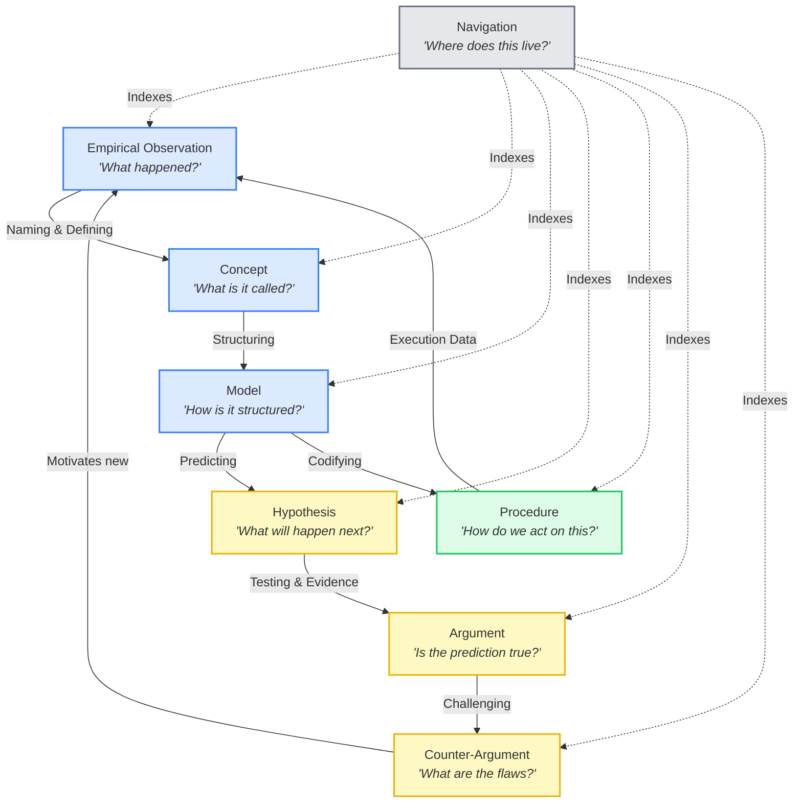

---
tags:
  - resource
  - analysis
  - knowledge_management
  - building_blocks
  - ontology
  - epistemology
  - mental_model
keywords:
  - building blocks
  - ontology
  - epistemic reasoning cycle
  - knowledge relationships
  - Sascha
  - knowledge building blocks
  - directed graph
  - composition
  - mental model
  - naming
  - structuring
  - predicting
  - testing
  - challenging
  - codifying
topics:
  - Knowledge Management
  - Epistemology
  - Ontology
  - Building Blocks
language: markdown
date of note: 2026-04-10
status: active
building_block: argument
folgezettel: "1"
folgezettel_parent: ""
---

# Thought: The Ontology of Building Block Relationships — Extending Sascha's Taxonomy from Types to a Directed Graph

## Thesis

Sascha Fast's Knowledge Building Blocks ([The Complete Guide to Atomic Note-Taking](../digest/digest_atomicity_guide_sascha.md)) defines **6 types** of knowledge atoms: concepts, arguments, counter-arguments, models, hypotheses, and empirical observations. This taxonomy answers "what type of knowledge is this note?" But Sascha's framework is deliberately **flat** — the types are presented as an unordered set with no prescribed relationships between them.

The Tessellum extends this taxonomy in two ways: (1) adding **2 additional types** (procedure, navigation) for operational knowledge, and (2) defining **directed relationships between the 8 types** that form an **epistemic reasoning cycle** — a directed graph showing how knowledge flows from observation to theory to action and back. This extension transforms Sascha's classification scheme from a **type system** into an **ontology** — with both types and relations.

## What Sascha Defined (The Types)

Sascha's original 6 building blocks (later refined to the taxonomy below):

| Building Block | Question | Sascha's Definition |
|---|---|---|
| **Concept** | "What is it?" | Define specific parts of reality by drawing boundaries |
| **Empirical Observation** | "What happened?" | Results from sensory engagement with reality |
| **Model** | "How does it relate?" | Show relationships between entities and whole-part dynamics |
| **Hypothesis** | "What do we predict?" | Formulate reality statements; theories include methods |
| **Argument** | "Why believe this?" | Transfer truth between statements via logical structure |
| **Counter-Argument** | "What's wrong?" | Disrupt truth transfer from arguments |

**What Sascha explicitly did NOT define**: How these types relate to each other. The taxonomy is a set of categories, not a graph. Sascha's guidance is "one building block per note" — but he doesn't say which blocks connect to which, or in what direction knowledge flows between them.

## What We Added (The Relationships)

The Tessellum's extension defines **10 directed relationships** between the 8 building blocks (6 original + 2 added: procedure, navigation):


**Mermaid source** (for rendering in Obsidian, GitHub, or any mermaid-compatible viewer):



### The 10 Edges

| From | Relationship | To | Meaning |
|------|-------------|-----|---------|
| Empirical Observation | **Naming & Defining** | Concept | Observations are named and categorized into concepts |
| Concept | **Structuring** | Model | Concepts are organized into structural models |
| Model | **Predicting** | Hypothesis | Models generate testable predictions |
| Model | **Codifying** | Procedure | Models are operationalized into action steps |
| Hypothesis | **Testing & Evidence** | Argument | Hypotheses are tested; results become evidence-backed arguments |
| Argument | **Challenging** | Counter-Argument | Arguments invite adversarial critique |
| Counter-Argument | *(feeds back)* | Empirical Observation | Challenges motivate new observations to resolve the dispute |
| Procedure | **Execution Data** | Empirical Observation | Executing procedures generates new observational data |
| Navigation | **Indexes** | All types | Navigation notes route to all other building blocks |

### The Cycle

The relationships form a **directed cycle** — knowledge flows and compounds:


```
Observation → (naming) → Concept → (structuring) → Model
                                                      ↓
                                                 (predicting)  (codifying)
                                                      ↓              ↓
                                                 Hypothesis     Procedure
                                                      ↓              ↓
                                                 (testing)    (execution)
                                                      ↓              ↓
                                                  Argument ←─────────┘
                                                      ↓         (new data)
                                                 (challenging)
                                                      ↓
                                               Counter-Argument
                                                      ↓
                                                 (motivates)
                                                      ↓
                                              New Observation ──→ ...
```

## Why This Extension Matters

### 1. From Classification to Reasoning

Sascha's types tell you **what** a note is. Our relationships tell you **what to do next**:

| You have... | Sascha says... | The ontology says... |
|-------------|---------------|---------------------|
| An observation | "This is an empirical observation" | "Name it (→ concept), or structure it (→ model)" |
| A hypothesis | "This is a hypothesis" | "Test it with evidence (→ argument)" |
| An argument | "This is an argument" | "Challenge it (→ counter-argument)" |
| A model | "This is a model" | "Predict from it (→ hypothesis) or codify it (→ procedure)" |

**The edges are prescriptive, not just descriptive.** They tell the agent (or the human) what reasoning step follows.

### 2. From Static to Dynamic Knowledge

Sascha's types are **static** — a note's type doesn't change. Our relationships are **dynamic** — they describe how knowledge **evolves**:

- An observation becomes a concept when named
- A concept becomes a model when structured
- A model becomes a hypothesis when used to predict
- A hypothesis becomes an argument when tested
- An argument invites a counter-argument
- A counter-argument motivates new observations

**This is a knowledge lifecycle**, not just a classification.

### 3. From Individual Notes to System Quality

Sascha's types enable per-note quality checks ("is this note atomic?"). Our relationships enable **system-level quality diagnostics**:

- "Many observations but few concepts" → naming gap (→ run `capture-term-note`)
- "Many models but few hypotheses" → prediction gap (→ run `capture-hypothesis`)
- "Many arguments but few counter-arguments" → adversarial gap (→ run `generate-questions`)
- "Many models but few procedures" → operationalization gap (→ run `distill-ari-sop`)

**The edges tell you which gaps are downstream of which.** A naming gap (observation → concept) propagates: without concepts, you can't build models; without models, you can't generate hypotheses.

### 4. Three Visual Layers in the Diagrams

The two diagrams encode three distinct layers:

| Layer | Clean Diagram | Mermaid Diagram |
|-------|--------------|-----------------|
| **Type layer** | Color-coded boxes (blue = knowledge, yellow = reasoning, green = action, gray = meta) | Same boxes with questions ("What happened?", "What is it called?") |
| **Relationship layer** | Arrows between boxes (direction of knowledge flow) | Labeled edges (Naming, Structuring, Predicting, Testing, Challenging, Codifying, Execution Data) |
| **Routing layer** | Navigation → all (dashed lines) | Navigation → all with "Indexes" labels |

The **color coding** reveals a deeper structure:

| Color | Building Blocks | Epistemic Function |
|-------|----------------|-------------------|
| **Blue** (knowledge) | Observation, Concept, Model | Descriptive — what is, what it's called, how it's structured |
| **Yellow** (reasoning) | Hypothesis, Argument, Counter-Argument | Evaluative — what we predict, why we believe, what might be wrong |
| **Green** (action) | Procedure | Prescriptive — what to do |
| **Gray** (meta) | Navigation | Routing — where to find it |

The cycle flows from **blue (observe) → blue (name) → blue (structure) → yellow (predict) → yellow (argue) → yellow (challenge) → back to blue (new observations)**. Green (procedure) branches off from blue (model) and feeds back new observations. Gray (navigation) connects everything.

## The Ontology as an Agentic Routing Table

For agents, the ontology IS the decision logic:

```python
def next_action(current_note_type, vault_state):
    """Given a note type, determine the next reasoning action."""
    routes = {
        'empirical_observation': ('capture-term-note', 'Name and define what was observed'),
        'concept':              ('capture-model-note', 'Structure concepts into a model'),
        'model':                ('capture-hypothesis',  'Generate predictions from the model'),
        'hypothesis':           ('review-paper',        'Test with evidence → build argument'),
        'argument':             ('generate-questions',  'Challenge with counter-arguments'),
        'counter_argument':     ('search-notes',        'Find new observations to resolve'),
        'procedure':            ('run-incremental-update', 'Procedure executed → capture results'),
        'navigation':           ('search-notes',        'Route to the right note'),
    }
    return routes.get(current_note_type, ('search-notes', 'Explore'))
```

**This routing table doesn't exist in Sascha's framework** — it's enabled by the ontology extension.

## Relationship to Sascha's Contextualizing Principles

Sascha's three principles (Sound Communication, Focus, Purpose) moderate when atomicity should bend. Our ontology respects all three:

1. **Sound Communication**: The edges are **soft guidance**, not hard rules. A model note that includes a brief procedure section (Sound Communication) doesn't violate the ontology — it just means the model → procedure edge is realized within one note rather than across two.

2. **Focus**: Each note has one building block type (one focused subject). The edges describe connections **between** notes, not **within** notes.

3. **Purpose**: Navigation notes have a special purpose (routing) — the ontology reflects this by giving them "Indexes" edges to all other types, unlike the directional edges between knowledge types.

## Open Questions

| # | Open Question |
|---|-------------|
| **OQ34** | Are the 10 edges we defined the *complete* set, or are there missing relationships? (e.g., does Counter-Argument → Hypothesis exist directly — "a critique motivates a revised prediction"?) |
| **OQ35** | Do the edge labels (Naming, Structuring, Predicting, etc.) map to specific cognitive operations — and can an agent be trained to perform each operation as an atomic skill? |
| **OQ36** | Is the cycle direction (observation → concept → model → hypothesis → argument → counter-argument → observation) the only valid reasoning direction, or can knowledge flow backwards (argument → hypothesis revision)? |

## Related Notes

### Folgezettel Trail
- **★ Trail outcome [FZ 7g1a1a1a1]**: [Synthesis: One Vault, Three Invariance Regimes](thought_synthesis_three_invariance_regimes_one_vault.md) — where the FZ 7g1 chain concludes; this note (FZ 7g) is preserved as Layer 1 (Ontology) of a three-regime architecture.
- **Parent [FZ 7]**: [Atomicity as Universal Scaling Principle](thought_atomicity_as_universal_scaling_principle.md) — The 7-property definition; this note adds the relationship layer
- **Child [FZ 7g1]**: [Counter: BB Ontology Misses Same-BB Deep-Dive Trail](counter_bb_ontology_misses_same_bb_deep_dive.md) — Argues the 10 cross-type edges miss the dominant deep-dive pattern (intent → model → variable → a data loading service → ETL, all in "model" BB); proposes a parallel architectural edge family
- **Sibling [FZ 7a]**: [SlipBox Skills vs Atomic Skills](thought_slipbox_skills_vs_atomic_skills.md) — Skill routing uses these relationships
- **Sibling [FZ 7b]**: [Atomicity Evaluation](thought_atomicity_evaluation_abuse_slipbox.md) — Sascha's types validated; this note extends with relationships
- **Sibling [FZ 7c]**: [Vault Health](analysis_building_block_vault_health.md) — Distribution diagnostic uses type counts; this note explains why gaps propagate via edges
- **Sibling [FZ 7f]**: [Thinking Protocol](thought_slipbox_thinking_protocol.md) — The reasoning protocol follows these edges as reasoning steps

### Applied
- **[FZ 5k2: Ontology-Grounded Multi-Hop Benchmark](thought_ontology_grounded_multi_hop_benchmark.md)** — Uses this ontology's 10 directed edges to define multi-hop QA questions; Edge Recall@K measures whether retrieval recovers ontology edge pairs

### Source Digests
- **[The Complete Guide to Atomic Note-Taking (Sascha)](../digest/digest_atomicity_guide_sascha.md)** — Original 6-type taxonomy this note extends
- **[Intellectual Roots of Building Blocks](../digest/digest_intellectual_roots_knowledge_building_blocks.md)** — Epistemological grounding for each type
- **[Atomicity Principle (Sascha)](../digest/digest_atomicity_zettelkasten_christian.md)** — The atomicity principle that the ontology operationalizes

### Term Notes
- **[Knowledge Building Blocks](../term_dictionary/term_knowledge_building_blocks.md)** — Overview term note
- 8 individual building block terms: [Concept](../term_dictionary/term_knowledge_building_blocks_concept.md) | [Argument](../term_dictionary/term_knowledge_building_blocks_argument.md) | [Counter-Argument](../term_dictionary/term_knowledge_building_blocks_counter_argument.md) | [Model](../term_dictionary/term_knowledge_building_blocks_model.md) | [Hypothesis](../term_dictionary/term_knowledge_building_blocks_hypothesis.md) | [Empirical Observation](../term_dictionary/term_knowledge_building_blocks_empirical_observation.md) | [Procedure](../term_dictionary/term_knowledge_building_blocks_procedure.md) | [Navigation](../term_dictionary/term_knowledge_building_blocks_navigation.md)

### Entry Points
- **[Entry: Tessellum Research](../../0_entry_points/entry_abuse_slipbox_research.md)** — Section 5.3 contains the reasoning cycle diagram
- **[Entry: Argument Trail](../../0_entry_points/entry_abuse_slipbox_argument_trail.md)** — This note is FZ 7g

- [FZ 10b: BB × Category × Directory Mapping](thought_bb_category_directory_mapping.md) — empirical routing principles derived from the ontology

### Forward Extensions (FZ 10d1e1a family — applying the ontology as software architecture)

- **** — argues this ontology IS the design principle for the universal decomposer skill: split axis = BB type; cross-leaf inlinks = the 10 directed edges, correct-by-construction
- **** — applies the BB ↔ category mapping (FZ 10b) at *add-to-plan* time; sub-category becomes a deferred decision driven by leaf content
- **[FZ 10d1e1a5 ★](thought_synthesis_knowledge_auto_digest_architecture.md)** — Central design synthesis: the 12-criteria validator (C1–C12) operationalizes the ontology's purity rules; the 5-role architecture deploys the 10 directed edges as auto-generated cross-leaf inlinks
---

**Last Updated**: 2026-04-10

