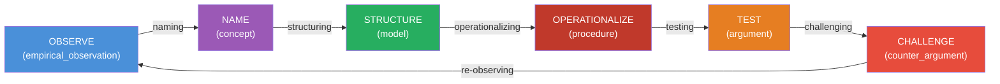

---
tags:
  - resource
  - analysis
  - dialectic
  - knowledge_management
  - thinking_protocol
  - knowledge_graph
  - zettelkasten
  - building_blocks
keywords:
  - DKS as thinking protocol
  - Slipbox knowledge graph
  - protocol over intelligence
  - two entities
  - separation of concerns
  - substrate vs process
  - knowledge structure vs reasoning cycle
  - thinking protocol
  - building block ontology
topics:
  - Knowledge Architecture
  - System Design
  - Epistemic Reasoning
  - Dialectic Reasoning
language: markdown
date of note: 2026-04-11
status: active
building_block: hypothesis
folgezettel: "8c5c1a10"
folgezettel_parent: "8c5c1a"
---

# Hypothesis: DKS Is a Thinking Protocol Running on a Slipbox Knowledge Graph — Two Entities, Not One

## The Claim

We have been describing DKS as a single system — "a neuro-symbolic architecture," "a knowledge system with dialectic." But DKS is actually **two separable entities**:

1. **The Slipbox KG** — the knowledge substrate (typed notes, building block ontology, 13 typed edges, 3 databases, vault of markdown files)
2. **The DKS Thinking Protocol** — the reasoning process that runs on top of the substrate (observe → name → structure → operationalize → test → challenge → improve)

These are related but **independent**. The Slipbox KG can exist without the DKS protocol (it's just a knowledge base). The DKS protocol could in principle run on a different substrate (a different KG, a different note system). The power comes from their combination — but they should be understood and evaluated as separate contributions.

## The Analogy

| Analogy | Substrate | Protocol |
|---------|-----------|----------|
| Computer | Hardware (CPU, memory, disk) | Operating system + programs |
| Database system | Storage engine (B-tree, LSM) | Query language (SQL) |
| Neural network | Weights + architecture | Training algorithm (SGD, Adam) |
| Web | HTTP servers + HTML pages | Search engine (PageRank) |
| **DKS** | **Slipbox KG** (typed notes, edges, databases) | **Thinking Protocol** (dialectic cycle) |

The substrate stores and structures. The protocol reasons and improves. Neither is useful without the other, but they have **different design principles, different evaluation criteria, and different contributions to the literature**.

## Entity 1: The Slipbox KG (Substrate)

### What It Is

A knowledge graph built on Zettelkasten principles:

| Component | Implementation |
|-----------|---------------|
| **Nodes** | Markdown notes with YAML frontmatter |
| **Node types** | 8 building blocks (concept, model, procedure, argument, counter-argument, hypothesis, observation, navigation) |
| **Edges** | Wiki-links formalized as 13 typed, directed relationships |
| **Schema** | Building block ontology (8 types × 10 directed edges) |
| **Storage** | Filesystem (markdown) + SQLite index + ChromaDB vectors |
| **Retrieval** | 5-tier pipeline (entry point → structured filter → keyword → semantic → graph traversal) |
| **Organization** | P.A.R.A. (Projects/Areas/Resources/Archives) |
| **Quality** | PageRank importance, atomicity drift detection, ghost note tracking |

### Its Intellectual Lineage

Zettelkasten (Luhmann) → Digital tools (Obsidian) → Agent-augmented vault (Abuse SlipBox) → Typed KG (building block ontology)

### What It Contributes Independently

Even without the DKS protocol, the Slipbox KG contributes:
- **Building block typing** — 8 epistemic types enabling health diagnosis ([RQ1.1](analysis_research_questions_abuse_slipbox.md))
- **Structured retrieval** — SQL over metadata outperforming embedding-only retrieval for structured queries ([RQ3.1](analysis_research_questions_abuse_slipbox.md))
- **Ghost note analysis** — knowledge gaps detected from broken links ([RQ3.2](analysis_research_questions_abuse_slipbox.md))
- **Atomicity criteria** — building-block-defined atomicity replacing subjective "one idea per note" ([RQ2.1](analysis_research_questions_abuse_slipbox.md))

### Evaluated Against

Knowledge graph systems (GraphRAG, HippoRAG, AutoSchemaKG), agent memory (A-MEM, PlugMem, Memoria), digital Zettelkasten tools (Obsidian, Roam)

## Entity 2: The DKS Thinking Protocol (Process)

### What It Is

A reasoning cycle that runs on the Slipbox KG:



The protocol has these properties:
- **Phase-driven**: 7 phases, each mapped to a building block type
- **Edge-guided**: The ontology edges prescribe which phase follows which
- **Dialectic**: The test → challenge transition is the core — competing arguments produce counter-arguments that improve warrants
- **Closed-loop**: Challenge → re-observe closes the cycle — improved warrants are recompiled and tested again
- **Convergent**: The cycle converges toward [dialectical adequacy](../term_dictionary/term_dialectical_adequacy.md) — warrants surviving all counter-arguments

### Its Intellectual Lineage

Hegel (dialectic) → Dung (attack semantics) → Toulmin (warrant structure) → Multi-agent debate (automated dialectic) → DKS protocol (closed-loop warrant repair on typed KG)

### What It Contributes Independently

Even on a different substrate, the DKS protocol contributes:
- **Closed-loop dialectic** — counter-arguments change warrants (C1)
- **Dialectical adequacy** — quality-based termination for argumentation (C3)
- **Warrant precision** — the learning objective: necessary and sufficient conditions for rules
- **Confidence-gated escalation** — route by CCS: single-agent / debate / human

### Evaluated Against

Multi-agent debate (MAD, RUMAD, ECON), self-improving agents (Constitutional AI, ADAS), formal argumentation (Dung, Toulmin, IBIS)

## Why the Separation Matters

### 1. Cleaner Contribution Claims

Currently DKS claims 3 contributions that mix substrate and protocol:

| Contribution | Substrate or Protocol? |
|-------------|:---------------------:|
| C1: Closed-loop dialectic for warrant precision | **Protocol** |
| C2: Building block ontology as epistemic instruction set | **Both** — the ontology is substrate, its use as instruction set is protocol |
| C3: Dialectical adequacy as quality criterion | **Protocol** |

Separating them clarifies: C1 and C3 are **protocol contributions** (novel reasoning process). C2 is the **interface** — the building block ontology is what makes the protocol possible on this substrate. The ontology alone (substrate) is an extension of Sascha Fast's Zettelkasten theory. The ontology as instruction set (protocol) is what's novel.

### 2. Independent Evaluation

| Dimension | Evaluate Slipbox KG Against | Evaluate DKS Protocol Against |
|-----------|---------------------------|------------------------------|
| **Baselines** | Obsidian, A-MEM, GraphRAG, PlugMem | MAD, Constitutional AI, RUMAD, RLHF |
| **Metrics** | Retrieval quality, coverage, atomicity | F1 improvement, dialectical adequacy, warrant precision |
| **Ablations** | Remove building blocks → untyped KG | Remove dialectic → accumulation-only |
| **User studies** | Navigability, onboarding time | Decision quality improvement rate |

### 3. Transferability

If DKS is one monolithic system, it transfers only to domains that can replicate the entire architecture. If DKS is protocol + substrate, each transfers independently:

- **Substrate transfers**: Any domain needing typed, linked, agent-augmented knowledge → apply Slipbox KG with domain-specific building blocks
- **Protocol transfers**: Any domain with competing classifiers and human feedback → apply DKS cycle regardless of substrate (could run on Neo4j, Notion, even a spreadsheet with typed columns)

### 4. Connection to Prior Work

The [Slipbox Thinking Protocol [FZ 7f]](thought_slipbox_thinking_protocol.md) already proposed "protocol-over-intelligence" — running a structured reasoning protocol on the knowledge graph. The [7-phase expansion [FZ 7f1]](thought_thinking_protocol_building_block_expansion.md) mapped ontology edges to reasoning phases. The DKS protocol is the **operational realization** of what FZ 7f proposed — but with dialectic (challenge phase) and closed loop (improve → re-observe) added.

```
FZ 7f:  Thinking Protocol (proposed) — traverse the graph step by step
FZ 7f1: Ontology expansion (proposed) — building block edges as reasoning transitions
FZ 7f2: Reasoning pipeline (proposed) — state machine composing skills
DKS:    Operational realization — the protocol runs in production with dialectic + closed loop
```

### 5. The Building Block Ontology Is the API

In software terms, the building block ontology is the **API** between substrate and protocol:

```
Substrate (Slipbox KG)                Protocol (DKS Thinking Protocol)
┌─────────────────────┐              ┌─────────────────────────┐
│ Markdown notes      │              │ OBSERVE phase           │
│ YAML frontmatter    │   building   │ NAME phase              │
│ SQLite index        │◄──block────►│ STRUCTURE phase         │
│ Wiki-links          │   ontology   │ OPERATIONALIZE phase    │
│ PageRank            │   (8 types   │ TEST phase              │
│ ChromaDB vectors    │    10 edges) │ CHALLENGE phase         │
│ PARA organization   │              │ IMPROVE + RE-OBSERVE    │
└─────────────────────┘              └─────────────────────────┘
```

The ontology defines **what the protocol can see and do** — which note types exist, which transitions are valid, which phases produce which building blocks. Change the ontology → change what the protocol can reason about. Change the substrate → the ontology interface stays the same.

## Predictions

| # | Prediction | Testable By |
|---|-----------|-------------|
| **P11** | The DKS protocol can run on a non-Slipbox substrate (e.g., Neo4j graph with the same 8 building block types) and still produce warrant improvement | Implement DKS cycle on a different KG backend; measure F1 improvement |
| **P12** | The Slipbox KG without the DKS protocol (accumulation only) will plateau in answer quality, while adding the protocol will produce continued improvement | A/B test: Slipbox KG + accumulation vs. Slipbox KG + DKS protocol over 3 months |
| **P13** | The building block ontology (the API) is the binding constraint — removing it breaks both substrate quality (no typed atoms) and protocol function (no phase guidance) | Ablation: replace 8 building blocks with untyped notes; measure both retrieval quality and protocol convergence |

## Related Notes

### Cross-Trail Refinement (Architecture Trail)
- **[FZ 7g1a1a1: DKS Constructs Knowledge, Retrieval Consumes It](thought_dks_constructs_knowledge_retrieval_consumes_it.md)** — sharpens this note's **two-entity model (Substrate + Protocol) into a three-entity model** (Substrate + Read Protocol + Write Protocol). DKS = Write Protocol; Retrieval = Read Protocol; Substrate is shared. The mutual enablement story for Substrate ↔ Protocol holds; a parallel Substrate ↔ Retrieval story is added.
- **[FZ 7g1a1a1a1: ★ Synthesis — One Vault, Three Invariance Regimes](thought_synthesis_three_invariance_regimes_one_vault.md)** — promotes the three entities into three **invariance regimes** with distinct design disciplines. DKS literature contribution sharpens to "closed-loop dialectic for warrant precision" (a write-protocol claim, not an answer-engine claim).

### Folgezettel Trail
- **Parent [FZ 8c5c1a]**: [DKS Design](../../projects/athelas_conv/athelas_conv_dialectic_knowledge_system.md)
- **Connected [FZ 7f]**: [Slipbox Thinking Protocol](thought_slipbox_thinking_protocol.md) — protocol-over-intelligence proposal
- **Connected [FZ 7f1]**: [Thinking Protocol Building Block Expansion](thought_thinking_protocol_building_block_expansion.md) — ontology edges as reasoning transitions
- **Connected [FZ 7f2]**: [Reasoning Pipeline from Atomic Skills](thought_reasoning_pipeline_from_atomic_skills.md) — state machine

### Counter-Argument Context
- [FZ 8c5c1a9a]: [Counter: Missing Zettelkasten Foundations](counter_dks_missing_zettelkasten_foundation.md) — motivated this separation
- [FZ 8c5c1a9b]: [Zettelkasten in KG and Agent AI](analysis_zettelkasten_in_kg_and_agent_ai.md) — substrate landscape

### Term Notes
- [Term: DKS](../term_dictionary/term_dialectic_knowledge_system.md) | [Term: Zettelkasten](../term_dictionary/term_zettelkasten.md) | [Term: Knowledge Building Blocks](../term_dictionary/term_knowledge_building_blocks.md)
- [Term: Dialectical Adequacy](../term_dictionary/term_dialectical_adequacy.md) | [Term: MAD](../term_dictionary/term_multi_agent_debate.md)

---

**Last Updated**: 2026-04-11
