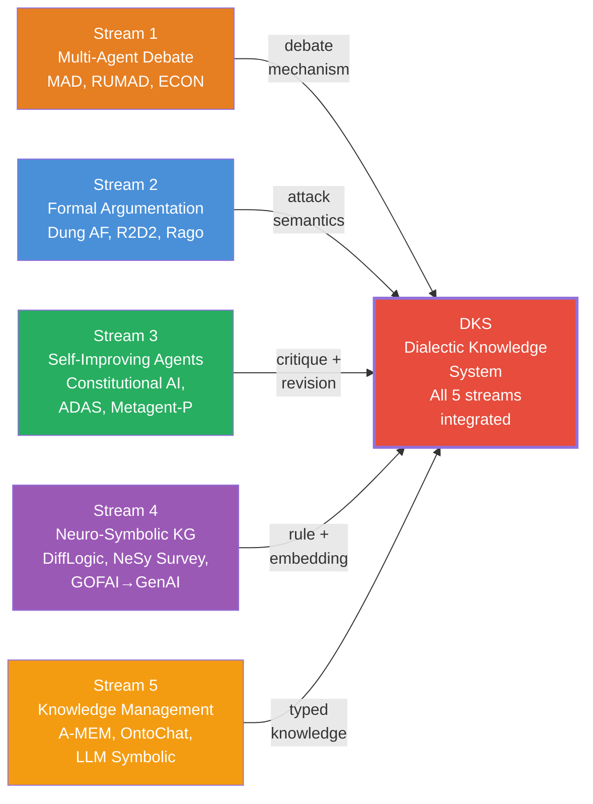
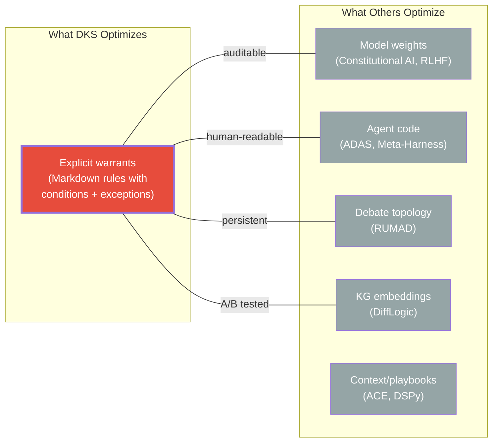

---
tags:
  - resource
  - analysis
  - dialectic
  - literature_review
  - contribution
  - knowledge_management
  - multi_agent
  - symbolic_ai
  - argumentation
keywords:
  - DKS contribution
  - literature review
  - related work synthesis
  - warrant-level optimization
  - dialectical adequacy
  - neuro-symbolic
  - multi-agent debate
  - closed-loop learning
  - building block ontology
  - research positioning
topics:
  - Literature Review
  - Research Contribution
  - Knowledge Architecture
  - System Design
language: markdown
date of note: 2026-04-11
status: active
building_block: argument
folgezettel: "8c5c1a9"
folgezettel_parent: "8c5c1a"
---

# Literature Review: Where DKS Lies and What It Contributes

## Scope

This note synthesizes the systematic literature search across **12 fully digested and reviewed papers** spanning two research directions — multi-agent debate (6 papers) and symbolic AI (6 papers) — plus 24 vault papers and ~60 external candidates identified through Semantic Scholar and web searches. It positions the [Dialectic Knowledge System](../term_dictionary/term_dialectic_knowledge_system.md) in the literature and sharpens its contribution claims.

## The Research Landscape: Five Streams

DKS sits at the intersection of five research streams. No prior work spans all five.

## Stream-by-Stream Analysis

### Stream 1: Multi-Agent Debate (MAD)

**What exists**: MAD improves single-answer quality through adversarial rounds (Du 2023, Liang 2023). RUMAD optimizes debate topology via RL (Wang 2026). ECON formalizes convergence via Bayesian Nash Equilibrium (Yi 2025).

**What MAD lacks** (from our reviews):
- **No persistent learning**: Debate state discarded after each query — every debate starts fresh ([review: Liang 6/10](../papers/review_liang2023encouraging.md))
- **Conclusion-level attacks only**: Agents debate WHAT the answer is, not WHY — making repair untargeted
- **No quality-based termination**: Fixed rounds or consensus, both fail (ICLR 2025: "overly aggressive")
- **No knowledge structure**: Arguments are untyped natural language, not building-block-classified atoms

**DKS contribution over MAD**: Five strengths ([FZ 8c5c1a6c](thought_dks_strength_in_multi_agent_debate.md)) — (S1) debate remembers via vault, (S2) warrant-level attacks, (S3) typed attacks enable targeted repair, (S4) [dialectical adequacy](../term_dictionary/term_dialectical_adequacy.md) as termination, (S5) two-timescale compounding.

### Stream 2: Formal Argumentation

**What exists**: Dung's AF (1995) provides attack/defense semantics with grounded/preferred/stable labelling. The Argumentation+ML survey (Rago 2024) maps the field but finds an implementation gap. R2D2 (Hildebrandt 2020) applies debate dynamics to KG triple classification via RL.

**What formal argumentation lacks**:
- **No closed loop**: Dung's framework models single-round argumentation — no mechanism for counter-arguments to improve warrants ([review: Hildebrandt 5/10](../papers/review_hildebrandt2020reasoning.md))
- **No LLM integration**: QBAF-MLP equivalence (Rago) is theoretical; no system applies it operationally
- **No pattern discovery**: R2D2 debates existing triples; it doesn't discover new behavioral patterns from observations

**DKS contribution over formal argumentation**: Operationalizes Dung semantics + Toulmin warrants in a production system. The building block ontology provides the typed structure that pure AF lacks. Gap reports (counter-arguments) produce warrant-level repair — connecting argumentation theory to operational system improvement.

### Stream 3: Self-Improving Agents

**What exists**: Constitutional AI (Bai 2022) uses AI-vs-AI critique with a fixed constitution. ADAS (Hu 2024) auto-designs agent architectures via meta-agent search. Metagent-P (Zhou 2025) learns symbolic rules bidirectionally with a metacognitive reflector.

**What self-improving agents lack**:
- **Constitutional AI**: Constitution is fixed — not learned from disagreement ([review: 4/6 DKS coverage](analysis_dks_novelty_assessment.md))
- **ADAS**: Optimizes architecture (code), not knowledge (warrants) — orthogonal to DKS ([review: Hu 7/10](../papers/review_hu2024automated.md))
- **Metagent-P**: Bidirectional rules closest to DKS warrant repair, but single-domain (Minecraft only) and no formal argumentation semantics ([review: Zhou 6/10](../papers/review_zhou2025metagent.md))

**DKS contribution over self-improving agents**: DKS optimizes **explicit, human-readable warrants** — not weights (Constitutional AI), not code (ADAS), not game-specific rules (Metagent-P). Each warrant update is documented in a `rule_` note, A/B tested, compiled, and version-controlled. This is the only self-improving system with a **monotonic improvement guarantee**.

### Stream 4: Neuro-Symbolic KG Reasoning

**What exists**: The NeSy KG survey (DeLong 2023) taxonomizes three approaches: logically-informed embeddings (Cat A), logical constraints on embeddings (Cat B), and differentiable rule learning (Cat C). DiffLogic (Chen 2023) unifies embeddings + rules via PSL with efficient RGIG grounding. GOFAI→GenAI (Garrido 2025) extracts expert rules into Prolog via LLM.

**What neuro-symbolic lacks**:
- **No dialectic**: NeSy systems combine symbolic rules with neural embeddings, but none has argument ↔ counter-argument dynamics ([review: DeLong 7/10](../papers/review_delong2023neurosymbolic.md))
- **No human-AI disagreement**: DiffLogic optimizes rule weights from data, not from human-agent disagreement ([review: Chen 6/10](../papers/review_chen2023differentiable.md))
- **No typed knowledge atoms**: Rules are first-order logic formulas; DKS rules are Toulmin-structured warrants with conditions, exceptions, and building block classifications
- **GOFAI→GenAI**: Extracts rules but no refinement loop; accuracy high (99.2%) but coverage/completeness unknown ([review: Garrido 5/10](../papers/review_garrido2025gofai.md))

**DKS contribution over NeSy**: DKS is neuro-symbolic (60% symbolic, 30% neural, [FZ 8c5c1a8](analysis_dks_symbolic_ai_connections.md)) but adds the **dialectic** that NeSy lacks. The closed loop (classify → disagree → diagnose → repair → reclassify) is absent from all NeSy KG systems. DiffLogic's EM alternation between embedding and weight updates is the closest — but it optimizes from data, not from structured disagreement.

### Stream 5: Knowledge Management + Ontology Engineering

**What exists**: A-MEM (Xu 2025) implements Zettelkasten-style typed notes with link generation. OntoChat (Zhang 2024) co-develops ontologies conversationally with LLMs. LLM Symbolic Reasoning survey (Li 2025) catalogs symbolic integration patterns.

**What KM lacks**:
- **A-MEM**: Accumulation without dialectic — notes grow but aren't challenged ([review: 2/6 DKS coverage](analysis_dks_novelty_assessment.md))
- **OntoChat**: Iterative but no adversarial challenge; ontology evolves by user guidance, not by counter-argument ([review: Zhang 5/10](../papers/review_zhang2024ontochat.md))
- **LLM Symbolic**: Three integration patterns (translator/verifier/hybrid) but no closed-loop warrant refinement ([review: Li 6/10](../papers/review_li2025symbolic.md))

**DKS contribution over KM**: DKS's building block ontology is **operational** — each edge prescribes a reasoning action, not just a classification label. The ontology cycle (naming → structuring → operationalizing → testing → challenging → re-observing) runs as production Python scripts. No other KM system has an epistemic reasoning cycle implemented in code.

## The Contribution, Sharpened

### What DKS Is

A **Dialectic Knowledge System** — a neuro-symbolic architecture where:
1. Empirical observations are typed using an 8-building-block ontology
2. Typed observations are abstracted into atomic behaviors and composite patterns
3. Two independent argument generators (LLM + human) classify the same data
4. Disagreement is a first-class typed graph edge producing structured counter-arguments
5. Counter-arguments diagnose warrant failures (premise/warrant/counter-example/undercutting)
6. Warrant repairs are A/B tested, compiled, and deployed in a closed loop
7. The system converges toward [dialectical adequacy](../term_dictionary/term_dialectical_adequacy.md) — warrants that survive all available counter-arguments

### What Makes It Novel (The Gap No Prior Work Fills)

The **integration** of five capabilities, each with precedent, into a single closed-loop system:

| Capability | Best Prior Work | What DKS Adds |
|-----------|----------------|---------------|
| **Competing arguments** | MAD (Du/Liang 2023) | Arguments are typed (building blocks), not unstructured text |
| **Attack semantics** | Dung AF (1995), R2D2 (2020) | Attacks are typed (4 failure types), connected to repair actions |
| **Self-improvement** | Constitutional AI (Bai 2022) | Warrants are learned from disagreement, not fixed by design |
| **Neuro-symbolic rules** | DiffLogic (Chen 2023) | Rules have Toulmin structure (conditions + exceptions), not FOL formulas |
| **Typed knowledge** | A-MEM (Xu 2025), PlugMem (Yang 2026) | Building blocks prescribe reasoning actions, not just classify |
| **Closed loop** | RLHF (Ouyang 2022) | Loop operates on explicit warrants (auditable), not weights (opaque) |

### Three Specific Contributions

**C1: Closed-Loop Dialectic for Warrant Precision**

No prior system closes the loop where **counter-arguments change the warrants** (explicit classification rules) and the system reclassifies with improved rules. RLHF closes the loop on weights (opaque); Constitutional AI has a fixed constitution; MAD resets per query. DKS operates on **explicit, human-readable, A/B-tested warrants** with a monotonic improvement guarantee.

**Measured impact**: PDA F1 +32.7%, DNR F1 +16.2% in production (Athelas-Conv).

**C2: Building Block Ontology as Epistemic Instruction Set**

No prior system uses **typed knowledge atoms** where the type **prescribes the next reasoning step**. A-MEM has typed notes but types are descriptive. PlugMem has 2 knowledge types but they determine storage, not reasoning. DKS's 8-type ontology with 10 directed edges implements a reasoning cycle as production code — 6 ontology edges realized as Python scripts.

**C3: Dialectical Adequacy as Quality Criterion**

No prior MAD system has a **quality-based termination criterion** grounded in formal argumentation theory. MAD terminates by rounds (arbitrary) or consensus (can be wrong). DKS terminates when warrants achieve dialectical adequacy — they survive all available counter-arguments. This provides a termination guarantee ($\leq |G|+1$ rounds), diagnostic value (unresolved attacks identify what to fix), and robustness to distribution shift (explicit exceptions document boundaries).

### The Learning Objective

DKS learns **warrant precision** — the degree to which rule conditions are necessary and sufficient ([FZ 8c5c1a6](thought_dks_learning_objective_warrant_precision.md)):

$$\underbrace{\text{Warrant precision}}_{\text{what changes}} \implies \underbrace{\text{Human-agent alignment}}_{\text{structural effect}} \implies \underbrace{\text{Classification accuracy}}_{\text{measured outcome}}$$

This is unique among self-improving systems: the learning target is explicit, human-readable, version-controlled, and monotonically non-decreasing under A/B testing.

## Positioning Summary

## Related Notes

### Folgezettel Trail
- **Parent [FZ 8c5c1a]**: [DKS Design](../../projects/athelas_conv/athelas_conv_dialectic_knowledge_system.md)
- **Sibling [FZ 8c5c1a3]**: [Novelty Assessment](analysis_dks_novelty_assessment.md) — Gap matrix (6/6 coverage)
- **Sibling [FZ 8c5c1a7]**: [Related Work: Four Directions](analysis_dks_related_work_candidate_list.md) — MAD direction candidates
- **Sibling [FZ 8c5c1a8]**: [Symbolic AI Connections](analysis_dks_symbolic_ai_connections.md) — NeSy direction candidates
- **Sibling [FZ 8c5c1a6]**: [Learning Objective: Warrant Precision](thought_dks_learning_objective_warrant_precision.md)
- **Sibling [FZ 8c5c1a6c]**: [Five Strengths of DKS in MAD](thought_dks_strength_in_multi_agent_debate.md)

### Papers Reviewed (12 papers, all digested + reviewed)

**Multi-Agent Debate Direction:**
- [R2D2 (Hildebrandt, AAAI 2020)](../papers/lit_hildebrandt2020reasoning.md) — 5/10, closest structural match
- [MAD (Liang, EMNLP 2024)](../papers/lit_liang2023encouraging.md) — 6/10, foundational, DoT problem
- [RUMAD (Wang, 2026)](../papers/lit_wang2026rumad.md) — 6/10, RL debate topology
- [ADAS (Hu, ICLR 2025)](../papers/lit_hu2024automated.md) — 7/10, orthogonal (architecture)
- [Argumentation+ML (Rago, 2024)](../papers/lit_rago2024argumentation.md) — 6/10, QBAF-MLP equivalence
- [Debate to Equilibrium (Yi, ICML 2025)](../papers/lit_yi2025debate.md) — 7/10, BNE formulation

**Symbolic AI Direction:**
- [NeSy KG Survey (DeLong, IEEE TNNLS)](../papers/lit_delong2023neurosymbolic.md) — 7/10, 3-category taxonomy
- [GOFAI→GenAI (Garrido, 2025)](../papers/lit_garrido2025gofai.md) — 5/10, LLM→Prolog
- [Metagent-P (Zhou, ACL 2025)](../papers/lit_zhou2025metagent.md) — 6/10, bidirectional rules
- [DiffLogic (Chen, NeurIPS 2023)](../papers/lit_chen2023differentiable.md) — 6/10, PSL + RGIG
- [LLM Symbolic Reasoning (Li, AAAI 2026)](../papers/lit_li2025symbolic.md) — 6/10, 6-branch taxonomy
- [OntoChat (Zhang, ESWC 2024)](../papers/lit_zhang2024ontochat.md) — 5/10, conversational ontology

### Term Notes
- [DKS](../term_dictionary/term_dialectic_knowledge_system.md) | [Dialectical Adequacy](../term_dictionary/term_dialectical_adequacy.md) | [MAD](../term_dictionary/term_multi_agent_debate.md)
- [Neuro-Symbolic AI](../term_dictionary/term_neuro_symbolic.md) | [Argumentation](../term_dictionary/term_argumentation.md) | [MDP](../term_dictionary/term_mdp.md)

---

**Last Updated**: 2026-04-11
