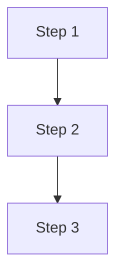

---
tags:
  - resource
  - skill
  - procedure
  - capture
  - code_snippets
  - documentation
keywords:
  - capture code snippet
  - tessellum-capture-code-snippet
  - in-vault skill canonical
topics:
  - Skill Procedures
  - Vault Tools
language: markdown
date of note: 2026-04-28
status: active
building_block: procedure
pipeline_metadata: ./skill_tessellum_capture_code_snippet.pipeline.yaml
---

# Procedure: tessellum-capture-code-snippet (Canonical Body)

This is the **single canonical body** for the `tessellum-capture-code-snippet` skill. This skill is invoked directly by Tessellum's composer (see `tessellum composer compile / run`); no ecosystem shims are needed.

## Skill description <!-- :: section_id = skill_description :: -->

Create a code snippet note documenting one component or algorithm from a code repository. Reads source code, writes a formatted snippet note with YAML frontmatter, Purpose, Math/Diagram, **Patterns** (per-function sub-sections each carrying verbatim source + an adapted-to-different-domain example), Source, and References. Adapts the BB-specific section by building block type (concept=MathJax, procedure=Mermaid pipeline, model=architecture diagram). Updates the per-package entry point `entry_code_snippets_<package>.md` (creating it + adding a row to the master TOC if the package is new). Use when the user asks to create a code snippet, document a component, or extract an algorithm into a snippet note.

## Setup <!-- :: section_id = setup :: -->

```bash
VAULT_PATH="."   # run from your vault root
# `tessellum search` and `tessellum index build` resolve paths from CWD
```

## Step 1: Read Source Code <!-- :: section_id = step_1_read_source_code :: -->

Read the target source file from GitHub:

```
https://github.com/<owner>/REPO/blob/main/PATH/TO/FILE.py
```

Identify the ONE component or algorithm to document. If the file has multiple independent classes, create separate snippets. NEVER merge two algorithms into one snippet.

## Step 2: Determine Building Block Type <!-- :: section_id = step_2_determine_building_block_type :: -->

| Type | When to Use | Key Sections |
|------|-------------|-------------|
| `concept` | Defines a reusable abstraction (loss function, attention layer, metric) | MathJax formula required |
| `procedure` | Step-by-step pipeline or workflow | Mermaid flowchart required |
| `model` | Architecture definition or configurable system | Architecture diagram or class diagram required |

## Step 3: Check for Duplicates <!-- :: section_id = step_3_check_for_duplicates :: -->

```bash
ls "$SNIPPETS_DIR"/snippet_*COMPONENT_NAME*.md 2>/dev/null
```

If a snippet already exists, ask user: update or skip?

## Step 4: Search Vault for Cross-References <!-- :: section_id = step_4_search_vault_for_cross_references :: -->

```bash
sqlite3 "$DB_PATH" "SELECT note_id FROM notes WHERE note_second_category='terminology' AND note_name LIKE '%KEY_TERM%' LIMIT 10"
sqlite3 "$DB_PATH" "SELECT note_id FROM notes WHERE note_second_category='team' AND note_name LIKE '%TEAM%' LIMIT 5"
sqlite3 "$DB_PATH" "SELECT note_id FROM notes WHERE note_name LIKE '%repo_REPO_SLUG%' LIMIT 5"
sqlite3 "$DB_PATH" "SELECT note_id FROM notes WHERE note_category='project' AND note_name LIKE '%PROJECT%' LIMIT 5"
# Find related snippets
ls "$SNIPPETS_DIR"/snippet_*RELATED*.md 2>/dev/null
```

## Step 5: Write Snippet Note <!-- :: section_id = step_5_write_snippet_note :: -->

Create: `$SNIPPETS_DIR/snippet_REPO_COMPONENT.md`

Naming: `snippet_<repo_slug>_<component_name>.md` — all lowercase, underscores.
Flat directory: NO subdirectories under code_snippets/.

**Section order** (same for ALL BB types):

```
Title → Purpose → <BB-specific section> → Patterns → Source → References
```

The BB-specific section is the only piece that differs by `building_block`:

| BB | Section header | Required content |
|---|---|---|
| `concept` | `## Mathematical Definition` | MathJax (`$$`) |
| `procedure` | `## Procedure` | Mermaid `flowchart` |
| `model` | `## Architecture / Model` | Mermaid `flowchart` or `classDiagram` |

The shared `## Patterns` template (sub-sections + dual code blocks per pattern) is defined ONCE under [Patterns Template](#patterns-template-shared-across-all-bb-types) below — every BB type uses the identical Patterns shape.

**Reference implementation:** `snippet_<example>.md` is the worked example of the new shape (9 patterns, dual blocks per pattern, Composition row at the end). Read it before authoring a new snippet — it's the model.

### YAML Frontmatter (ALL types) <!-- :: section_id = yaml_frontmatter_all_types :: -->

```yaml
---
tags:
  - resource
  - code
  - <domain_tag>
  - <framework_tag>
keywords:
  - <ClassName>
  - <key concepts>
topics:
  - <Topic Area>
language: <python|cpp|r|yaml|gremlin>
date of note: <YYYY-MM-DD>
status: active
building_block: <concept|procedure|model>
---
```

CRITICAL: First two tags MUST be `resource`, `code`. Tags must use YAML list format (no inline arrays).

### Patterns Template (shared across all BB types) <!-- :: section_id = patterns_template_shared :: -->

This is the SINGLE template for the `## Patterns` section. Every snippet (concept / procedure / model) uses this identical shape; the per-BB sections below only show their unique BB-specific block.

```markdown
## Patterns

### Index
| # | Pattern | Source function/class | Lift difficulty |
|---|---|---|---|
| 1 | <pattern name — search-phrase, not function name> | `func_a` | low / medium / high |
| 2 | ... | ... | ... |

(For procedure-BB pipelines, the optional final row "Composition" describes
how the steps wire together. For model-BB architectures, the optional final
row "Wiring" describes how the classes compose at runtime.)

### Pattern 1: <Pattern Name>

**Role in this script:** <1-line role>.

**The lift unit:**
- Stays: <structural part — signature, algorithm shape, return shape, dependency edges>
- Swaps: <domain-specific part — strategies, regex, table names, body>

**In this script (L<xx>-L<yy>):**

\```python
# verbatim from source — load-bearing logic preserved per function.
# Logging, long docstrings, argv/main, and site-specific paths
# MAY be elided with `...`; algorithm + branches MUST NOT be modified.
def func_a(args):
    ...
\```

**Adapted to <one-phrase new domain>:**

\```python
# teaching code — same SHAPE, different content.
# Pick a domain where the lift is non-obvious; renaming variables doesn't count.
def adapted_function(args):
    ...
    return result
\```

**Key invariants:** <1-3 bullets on what must hold for the pattern to work>

### Pattern 2: ...

(repeat per meaningful lift unit in `## Code`. The optional Composition / Wiring
sub-section at the end may show only the adapted block — composition is
architectural, not a single source function, so its "In this script" block
is the script's overall flow, optionally elided.)
```

### Document Structure by Building Block <!-- :: section_id = document_structure_by_building_block :: -->

Each BB type uses the same overall section order (Title → Purpose → BB-specific → Patterns → Source → References). Only the BB-specific section between Purpose and Patterns differs. The `## Patterns` template above is identical across all three.

#### CONCEPT (math-based components) — BB-specific block:

```markdown
# Code Snippet: <Name> — <One-Line Description>

## Purpose
2-3 sentences: what it does, why it exists, where it's used.

## Mathematical Definition
MathJax formulas defining the component. Use $$ for display math.
Include variable definitions.

## Patterns
[use the shared Patterns template above]

## Source
- **RepoName**: `path/to/file.py:Lxx-Lyy` (NNN total lines)

## References
- Snippet: Related → snippet_related.md
- Repo: Parent → repo_parent.md
- Term: Concept → term_concept.md
- Team: Owner → team_owner.md
```

#### PROCEDURE (pipeline/workflow) — BB-specific block:

```markdown
# Code Snippet: <Name> — <One-Line Description>

## Purpose
2-3 sentences.

## Procedure

Natural language description of each step.

## Patterns
[use the shared Patterns template above; add an optional Composition row to the Index when the pipeline SHAPE itself is the lift unit]

## Source
- **RepoName**: `path/to/file.py:Lxx-Lyy` (NNN total lines)

## References
- [links]
```

Use `flowchart TB` (top-down) for 4+ steps. Use `flowchart LR` (left-right) for 3 or fewer steps.

#### MODEL (architecture/system) — BB-specific block:

```markdown
# Code Snippet: <Name> — <One-Line Description>

## Purpose
2-3 sentences.

## Architecture / Model
```mermaid
flowchart TB  OR  classDiagram
    [architecture diagram]
```
Comparison table if multiple variants exist.

## Patterns
[use the shared Patterns template above; add an optional Wiring row to the Index for multi-class architectures]

## Source
- **RepoName**: `path/to/file.py:Lxx-Lyy` (NNN total lines)

## References
- [links]
```

### Code Block Rules <!-- :: section_id = code_block_rules :: -->

Code lives inside `## Patterns`, in TWO blocks per `### Pattern N` sub-section:

1. **`**In this script (Lxx-Lyy):**`** block — verbatim from the source file
2. **`**Adapted to <new domain>:**`** block — teaching code that lifts the same shape into a different problem

Verbatim source block rules (the "In this script" half):
- Preserves **load-bearing logic** per function/method — the algorithm, all
  branches, the API surface, and the names a caller would use stay intact
- The following MAY be elided with `...` or omitted entirely (noise for the
  lift unit, not the lift unit itself):
    - logging, debug prints, telemetry
    - argparse / `__main__` / CLI scaffolding
    - long docstrings (1-line summary OK)
    - site-specific hardcoded paths (replace with `<placeholder>`)
    - boilerplate exception messages (`try` / `except` shape stays)
- The following MUST stay verbatim (lift unit):
    - function/method signatures
    - the algorithm (loops, conditionals, recursion, key transformations)
    - public API names a caller would import
    - data shapes returned

Adaptation block rules (the "Adapted to ..." half):
- ~10-40 lines showing the SAME shape applied to a DIFFERENT problem domain
- NOT a restatement of the source — if you change only variable names, it's
  not teaching anything; pick a domain where the lift is non-obvious
- Self-contained: a reader should be able to copy this block and run it (with
  reasonable fakes for `cursor`, `fetch_X`, etc. that are already implied)

Coverage rules:
- Every function in the source that's a meaningful lift unit MUST get its own
  `### Pattern N` sub-section
- I/O scaffolding (`main`, `argparse` setup, output formatters > 50 LOC) MAY
  be omitted — call out the omission near the `### Index` table

### MathJax Rules (concept type) <!-- :: section_id = mathjax_rules_concept_type :: -->

- Use `$$` for display math (centered, own line)
- Use `$` for inline math
- Define all variables after the formula
- Use heredoc or fs_write (NOT Python f-strings) to avoid `\a`, `\t`, `\f` escape corruption

### Mermaid Rules (procedure/model type) <!-- :: section_id = mermaid_rules_procedure_model_type :: -->

- Use `flowchart TB` for long procedures (4+ steps)
- Use `flowchart LR` for short pipelines (2-3 steps)
- Use `classDiagram` for class hierarchies
- Color key nodes with `style node fill:#color,color:#fff`

### References Section (ALL types) <!-- :: section_id = references_section_all_types :: -->

MUST include all applicable:

```markdown

## References

- Snippet: Related Component → snippet_related.md — relationship
- Repo: Parent Repo → repo_parent.md
- Repo: Sub-Note → repo_parent_module.md
- Term: Key Concept → term_concept.md
- Team: Owner Team → team_owner.md
- Project: Related Project → project_name.md
- Model: Related Model → model_name.md
- Paper: Related Paper → lit_paper.md
- MTR: Related MTR → mtr_name.md
```

Minimum: 1 repo link + 1 term link + 1 related snippet link.

## Step 6: Update Per-Package Entry Point + Master TOC <!-- :: section_id = step_6_update_entry_point :: -->

The vault uses a **TOC-of-entry-points** pattern (introduced in the 2026-05-09 refactor):

- `entry_code_snippets.md` is the **Master TOC** — a thin index listing all per-package entry points with snippet counts.
- `entry_code_snippets_<package>.md` is the **per-package entry point** — holds the actual snippet table for one package (e.g., `entry_code_snippets_openclaw.md`, `entry_code_snippets_meshclaw.md`, `entry_code_snippets_cursus.md`).

Step 6 has three branches depending on whether the per-package entry point exists.

### 6.1 Determine the package <!-- :: section_id = step_6_1_determine_package :: -->

```bash
SNIPPET_NAME="snippet_<package>_<component>.md"   # e.g., snippet_openclaw_gateway_handler.md
PACKAGE=$(basename "$SNIPPET_NAME" .md | sed 's/^snippet_//' | awk -F'_' '{print $1}')
PACKAGE_ENTRY="$ENTRY_POINTS_DIR/entry_code_snippets_${PACKAGE}.md"
```

The package is the first underscore segment after `snippet_`. Examples:
- `snippet_openclaw_gateway_handler.md` → `openclaw` → `entry_code_snippets_openclaw.md`
- `snippet_meshclaw_session_pool.md` → `meshclaw` → `entry_code_snippets_meshclaw.md`
- `snippet_cursus_step_builder.md` → `cursus` → `entry_code_snippets_cursus.md`

Some packages combine multiple prefixes — refer to the Master TOC's package table to map non-obvious slugs (e.g., `tsa_*` and `cosa_*` both go to `entry_code_snippets_tsa_cosa.md`; all `otf_*` variants go to `entry_code_snippets_otf.md`; all `sais_*` to `entry_code_snippets_sais.md`).

### 6.2 Branch A — Per-package entry exists (most common) <!-- :: section_id = step_6_2_branch_a_exists :: -->

```bash
if [ -f "$PACKAGE_ENTRY" ]; then
    # Append the new snippet row to the appropriate sub-section table
    # (each per-package entry organizes by sub-domain — pick the matching one,
    #  or extend the most specific table if no sub-section fits)
    : "edit $PACKAGE_ENTRY in place — add the row below"
fi
```

Add a row to the matching table inside `$PACKAGE_ENTRY`:

```markdown
| [Component Name](../resources/code_snippets/snippet_name.md) | type | One-line description |
```

If the per-package entry has multiple `###` sub-sections (e.g., openclaw entry has Gateway/Daemon/RPC sections), add to the most specific one. If no sub-section fits, append a new `###` heading following the existing pattern in that file.

**Do NOT touch `$MASTER_TOC`** in Branch A — the master TOC's snippet count is approximate and is regenerated periodically; one new snippet does not require a master-TOC edit.

### 6.3 Branch B — Per-package entry does NOT exist (new package) <!-- :: section_id = step_6_3_branch_b_create :: -->

```bash
if [ ! -f "$PACKAGE_ENTRY" ]; then
    # Create the per-package entry point + add a row in the Master TOC
    : "create $PACKAGE_ENTRY with the standard frontmatter + table"
    : "add a row to $MASTER_TOC's per-package table"
fi
```

**Step 6.3.a — Create the per-package entry point** at `$PACKAGE_ENTRY` with this template:

```markdown
---
tags:
  - entry_point
  - index
  - code_snippets
  - <package>
keywords:
  - code snippets
  - <package>
topics:
  - code snippets
  - <package>
date of note: <YYYY-MM-DD>
status: active
language: markdown
building_block: navigation
---

# Entry: <Human-Readable Package Name> — Code Snippets (1)

<one-paragraph description of what the package is and what kinds of snippets live here>

## <Domain Section> — 1 snippet

| Snippet | Type | Description |
|---------|------|-------------|
| [<Component Name>](../resources/code_snippets/<new_snippet>.md) | <bb_type> | <one-line description> |

---

## Related Entry Points

- [Code Snippets Master TOC](entry_code_snippets.md) — index of all per-package code-snippet entry points
- [Code Repositories](entry_code_repos.md)
- [Datasheets Catalog](entry_datasheets_catalog.md)
```

**Step 6.3.b — Add a row to the Master TOC** (`$MASTER_TOC`) under the `## Per-Package Entry Points` table. The row format is:

```markdown
| **<Human-Readable Package Name>** | 1 | [entry_code_snippets_<package>.md](entry_code_snippets_<package>.md) | <one-line domain description> |
```

Insert the row in count-descending order (the Master TOC sorts by snippet count). For a brand-new package with one snippet, the row goes near the bottom of the table (just above the 2-snippet packages).

### 6.4 Verification <!-- :: section_id = step_6_4_verify :: -->

```bash
# Branch A: confirm row landed in per-package entry
grep -F "$SNIPPET_NAME" "$PACKAGE_ENTRY" || echo "MISSING: snippet row not added to per-package entry"

# Branch B (new package): confirm both files exist + linked
[ -f "$PACKAGE_ENTRY" ] || echo "MISSING: per-package entry point not created"
grep -F "entry_code_snippets_${PACKAGE}.md" "$MASTER_TOC" || echo "MISSING: master TOC row for new package"
```

## Step 7: Verify <!-- :: section_id = step_7_verify :: -->

```bash
NOTE="$SNIPPETS_DIR/snippet_NEW.md"

# 1. Patterns section + Index TOC present
grep -q '^## Patterns' "$NOTE" || echo "MISSING: ## Patterns"
grep -q '^### Index' "$NOTE" || echo "MISSING: ### Index TOC"

# 2. Pattern sub-sections + each has source + adaptation block
PAT_COUNT=$(grep -c '^### Pattern [0-9]' "$NOTE")
SRC_COUNT=$(grep -c '^\*\*In this script' "$NOTE")
ADAPT_COUNT=$(grep -c '^\*\*Adapted to' "$NOTE")
INV_COUNT=$(grep -c '^\*\*Key invariants:' "$NOTE")
echo "Pattern sub-sections: $PAT_COUNT"
echo "  In-this-script blocks: $SRC_COUNT (must equal $PAT_COUNT)"
echo "  Adapted-to blocks:     $ADAPT_COUNT (must equal $PAT_COUNT)"
echo "  Key-invariants lines:  $INV_COUNT (must equal $PAT_COUNT)"

# 3. Building_block-specific content (math/mermaid)
BLOCK=$(grep "building_block:" "$NOTE" | sed 's/building_block: //')
case $BLOCK in
  concept) grep -c '\$\$' "$NOTE" ;;
  procedure) grep -c 'mermaid' "$NOTE" ;;
  model) grep -c 'mermaid\|classDiagram' "$NOTE" ;;
esac

# 4. References
grep -c 'term_dictionary\|code_repos\|snippet_' "$NOTE"

# 5. Pattern coverage — every function named in an "In this script" block
#    appears as the source of some pattern (no orphan source functions)
awk '/^\*\*In this script/,/^\*\*Adapted to/' "$NOTE" \
  | grep -oE '^def [a-zA-Z_][a-zA-Z_0-9]*|^class [a-zA-Z_][a-zA-Z_0-9]*' \
  | sed -E 's/^(def|class) //' | sort -u > /tmp/snippet_src_names.txt

awk '/^### Index/,/^### Pattern 1/' "$NOTE" \
  | grep -oE '`[a-zA-Z_][a-zA-Z_0-9.]*`' \
  | tr -d '`' | sed 's/\..*//' | sort -u > /tmp/snippet_index_names.txt

comm -23 /tmp/snippet_src_names.txt /tmp/snippet_index_names.txt \
  | sed 's/^/UNCOVERED in Index: /'

# 6. Each "In this script" block has a line range like (Lxx-Lyy)
SRC_RANGE_COUNT=$(grep -cE '^\*\*In this script \(L[0-9]+-L[0-9]+\)' "$NOTE")
echo "In-this-script blocks with line ranges: $SRC_RANGE_COUNT (must equal $PAT_COUNT)"
```

## Error Handling <!-- :: section_id = error_handling :: -->

| Error | Recovery |
|-------|----------|
| Source file not found | Ask user for correct path or provide code directly |
| File has multiple classes | Create separate snippets per class |
| No math formula for concept | Add at minimum the input/output signature as math |
| No diagram for procedure | Add at minimum a 3-step flowchart |
| Missing references | Search vault DB for related terms, repos, teams |

---

## Important Constraints <!-- :: section_id = important_constraints :: -->

These constraints capture what is NOT already enforced by the Code Block Rules + Validate Content table. Refer there for the per-block rules, the source/adaptation discipline, and the coverage check.

1. **Provenance — what is original vs agent-written**:
   - **Original from source** (the "In this script" block in each `### Pattern N`): function/method/class names, signatures, algorithm (loops/branches/recursion), public API names, data shapes returned, file path
   - **Agent-written** (interpretation, not transcription): YAML keywords/topics, Purpose, Math/Diagram, Patterns Index columns (Pattern name + Lift difficulty), each pattern's `Role` / `Lift unit` / `Key invariants` text, every "Adapted to <new domain>" code block, References links
2. **Migration note** (history, not a rule for new snippets): this canonical previously had separate `## Code` + `## Reusable Patterns` sections. Pre-2026-05-02 snippets follow the old shape; new snippets use the merged `## Patterns` section per the templates above. When updating an old snippet, fold its `## Code` content into per-pattern `**In this script:**` blocks and add the matching `**Adapted to:**` blocks.

### Validate Content and Format <!-- :: section_id = validate_content_and_format :: -->

After creating the snippet note, re-read the source file and verify:

| Check | Pass Criteria |
|-------|---------------|
| `## Patterns` section + `### Index` TOC present | Both the section header and the index table at its top exist |
| Each lift-unit function gets its own `### Pattern N` | Coverage check: every function name appearing in an "In this script" block is also a row in the Index (no orphan source functions) |
| Pattern names are interpretive, not mechanical | Each Index "Pattern" entry is a phrase a reader would search for (e.g., "4-strategy fuzzy match with dedup"), not a restatement of the function name |
| Each pattern has BOTH source + adaptation code blocks | Every `### Pattern N` contains `**In this script (Lxx-Lyy):**` + `**Adapted to <new domain>:**`. Counts must match: `In-this-script` count == `Adapted to` count == pattern count. |
| In-this-script source verbatim | Algorithm + branches + signatures + return shape match source character-for-character; only the explicitly-allowed simplifications (logging / argv / docstrings / paths) are elided |
| Adaptation is a different domain, not a rename | The "Adapted to ..." block solves a DIFFERENT problem with the same shape — if it's the source code with renamed variables it isn't teaching anything; reject and rewrite |
| Source line range on every pattern | Every `**In this script (Lxx-Lyy):**` block has parenthetical line range. Count must equal pattern count. |
| Each pattern lists invariants | Every `### Pattern N` ends with `**Key invariants:**` listing what must hold for the pattern to work |
| Format aligned | Matches existing code snippet note structure for this BB type |

**If any check fails**: fix immediately before running DB update.

## Related Entry Point <!-- :: section_id = related_entry_point :: -->

- [Master TOC](../../0_entry_points/entry_master_toc.md) — full vault skill index, organized by C.O.D.E. stage; this skill's row in the catalog has a back-link to this canonical body
