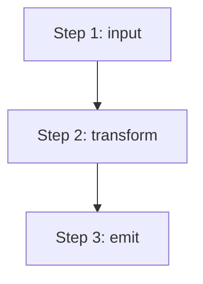

---
tags:
  - resource
  - code
  - template
  - code_snippet
keywords:
  - code snippet template
  - snippet skeleton
  - patterns template
  - lift unit
topics:
  - Note Format
  - Templates
  - Code Documentation
language: markdown
date of note: 2026-05-10
status: template
building_block: procedure
---

# Code Snippet: <Name> — <One-Line Description>

<!--
HOW TO USE THIS TEMPLATE:
1. Copy this file to vault/resources/code_snippets/snippet_<repo>_<component>.md
   (or use `tessellum capture code_snippet <slug>`).
2. Pick the building_block in YAML frontmatter:
     - `concept`   for math-based components (loss functions, attention, metrics)
     - `procedure` for pipelines / workflows (DEFAULT — most snippets are this)
     - `model`     for architectures / configurable systems
3. Fill the BB-specific section between Purpose and Patterns:
     - concept   → ## Mathematical Definition (MathJax `$$`)
     - procedure → ## Procedure (Mermaid flowchart)
     - model     → ## Architecture / Model (Mermaid flowchart or classDiagram)
4. Author one `### Pattern N` per meaningful lift unit in the source.
   Each pattern carries a `**In this script (Lxx-Lyy):**` block (verbatim
   source) AND a `**Adapted to <new domain>:**` block (teaching code that
   lifts the same shape into a different problem).
5. Verbatim block rules: signatures + algorithm + branches + return shape MUST
   match source character-for-character; logging / argv / docstrings / paths
   MAY be elided with `...`. Do NOT modify the algorithm.
6. Adaptation block rules: ~10-40 lines showing the SAME shape applied to a
   DIFFERENT problem domain. If you change only variable names it isn't
   teaching anything; pick a domain where the lift is non-obvious.
7. Status field: change `template` → `active` once authored.
8. Remove this commentary block.

EPISTEMIC FUNCTION (Doing or Defining): a code snippet codifies a reusable
pattern lifted from a real source. The reader walks away knowing both the
exact source it lives in and how to apply the same shape elsewhere.
-->

## Purpose

<2-3 sentences: what does this component do, why does it exist, where is it
used? The reader should understand the intent without reading the source.>

## Procedure

<!-- For procedure-BB. Replace this section with `## Mathematical Definition`
     (concept) or `## Architecture / Model` (model) per the BB choice above. -->



<Natural-language description of each step. ~2-3 sentences max.>

## Patterns

### Index

| # | Pattern | Source function/class | Lift difficulty |
|---|---------|----------------------:|:---------------:|
| 1 | <pattern name — search-phrase, not function name> | `func_a` | low |
| 2 | <pattern name>                                    | `func_b` | medium |

<!-- Optional final row "Composition" (procedure-BB) or "Wiring" (model-BB)
     describes how the steps wire together. -->

### Pattern 1: <Pattern Name>

**Role in this script:** <one-line role>.

**The lift unit:**
- Stays: <structural part — signature, algorithm shape, return shape>
- Swaps: <domain-specific part — strategies, regex, table names, body>

**In this script (L10-L25):**

```python
# verbatim from source — load-bearing logic preserved.
# Logging, long docstrings, argv/main, and site-specific paths
# MAY be elided with `...`; algorithm + branches MUST NOT be modified.
def func_a(args):
    ...
    return result
```

**Adapted to <one-phrase new domain>:**

```python
# teaching code — same SHAPE, different content.
# Pick a domain where the lift is non-obvious.
def adapted_function(args):
    ...
    return result
```

**Key invariants:** <1-3 bullets on what must hold for the pattern to work>

### Pattern 2: <Pattern Name>

<Repeat the per-pattern shape above for each lift unit.>

## Source

- **<RepoName>**: `path/to/file.py:L10-L80` (123 total lines)
- **Public URL**: `https://github.com/<owner>/<repo>/blob/main/path/to/file.py`

## References

- Snippet: <Related Component> → `snippet_related.md` — <relationship>
- Repo: Parent → `repo_parent.md`
- Term: <Key Concept> → `term_concept.md`

<!-- Minimum: 1 repo link + 1 term link + 1 related snippet link. Add
     team / project / model / paper links when applicable. -->
