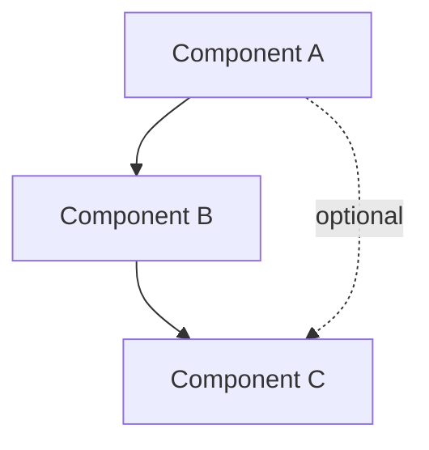

---
tags:
  - resource
  - template
  - model
keywords:
  - model template
  - model skeleton
  - architecture template
  - note format
topics:
  - Note Format
  - Templates
language: markdown
date of note: 2026-05-10
status: template
building_block: model
---

# Model: <Model / Architecture Name>

<!--
HOW TO USE THIS TEMPLATE:
1. Copy to the appropriate vault subdirectory. Common locations:
   - `vault/areas/code_repos/repo_<name>.md` (code repository documentation)
   - `vault/resources/term_dictionary/` (architectural concepts as terms)
   - `vault/resources/papers/` (architectural patterns from literature)
2. Rename appropriately.
3. Update YAML — tags[1] commonly `code_repo`, `architecture`, `schema`, etc.
4. Fill required sections: Architecture, Components, Relationships, References.
5. Remove this commentary block.

EPISTEMIC FUNCTION (Structuring): a model note formalizes a system —
shows relationships between named entities. It answers "How is it structured?"
Models bridge concepts (named things) and procedures (operational sequences).
-->

## Overview

<2-3 sentence description: what the model represents, what problem it structures,
where it fits in the broader system.>

## Architecture

<A diagram + the prose around it. Mermaid is preferred for architecture
diagrams since it renders in Obsidian, GitHub, and most markdown viewers.>

<Prose explanation of the diagram: what each box represents, what each arrow
means.>

## Components

<List + describe each component. For each component: what it is, what it does,
what it depends on. Aim for 3-7 components per model — fewer is too coarse,
more suggests the model should be split.>

### <Component A>

<Purpose, responsibilities, key interfaces.>

### <Component B>

<...>

### <Component C>

<...>

## Relationships

<How the components interact. Distinguish:
- **Composition** (A is made of B and C)
- **Dependency** (A requires B to function)
- **Communication** (A sends messages to B)
- **Sequence** (A runs before B)
The diagram shows these visually; the prose names them precisely.>

| Source | Relationship | Target |
|---|---|---|
| Component A | composes | Component B + C |
| Component B | depends on | Component C |

## Trade-offs

<Optional. What does this model do well? What does it not do well? What
alternatives were considered and why did this win?>

## References

- Related Concept
- Related Procedure
- <External source if applicable>
